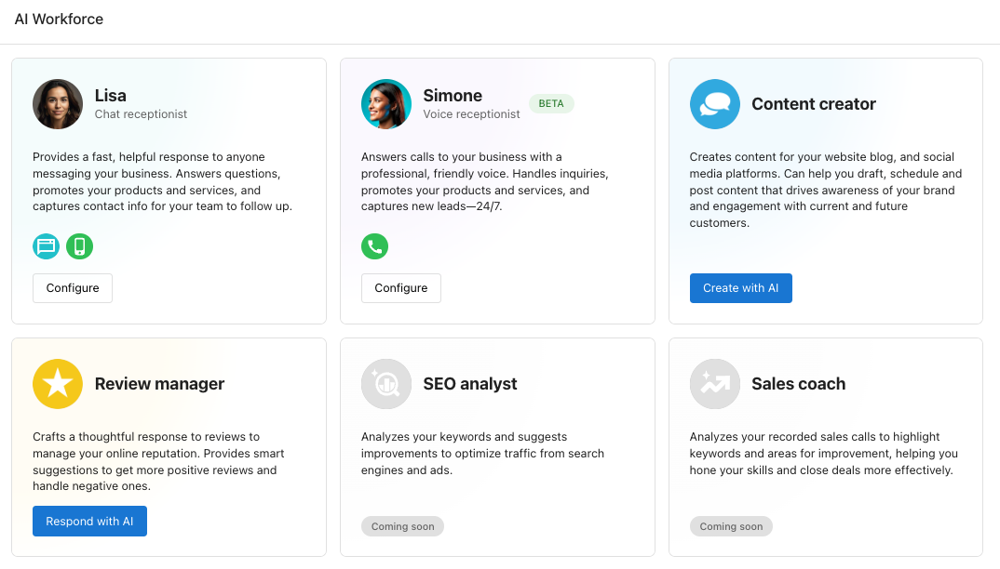
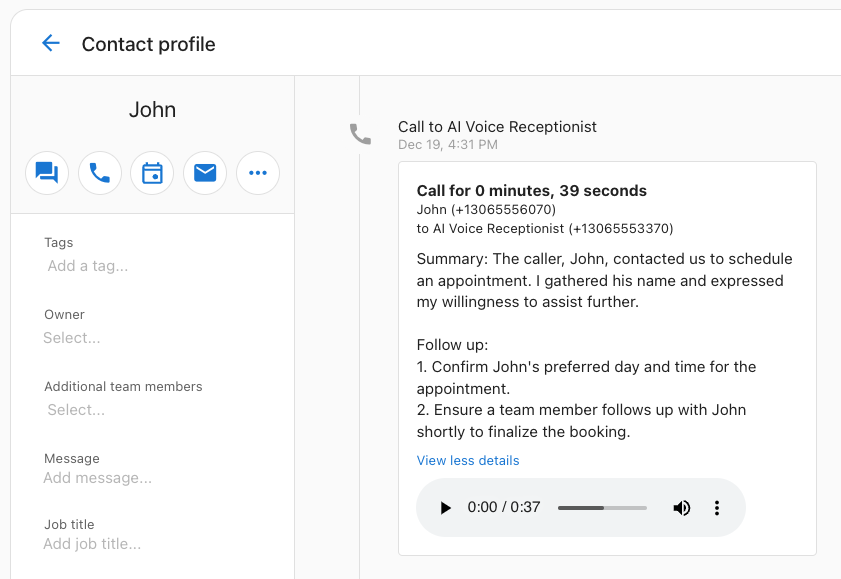

## What is the AI Voice Receptionist?

The AI Voice Receptionist is a total voicemail replacement, enabling businesses to answer calls 24/7 with an AI-powered receptionist. This feature ensures businesses never miss another call, even outside of business hours. The AI Voice Receptionist can:

- Answer frequently asked questions (FAQs)
- Capture contact details
- Send a detailed call summary to the business for follow-up

Customers no longer need to leave voicemails or face unanswered calls, improving their experience and reducing the chance of them turning to competitors.

## Availability

**Please note that this feature is currently in Open Beta.**

Voice AI is an early and evolving technology. It can perform incredibly well in many scenarios, but also might experience some less than ideal conversations. We are excited to bring big improvements over time as you and your customers experience Voice AI.

This feature is currently available for businesses based in the USA and Canada that have activated Inbox Pro and been assigned a phone number.

## Why Choose the AI Voice Receptionist?

When a business is busy or unavailable, they still want new leads and customers to be taken care of quickly without making them wait.

**Before:**  
A caller reaches out to a business, but if the call isn't answered, it might go to voicemail or simply ring indefinitely. This often leads to customer frustration and missed opportunities, as leads go to the next business that answers the phone.

**Now:**  
With the AI Voice Receptionist, every call receives an answer—24/7. Even if the business cannot respond immediately, the AI voice receptionist:

- Represents the business professionally
- Answers questions
- Captures the caller's request and contact information for follow-up

  

  

## Key Features

**Always Available** – The AI receptionist answers the phone any time of day, even during holidays or after business hours. This allows some businesses to set their business hours to be open longer. The AI can also answer multiple calls simultaneously, allowing you to capture more leads without anyone getting a busy signal.

**Multi-Language Support** – Supports multiple languages including English, French, Spanish, German, Tagalog, Hebrew, Chinese and many more. Note: Multi-lingual capabilities are in beta, and results may vary.

**Answer FAQs** – The AI receptionist is trained with business-specific knowledge, enabling it to answer detailed questions about products, services, hours of operation, and more. This saves time for both staff and customers by providing immediate responses.

**Lead Capture** – The AI understands caller requests and gathers their contact information, ensuring businesses can follow up efficiently.

**Call Recordings and Transcripts** – All calls are logged in the CRM with recordings, transcripts, and summarized action items for easy review by the business team.

**Customizable Personality** – Tailor the AI receptionist's personality to align with your brand. Whether you prefer a calm and professional tone or a bubbly and playful demeanor, it's up to you.

**Configurable Conversations** – Control how the AI handles calls:

- Decide how it answers the phone
- Specify FAQs it can address
- Redirect callers to specific resources (e.g., website for reservations)

## How to Set Up and Use the AI Voice Receptionist

1. **Ensure Eligibility:**
   - AI Voice call receptionist is available to users of Inbox Pro in USA or Canada.
   - Ensure an active phone number is assigned to the account. (Note: A2P registration is not required to start using calling features on the assigned phone number.)

2. **Enable the AI Voice Receptionist:**
   - Go to **Business App** > **AI Workforce** > **AI Voice Receptionist** > **Configure**.
   - Check on "Phone call: Answer with Voice AI" and hit save.
   - Test the default Voice Receptionist by calling your assigned number.

3. **Customize the AI Receptionist:**
   - Assign a custom name to the AI.
   - Update business knowledge to ensure accurate database from which it can lookup answers.
   - Add 'additional instructions' for common caller scenarios:
     - Example: IMPORTANT: When you answer the phone, say "Hello...."
     - Example: "If someone asks about reservations, direct them to [website.com]."
     - Example: "If someone inquires about sending a fax, provide... relevant instructions.
   - **Customizing AI Voice Receptionist Options**: There are multiple voices to choose from, divided into different families—each with their own strengths. Businesses can now select from:
     - **Astra**: Multilingual, less expressive, slower speaking
     - **Horizon**: Multilingual, very expressive
     - **Deepgram Aura** (New): English-only, highly accurate speech recognition, slightly robotic tone
   
   The **Deepgram Aura** voice family includes 16 new English-only voices designed for **more reliable and accurate caller understanding**, especially in noisy or difficult audio conditions. While these voices are less expressive than other options, their strength lies in understanding callers clearly and consistently—making them ideal for public-facing businesses that prioritize precision over tone.
   
   > Note: Deepgram is currently English-only and may sound more robotic compared to Astra or Horizon voices, but offers superior speech recognition accuracy.
   
   Each voice family provides different strengths, ensuring businesses can select the tone, accent, and personality that align best with their customer base.

## How to Select a Voice Option:

1. Navigate to **Business App > AI Workforce > AI Voice Receptionist > Configure.**
2. Locate the **Voice Settings** section.
3. Choose your preferred voice from **Astra, Horizon, or Deepgram.**
4. Click the play icon to **preview** voices before selecting.
5. Save changes and test by calling your AI receptionist number.

**Set a business phone number to forward missed calls to your AI Voice number**

- A business can work with their phone provider to forward missed or busy calls to your Voice AI receptionist.
- Many phone providers have instructions on how to do this. Some examples:
  - **United States**
    - **AT&T Business:**
      - [Manage Call Forwarding](https://www.att.com/support/smallbusiness/article/smb-local-long-distance/KM1181691/)
      - [Landline Call Forwarding](https://www.att.com/support/smallbusiness/article/smb-local-long-distance/KM1194925/)
      - [Call Forwarding User Guide](https://www.wireless.att.com/business/ts-pdf/att-business-ready-user-call-forwarding.pdf)
    - **Verizon Business:**
      - [Call Forwarding: Everything You Need to Know](https://www.verizon.com/articles/verizon-unlimited-plans/call-forwarding-everything-you-need-to-know/)
      - [Call Forwarding - Verizon Business Digital Voice](https://businessdigitalvoice.verizon.com/call-forwarding-end-user/)
    - **T-Mobile Business:**
      - [Call Forwarding Support](https://www.t-mobile.com/support/devices/features/call-forwarding)
    - **Sprint Business:**
      - [Self-service short codes for Call Forwarding](https://www.t-mobile.com/support/plans-features/self-service-short-codes)
  - **Canada**
    - **Bell Business:**
      - [How to use Call Forwarding on my mobile phone](https://support.bell.ca/Mobility/Rate_plans_features/How_to_use_Call_Forwarding_on_my_mobile_phone?step=3)
    - **Rogers Business:**
      - [Rogers Wireless Call Forwarding](https://www.rogers.com/support/mobility/use-call-forwarding)
    - **Telus Business:**
      - [Call Forwarding](https://www.telus.com/en/support/article/call-forward-mobile)
    - **SaskTel Business:**
      - [Call Forwarding](https://support.sasktel.com/app/answers/detail/a_id/11035/~/using-wireless-call-forward-features)
- Note: A business may experience additional charges from their phone provider for call forwarding.

## Automate Follow-Up via SMS

To enhance the AI Voice Receptionist experience, businesses can automate follow-up SMS messages after a call. Using the pre-built automation template, **'AI Receptionist sends follow-up SMS to leads who called,'** businesses can:

- Trigger an SMS follow-up when a call is made to the AI Voice Receptionist.
- Generate a personalized message based on the call transcript.
- Send the SMS automatically through Inbox and Automations.

This automation ensures that every caller receives an immediate follow-up, reinforcing engagement and preventing lost opportunities.

<iframe src="https://www.loom.com/embed/799fb92fabaa4f51b438fa53bebac7a4" width="560" height="315" frameborder="0" allowFullScreen></iframe>

## How to Enable This Automation

You or your clients can turn it on in **Business App > Automations > AI Receptionist sends follow-up SMS to leads who called > [toggle on]**.

## Frequently Asked Questions

**1. What happens if the AI cannot answer a caller's question?**

If the AI cannot answer a caller's question, it will capture the caller's details and pass the inquiry to the business for follow-up. This ensures no leads or customer concerns are missed.

**2. How accurate is the AI at answering FAQs?**

The AI is trained with the business's knowledge base and FAQs. The open beta preview is highly capable, but you may see unexpected behavior. Accuracy will also depend on how well the business provides up-to-date and comprehensive information during configuration.

**TIP:** Don't give the AI too much knowledge to draw from; it currently performs best when it's been given only highly relevant, specific information that it will need for common phone interactions.

**TIP:** For best performance answering common questions, add instructions to the 'Additional Instructions' area of the Voice AI configuration, since this information is available for the AI to use in its answers without needing to "look up" anything. Common questions like pricing, services, FAQs can be added there.

**3. Can I choose which languages my AI receptionist speaks?**

Yes, businesses can enable specific languages for the AI receptionist based on their audience. Many common languages are supported, and the voice AI can switch into a different language at a caller's request. Multi-language support is currently in beta, so results may vary.

**TIP:** To instruct your AI to answer calls by default in another language, add this to the 'additional instructions': "IMPORTANT: Begin all calls by speaking [language], and say: "Bonjour..."

**4. How do I listen to call recordings and review transcripts?**

Call recordings and transcripts are accessible through the Inbox and the CRM. New calls will appear in Inbox, and be logged on the contact activity in the CRM.

Users will be notified about new calls via Email and App notifications.

**5. Can the AI receptionist handle multiple calls at the same time?**

Yes, the AI receptionist can manage multiple calls simultaneously, ensuring no caller is left waiting.

**6. Can I update my AI receptionist's script and knowledge base after setup?**

Absolutely! You can update the AI's script and business knowledge at any time by revisiting the configuration settings in the **AI Workforce** section.

**7. Is there a limit to how long the AI can engage with a caller?**

During the beta, there is a 5 minute call limit. When a call reaches 5 minutes, it will end without warning.

**8. Does the AI receptionist work with existing business phone systems?**

The AI receptionist works with any phone number assigned through Inbox Pro. It can also receive calls forwarded from other phone systems. It does not integrate directly with third-party phone systems at this time.

**9. Can the AI redirect calls to a human representative?**

Not currently, the AI will capture contact details and then send a notification to business users, for them to follow up via Inbox (send a text) or return their call.

**10. How much does the AI Voice Receptionist cost?**

The AI Voice Receptionist is included with Inbox Pro subscriptions. To allow everyone to experience this feature, we are currently providing 300 minutes of call time with your Inbox Pro subscription! In the future, there will be per-minute billing options to fit each business's needs.

**11. Can I remove the "This call is being recorded" message at the beginning of the AI Voice Receptionist calls?**

This notification is a legal requirement in Canada and many US states. In the future, we might look at allowing individuals to opt-out by letting them assume all legal risk, but at this time the notification will remain in place for all use.

**Leverage the AI Voice Receptionist to ensure every call gets answered, customers feel valued, and no leads slip through the cracks. Activate it today to elevate your business's customer service and efficiency!**