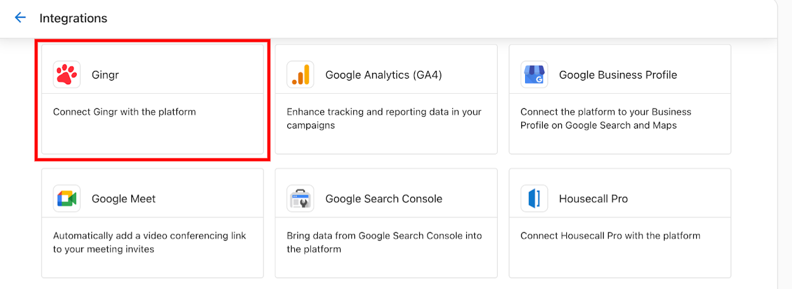
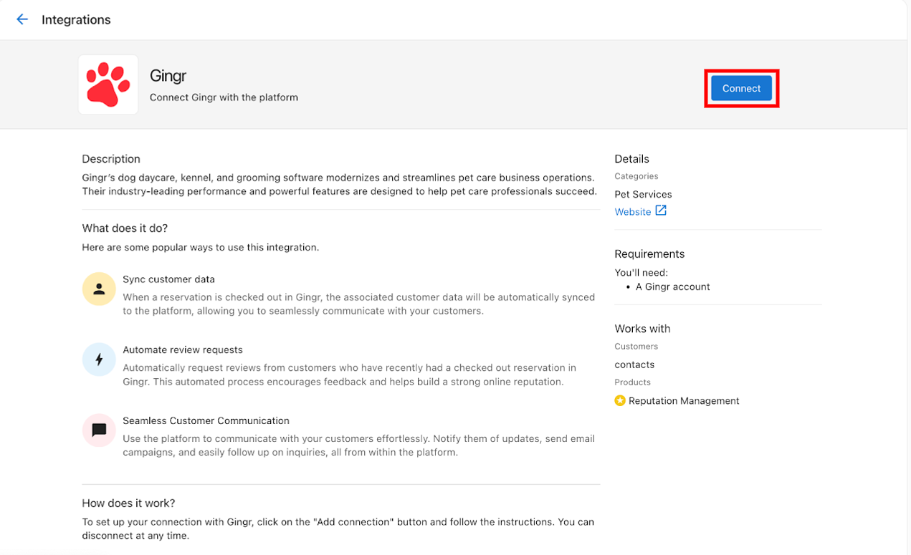
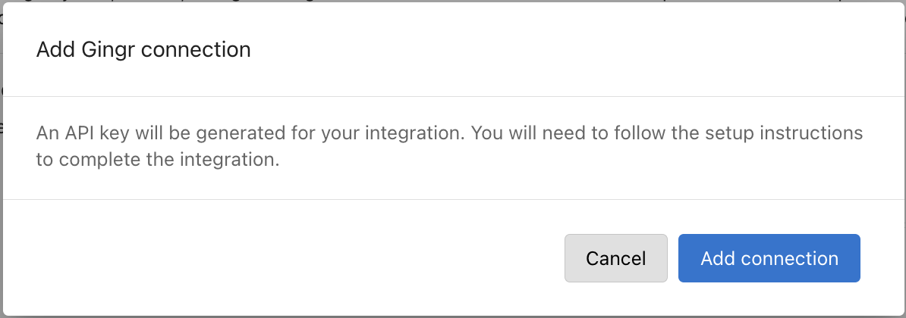
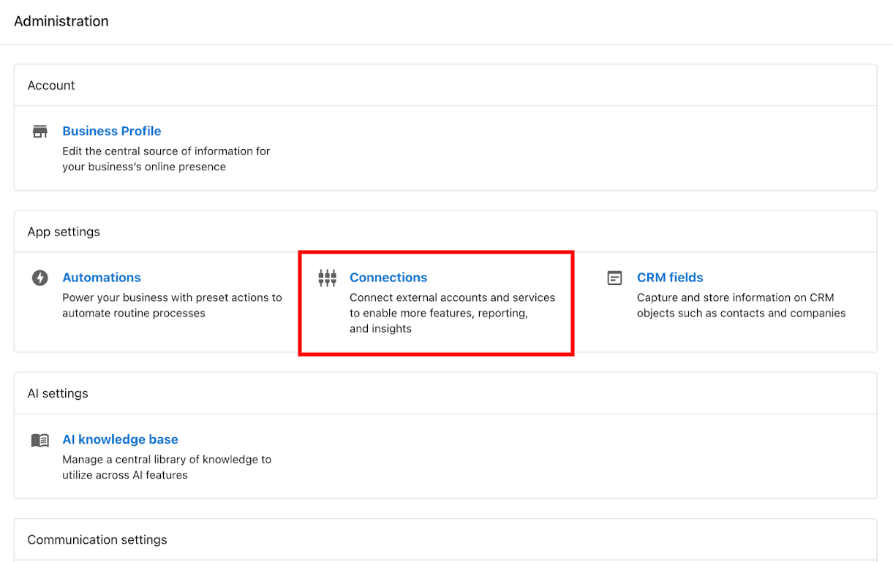
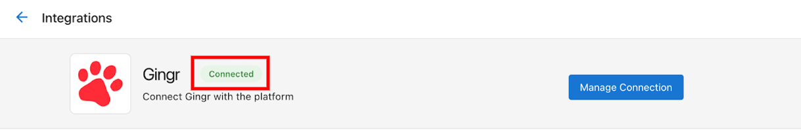

# API-Key Based Integrations

## Introduction
API-key based integrations are third-party applications that integrate with the platform using API keys. These integrations can provide additional functionalities to the platform, such as marketing services, analytics, and more.

## Finding and connecting API-key based integrations

### Browsing available integrations
You can find available API-key based integrations by navigating to the **Connections** tab in the Partner Center. Look for integration cards that display "API-Key Based" as shown below:

### Viewing the marketing page
Click on an integration to view its marketing page, which provides detailed information about the integration, including features, pricing, and requirements.

### Adding a connection
To add a connection, click the **Add Connection** button on the marketing page.

### Configuring the connection
After clicking **Add Connection**, you will be prompted to configure the connection settings. This typically involves entering an API key or other credentials provided by the third-party service.

## Managing your connections

### Connections page
Once you have added connections, they will appear on the **Connections** page. Here you can view and manage all your existing connections.

### Connection status
Connection cards display status indicators to help you quickly identify the state of each connection:

- **Connected**: The integration is successfully connected and working properly
- **Connection Issue**: There is a problem with the connection that needs attention
- **Pending**: The connection is in progress but not yet complete

## Troubleshooting

### Common issues
- **Invalid API Key**: Ensure the API key you entered is correct and has not expired
- **Permissions**: Make sure the API key has the necessary permissions for the integration to function
- **Service Downtime**: Check if the third-party service is experiencing any outages

### Getting help
If you encounter issues with an API-key based integration:

1. Check the integration's documentation for troubleshooting guides
2. Contact the integration's support team for assistance with their service
3. Reach out to Vendasta Support if the issue appears to be platform-related