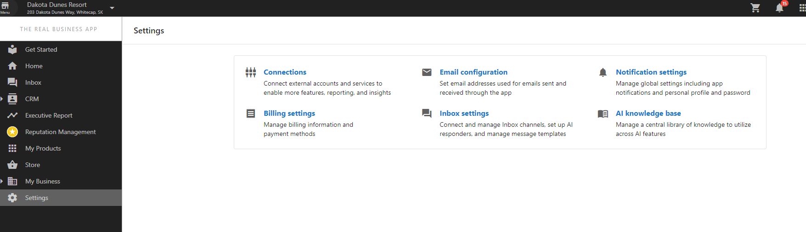
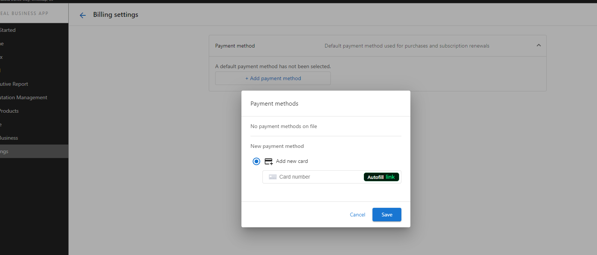

# Billing settings

Billing settings in Business App lets users keep their payment information current.

## Payment methods
- [Add or update stored credit cards](#where-can-a-client-add-their-credit-card-details)
- Encourage clients to refresh expired cards before renewals to avoid failed payments.

## Invoices
- [View and download invoices shared via Business App](/business-app/administration/invoices)
- [Review fulfilled orders and receipts](/business-app/administration/orders)

## Best practices
- Verify that Vendasta Payments is enabled so clients can pay invoices in-app.
- Remind clients that billing permissions mirror their Business App user role—grant access only to trusted team members.

## Frequently Asked Questions

### Where can a client add their credit card details?

Your clients can add their credit card details in the **Business App > Settings > Billing Settings > Add Payment Method.**

