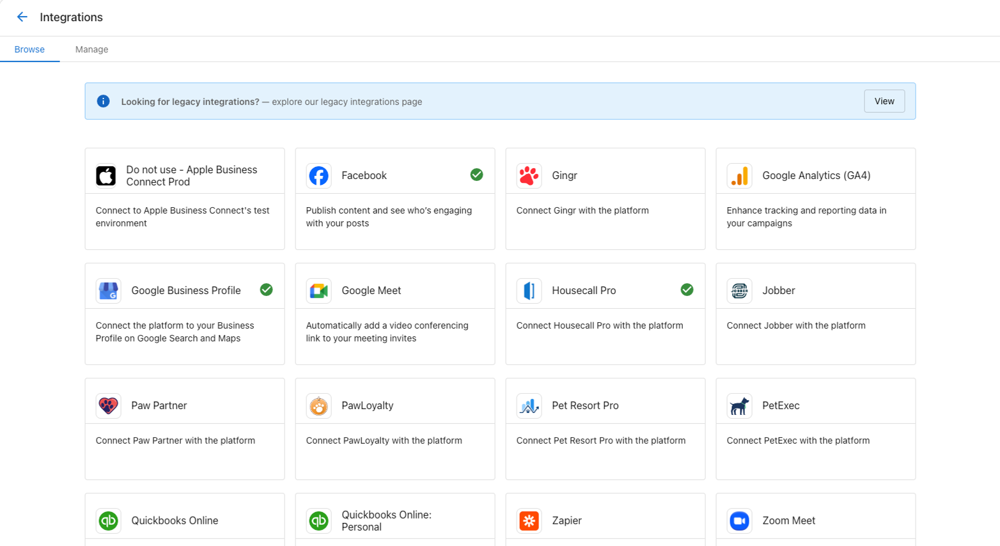
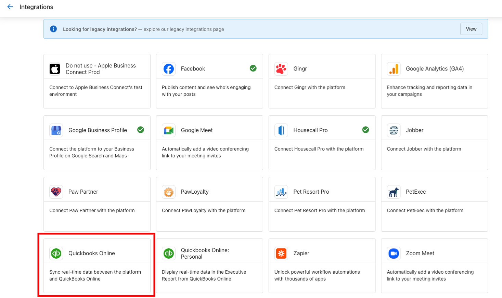
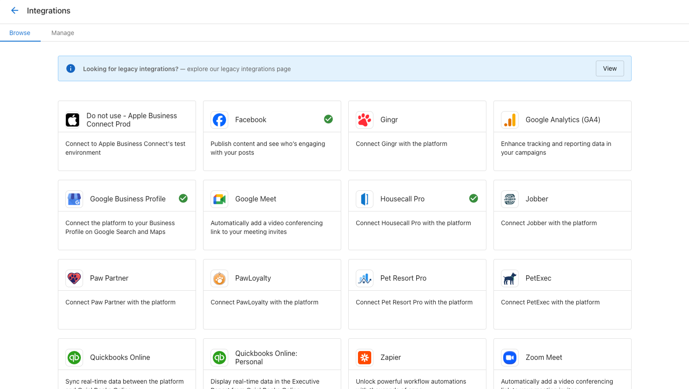
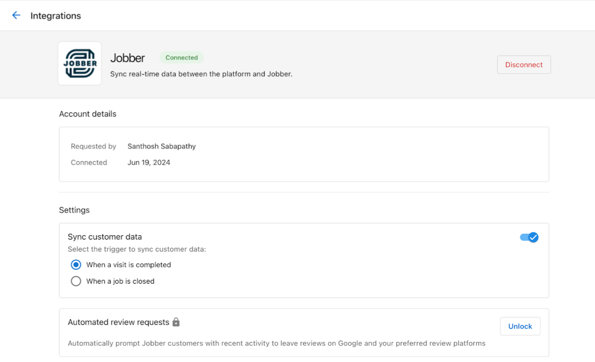
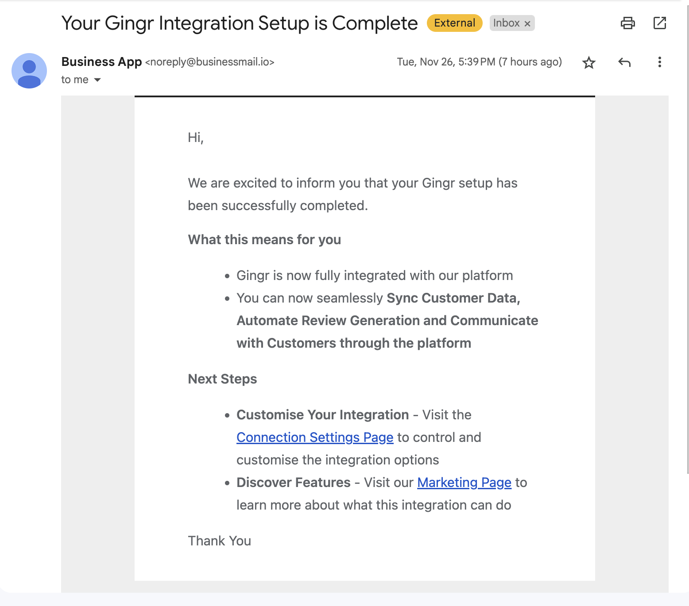
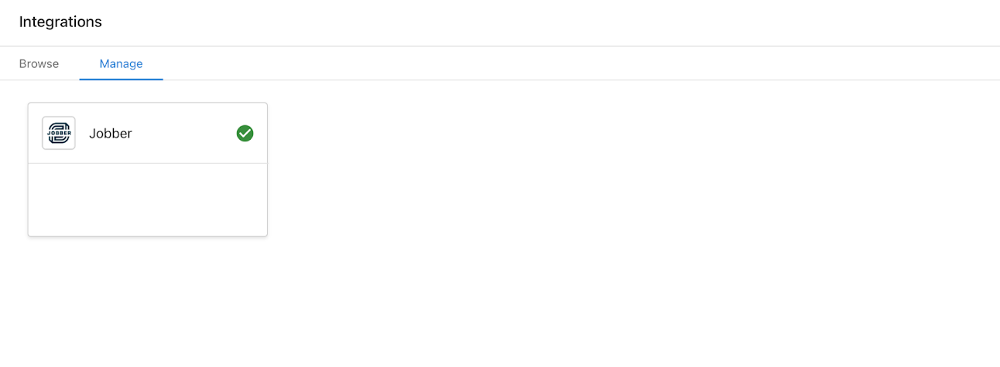

## What are Business Connections & Third-Party Integrations?

Business Connections & Third-Party Integrations enable businesses to connect their most important external accounts and services directly to Business App. This creates a centralized hub where Google Business Profile, Google Analytics, Facebook, QuickBooks, and dozens of other business tools can share data and automate workflows. These connections power analytics in the Executive Report, enable automated review requests, and streamline business operations by eliminating the need to manage multiple separate platforms.

## Why are Business Connections & Third-Party Integrations Important?

Connecting your business accounts is one of the most critical steps to maximize value from Business App and related services. Integrated accounts provide the data foundation that proves return on investment and enables powerful automation. Key benefits include:

- **Centralized data management** - All business metrics and information in one location
- **Automated workflows** - Review requests, data sync, and customer communications happen automatically
- **Improved analytics** - Executive Report and Marketing Funnel powered by real business data
- **Time savings** - Eliminates manual data entry and platform switching
- **Better customer experience** - Automated touchpoints and personalized communications
- **Enhanced ROI tracking** - Clear metrics demonstrate service value and business growth

## What You Can Do with Business Connections & Third-Party Integrations

### Core Connection Types
- **Google Services**: Business Profile, Analytics, Search Console
- **Social Media Platforms**: Facebook, Instagram, LinkedIn, Twitter
- **Business Management Tools**: QuickBooks, various CRM systems
- **Industry-Specific Software**: Legal practice management, field service tools
- **API-Based Integrations**: Custom connections using API keys
- **SSO-Based Integrations**: Single sign-on enabled third-party applications

### Integration Capabilities
- **Automated Data Sync**: Customer information, transactions, and business activities sync automatically
- **Review Request Automation**: Trigger review requests based on completed jobs or services
- **Analytics Integration**: Business data feeds into Executive Report and Marketing Funnel
- **Workflow Automation**: Connect business events to marketing and communication workflows
- **Single Sign-On**: Access integrated applications without separate logins

## How to Set Up Business Connections & Third-Party Integrations

### How to Access the Connections Interface

1. **Navigate to Connections**
   - In Business App, go to **Administration > Connections**
   - Toggle between **Browse** and **Manage** tabs as needed

2. **Understanding the Interface**
   - **Browse Tab**: Discover and connect new integrations
   - **Manage Tab**: View and configure existing connections
   - **Connection Cards**: Display integration status and options

### How to Set Up Google Business Profile Connection

1. **Locate Google Business Profile Integration**
   - In **Browse** tab, find Google Business Profile connection card
   - Click on the card to view integration details

2. **Connect Your Account**
   - Click **Connect** button
   - Sign in to your Google account when prompted
   - Grant necessary permissions for Business App access
   - Confirm connection authorization

3. **Verify Connection Status**
   - Check **Manage** tab for Google Business Profile connection card
   - Green checkmark indicates successful connection
   - Connection enables Executive Report data and review management

### How to Set Up QuickBooks Integration

1. **Find QuickBooks Integration**
   - Navigate to **Browse** tab in Connections
   - Locate QuickBooks integration card
   - Click **Learn more** to open marketing page

2. **Initiate Connection Process**
   - Click **Connect** button on marketing page
   - Complete pre-connect form with business information
   - Submit form to proceed to QuickBooks authorization

3. **Complete QuickBooks Authorization**
   - Enter QuickBooks credentials on sign-in page
   - Select or create QuickBooks company
   - Allow Business App to connect to QuickBooks
   - Confirm permissions and complete setup

4. **Manage QuickBooks Integration**
   - View connection status in **Manage** tab
   - Access QuickBooks data through Business App navigation
   - QuickBooks information appears in Executive Report

**Important Note**: Users must log in to Business App directly to connect QuickBooks. Partners cannot impersonate users for this connection. Only the connecting user can see and interact with QuickBooks data.

### How to Set Up SSO-Based Integrations

1. **Browse Available SSO Integrations**
   - Review applications on Connections page
   - Each application displays marketing page with features and benefits
   - Look for applications marked as "SSO-Based"

2. **Initiate SSO Connection**
   - Click **Connect** button on application marketing page
   - Complete any required pre-connect forms
   - Follow Single Sign-On prompts

3. **Complete SSO Authorization Process**
   - Create new account with third-party service OR
   - Connect to existing account
   - Provide authorization for data sharing
   - Confirm permissions and complete setup

4. **Manage SSO Connections**
   - View connected applications in **Manage** tab
   - Connection cards display for each integrated application
   - Marketing pages show "Connected" tag for active integrations

### How to Set Up API-Key Based Integrations

1. **Find API-Key Integrations**
   - Look for integration cards marked "API-Key Based"
   - Click on integration to view marketing page
   - Review features, pricing, and requirements

2. **Add API-Key Connection**
   - Click **Add Connection** button on marketing page
   - Enter API key or credentials from third-party service
   - Configure connection settings as required
   - Save connection configuration

3. **Monitor Connection Status**
   - Check Connections page for status indicators:
   - **Connected**: Integration working properly
   - **Connection Issue**: Problem requiring attention
   - **Pending**: Connection in progress

### How to Configure Data Sync and Automated Review Requests

1. **Access Connection Settings**
   - Navigate to **Manage** tab in Connections
   - Click on connection card for integrated service
   - Access **Connection Settings** page

2. **Enable Data Sync**
   - Toggle on Data Sync feature
   - Choose triggering events (e.g., "Visit Completed" or "Job Completed")
   - Configure sync preferences for customer data
   - Save data sync settings

3. **Set Up Automated Review Requests**
   - **Requirement**: Reputation AI Premium subscription
   - Enable automated review request option
   - Configure trigger events for review requests
   - Set timing for review request delivery

4. **Benefits of Data Sync and Review Automation**
   - **Data Sync**: Customer information automatically updates in Business App
   - **Review Requests**: Automatic requests sent after job completion
   - **Comprehensive View**: Complete customer interaction history
   - **Improved Reputation**: Consistent review collection process

### How to Set Up Google Analytics Connection

1. **Access Google Analytics Integration**
   - Navigate to **Settings > Connections**
   - Click GA4 connection card

2. **Connect Google Analytics 4**
   - Marketing page opens for GA4 integration
   - Click **Add Connection** to begin setup
   - Follow Google authorization process
   - Select appropriate GA4 property for connection

### How to Set Up Vendor Managed Integrations

1. **Access Vendor Integration Portal**
   - Navigate to **Business App Administration**
   - Click **Vendor Integrations** tab

2. **Connect Available Integrations**
   - Browse available vendor integrations
   - Each shows vendor name, logo, and description
   - Click **Connect** button for desired integration

3. **Complete Authorization Process**
   - Popup window opens with third-party login
   - Enter credentials for third-party service
   - Review and approve requested permissions
   - Window closes automatically when complete

4. **Manage Vendor Integrations**
   - View connected integrations in **Installed Integrations** tab
   - Disconnect integrations if needed
   - Monitor integration status and performance

## Advanced Integration Management

### Connection Troubleshooting
- **Invalid API Key**: Verify key accuracy and expiration status
- **Permission Issues**: Ensure API key has necessary permissions
- **Service Downtime**: Check third-party service status
- **Authorization Problems**: Re-authorize connection if needed

### Integration Best Practices
- **Regular Monitoring**: Check connection status periodically
- **Permission Management**: Review and update permissions as needed
- **Data Quality**: Ensure accurate information in connected systems
- **Security**: Use strong authentication for all integrations
- **Documentation**: Keep track of connected services and their purposes

### Supported Integration Examples
- **Field Service**: Jobber, Housecall Pro
- **Legal Practice Management**: Clio
- **Accounting**: QuickBooks Online
- **Social Media**: Facebook, Instagram, LinkedIn
- **Analytics**: Google Analytics 4, Google Search Console
- **Review Platforms**: Google Business Profile integration

## Frequently Asked Questions

Why can't I connect QuickBooks when impersonating a user?

QuickBooks integration requires the actual Business App user to log in directly. Partners cannot impersonate users to complete this connection. Only the user who connects QuickBooks can see and interact with the QuickBooks data in Business App.

What's the difference between SSO and API-key integrations?

SSO integrations use Single Sign-On for seamless access without separate logins, while API-key integrations require manual entry of API credentials. SSO integrations typically offer more automated features and easier management.

Do I need Reputation AI Premium for automated review requests?

Yes, sending automated review requests through integrations requires a Reputation AI Premium subscription. Without this subscription, the review request option will be locked in Connection Settings.

How do I know if my integration is working properly?

Check the **Manage** tab in Connections for status indicators. Green checkmarks or "Connected" status indicate proper functionality. Red indicators or "Connection Issue" status require attention.

Can I disconnect an integration after setting it up?

Yes, you can disconnect integrations at any time. Go to the **Manage** tab, find the integration you want to disconnect, and click the **Disconnect** button. Confirm when prompted.

What data gets synced when I connect an integration?

Data sync varies by integration but typically includes customer contact information, transaction details, job completion status, and other relevant business activities. Check Connection Settings for specific sync options.

How long does it take for connected data to appear in Business App?

Most integrations sync data in real-time or within a few minutes of the triggering event. Some integrations may have longer sync intervals depending on the third-party service's API limitations.

Can I connect multiple accounts from the same service?

This depends on the specific integration. Some services allow multiple account connections, while others limit you to one connection per Business App account. Check the integration documentation for details.

What should I do if an integration stops working?

First, check the connection status in the **Manage** tab. Try disconnecting and reconnecting the integration. Ensure your credentials are still valid and that the third-party service is operational. Contact support if issues persist.

Are there additional costs for integrations?

Most integrations are included with Business App, but some may require specific subscriptions (like Reputation AI Premium for automated review requests). Check the integration marketing page for pricing details.

## Screenshots

