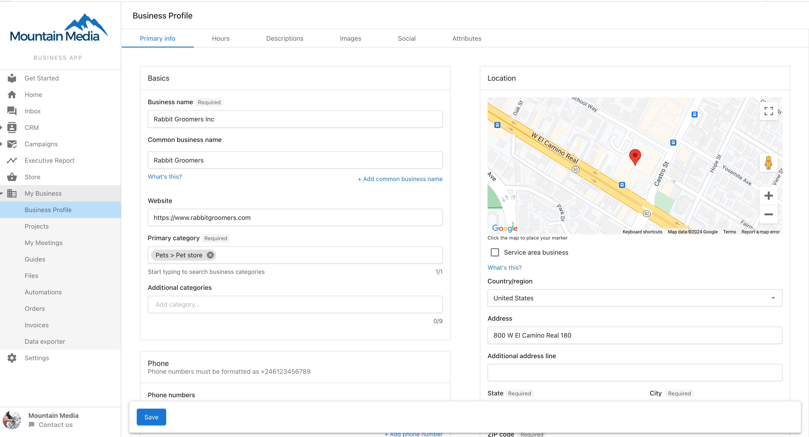
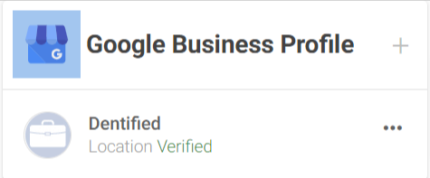
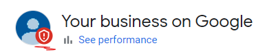
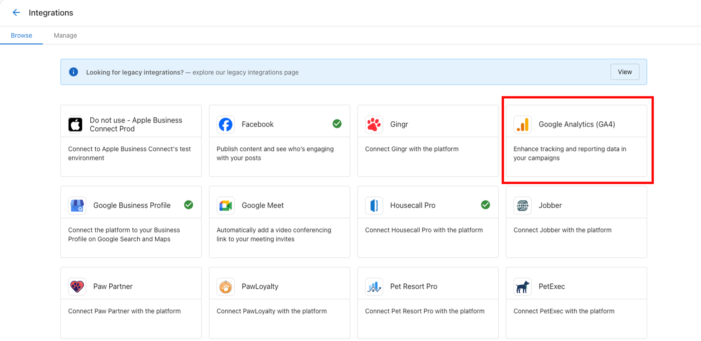
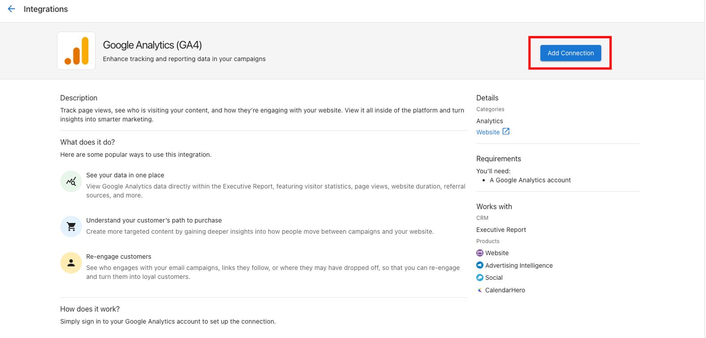

## What is Business Profile & Analytics Connections?

Business Profile & Analytics Connections encompasses the core business information management and analytics tracking capabilities within Business App. This includes managing your business profile information, verifying Google Business Profile listings, and connecting Google Analytics for comprehensive data tracking. These features ensure your business information stays consistent across all platforms while providing the data foundation for performance tracking and reporting.

## Why is Business Profile & Analytics Connections Important?

Accurate business profile information and proper analytics connections are fundamental to your digital presence and performance measurement. These features ensure consistency across all platforms and provide essential data for business insights. Key benefits include:

- **Consistent business information** - Profile data syncs across all products and platforms
- **Improved local SEO** - Verified Google Business Profile enhances local search visibility
- **Comprehensive analytics** - Google Analytics data powers Executive Reports and performance insights
- **Centralized management** - Update business information once, sync everywhere
- **Verification benefits** - Verified listings build trust and credibility with customers
- **Data-driven decisions** - Analytics connections provide insights for business growth

## What You Can Do with Business Profile & Analytics Connections

### Business Profile Management
- Update business hours, location, and contact information
- Manage business descriptions and service offerings
- Sync profile information across multiple products
- Maintain consistent branding and messaging
- Access profile information from multiple product interfaces

### Google Business Profile Integration
- Check verification status of Google Business Profile listings
- Connect Google Business Profile to Business App
- Monitor listing performance and customer interactions
- Manage reviews and customer communications
- Access Google Business Profile data in Executive Reports

### Google Analytics Connection
- Connect Google Analytics 4 (GA4) properties to Website Pro
- Access website performance data through Business App
- Integrate analytics data with Executive Reports
- Track website visitor behavior and conversions
- Monitor digital marketing campaign performance

## How to Set Up Business Profile & Analytics Connections

### How to Manage Your Business Profile

1. **Access Business Profile**
   - Log in to Business App
   - Navigate to **My Business > Business Profile**
   - View current business information and settings

2. **Update Business Information**
   - Modify business hours, location, and contact details
   - Update business description and service offerings
   - Add or change business categories and specialties
   - Upload business logos and photos

3. **Sync Across Products**
   - Business Profile automatically syncs with:
     - Local SEO product settings
     - Reputation Management profile information
     - Partner Center account details
   - Changes made in one location update everywhere
   - Maintain consistency across all business tools

### How to Verify Google Business Profile Status

#### If Google Business Profile is Connected to Business App

1. **Check Verification Status in Business App**
   - Navigate to your connected Google Business Profile
   - Look for verification indicators:
     - **'Verified' tag** = Profile is verified and active
     - **'Unverified' tag** = Profile requires verification

2. **View Verification Details**
   - Connected profiles show real-time verification status
   - Access Google Business Profile data through Business App
   - Monitor listing performance and customer interactions

#### If Google Business Profile is Not Connected

1. **Access Google Business Profile Dashboard**
   - Log in to Google Business Profile directly
   - Navigate to "Your business on Google" section

2. **Check Verification Indicators**
   - **Blue checkmark** = Profile has been verified successfully
   - **Red shield** = Profile still needs verification
   - Follow Google's verification process if unverified

3. **Complete Verification Process**
   - Follow Google's verification requirements
   - Options may include phone verification, postcard verification, or instant verification
   - [Complete verification using Google's official guide](https://support.google.com/business/answer/7107242?hl=en)

### How to Connect Google Analytics

1. **Access Google Analytics Connection**
   - Navigate to **Business App > Settings > Connections**
   - Locate GA4 connection card in available integrations

2. **Initiate GA4 Connection**
   - Click on GA4 connection card
   - Marketing page opens with integration details
   - Click **Add Connection** to begin setup process

3. **Complete Google Analytics Authorization**
   - Sign in to your Google account when prompted
   - Select appropriate Google Analytics 4 property
   - Grant necessary permissions for data access
   - Confirm connection authorization

4. **Verify Analytics Connection**
   - Check connection status in **Manage** tab
   - Ensure GA4 data appears in Executive Reports
   - Monitor website performance data through Business App

### How to Connect Google Business Profile to Business App

1. **Access Connections Interface**
   - Navigate to **Business App > Settings > Connections**
   - Find Google Business Profile in available connections

2. **Connect Your Google Business Profile**
   - Click on Google Business Profile connection card
   - Sign in to your Google account
   - Select appropriate business location
   - Grant permissions for Business App access

3. **Verify Connection Success**
   - Check **Manage** tab for Google Business Profile connection
   - Verify that business data appears in Executive Reports
   - Confirm review management capabilities are active

## Advanced Profile and Analytics Management

### Business Profile Best Practices
- **Regular Updates**: Keep business information current and accurate
- **Consistent Branding**: Use same business name, logo, and messaging across platforms
- **Complete Information**: Fill out all available profile fields for better visibility
- **Photo Management**: Use high-quality, professional business photos
- **Service Descriptions**: Provide clear, detailed descriptions of services offered

### Google Business Profile Optimization
- **Verification Priority**: Complete verification as soon as possible for maximum benefits
- **Review Management**: Respond to customer reviews promptly and professionally
- **Post Updates**: Share business updates, offers, and news through Google Business Profile
- **Photo Updates**: Regularly add fresh photos of products, services, and business activities
- **Q&A Management**: Monitor and respond to customer questions

### Analytics Connection Benefits
- **Website Performance**: Track visitor behavior, page views, and conversion rates
- **Marketing ROI**: Measure effectiveness of digital marketing campaigns
- **Customer Insights**: Understand customer demographics and interests
- **Business Growth**: Use data insights to make informed business decisions
- **Executive Reporting**: Comprehensive performance data in Executive Reports

### Cross-Platform Integration
- **Local SEO**: Business profile data enhances local search optimization
- **Reputation Management**: Connected profiles enable review monitoring and response
- **Website Pro**: Analytics data provides website performance insights
- **Executive Report**: All connected data feeds into comprehensive business reports

## Troubleshooting Common Issues

### Business Profile Sync Issues
- **Delayed Updates**: Allow time for changes to propagate across all platforms
- **Conflicting Information**: Ensure consistency when updating from multiple locations
- **Missing Data**: Verify all required fields are completed in business profile

### Google Business Profile Verification Problems
- **Verification Delays**: Google verification can take several days to complete
- **Address Issues**: Ensure business address matches exactly across all platforms
- **Phone Verification**: Use business phone number that can receive calls during verification

### Google Analytics Connection Issues
- **Permission Problems**: Ensure Google account has appropriate Analytics access
- **Property Selection**: Verify correct GA4 property is selected during connection
- **Data Delays**: Analytics data may take 24-48 hours to appear in reports

## Frequently Asked Questions

How do I know if my Google Business Profile is verified?

If connected to Business App, you'll see a 'Verified' or 'Unverified' tag. If not connected, log into Google Business Profile dashboard and look for a blue checkmark (verified) or red shield (unverified) under "Your business on Google."

Can I update my business profile from multiple products?

Yes, the Business Profile syncs across Local SEO, Reputation Management, and Partner Center. Changes made in one location automatically update everywhere, ensuring consistency across all platforms.

What's the difference between Google Business Profile and Business Profile in Business App?

Business Profile in Business App is your internal business information that syncs across Vendasta products. Google Business Profile is your public Google listing. Connecting them ensures consistency and enables advanced features.

How long does it take for Google Analytics data to appear in Business App?

Google Analytics data typically appears in Business App within 24-48 hours of connection. Real-time data may have shorter delays depending on Google Analytics processing times.

Can I connect multiple Google Analytics properties?

Connection capabilities depend on your specific setup and subscription. Most integrations support one primary GA4 property per Business App account. Contact support for multiple property requirements.

What happens if my Google Business Profile becomes unverified?

If your Google Business Profile loses verification status, you'll need to complete Google's re-verification process. This may involve phone verification, postcard verification, or other methods specified by Google.

Can I manage my business profile without connecting external accounts?

Yes, you can manage your Business Profile information within Business App without connecting Google Business Profile or Analytics. However, connections provide additional features and data insights.

How do I update my business hours in the profile?

Access **My Business > Business Profile** in Business App, update your business hours information, and save changes. These updates will sync across all connected products and platforms.

What should I do if my business information appears incorrectly in different products?

Update your information in the Business Profile section of Business App. This should sync the correct information across all products. If issues persist, contact support for assistance.

Is there a cost for connecting Google Analytics or Google Business Profile?

Connecting Google Analytics and Google Business Profile to Business App is typically included with your subscription. However, you must have active Google accounts for these services.

## Screenshots

