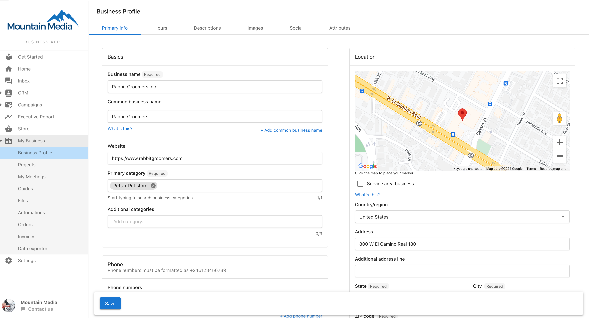

The Business profile page is an important component of a business's digital presence. It allows you and your clients to update all of their relevant business information such as hours, location, and phone number, and keep that information in sync across the platform, and the web.

**How do I access the Business Profile Page?**

Once your clients log in to their Business App account, they can access this page easily by going to **My Business > Business Profile.**

**Business Profile stays in sync across products.**

The Business Profile is also accessible from other products if they are active on the account, and editing the profile in one place will update it everywhere.

- Local SEO
- Reputation Management

It's also connected to the account in Partner Center, and editing it there will keep the business profile up to date.