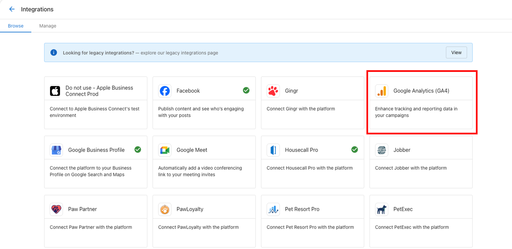
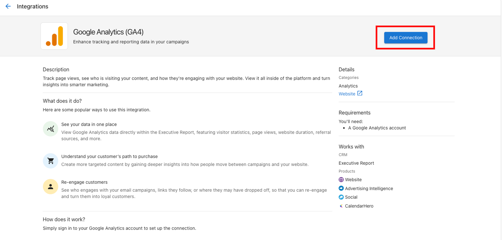

# Connecting Google Analytics in Business App

Google Analytics 4 (GA4) Properties can be connected to Website Pro through Business App.

To connect your Google Analytics account to the Business App:

- Open the Business App, and navigate to **Settings > Connections**. Click the GA4 connection card.
- The Marketing page for GA4 will open. From here, click **Add Connection** to connect.

