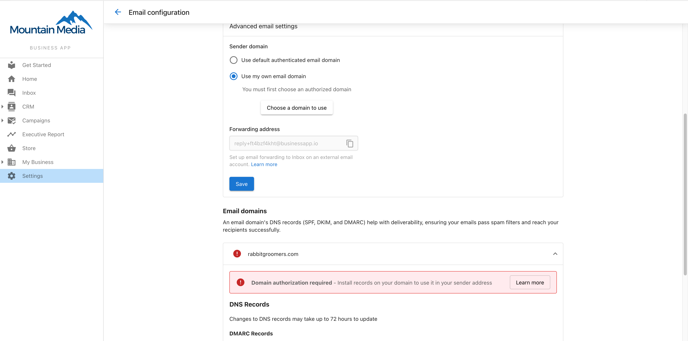

# Email Configuration in Business App

You can review SPF/DMARC/DKIM setup for your client in Business App. Open **Business App > Navigate to Settings > Email Configuration**.

- A red circle with the exclamation point next to a record indicates it has not been verified.
- A green circle with a checkmark next to a record indicates it has been verified.

