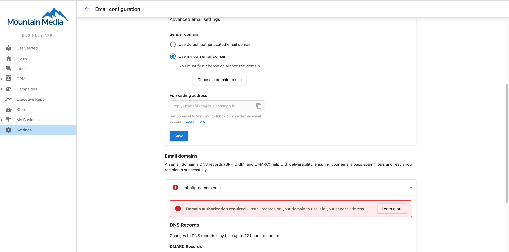
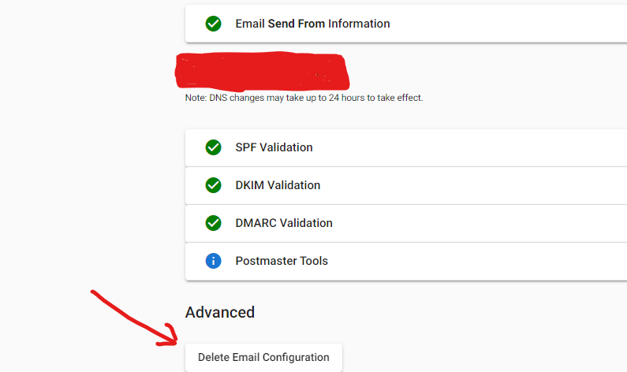
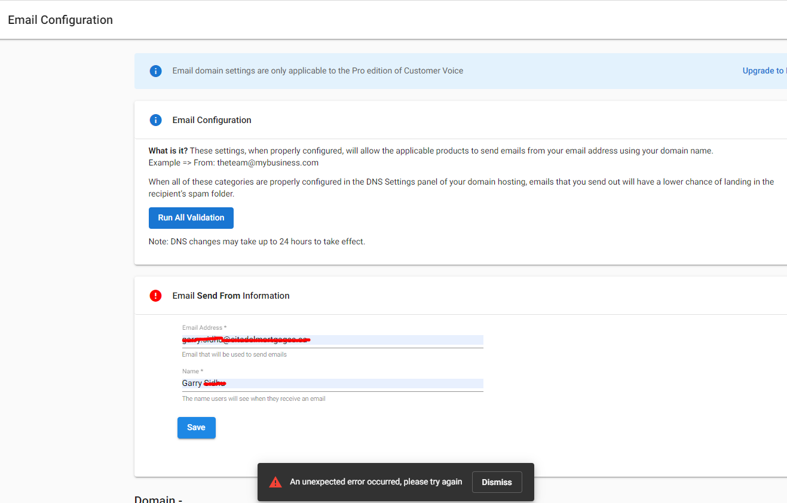
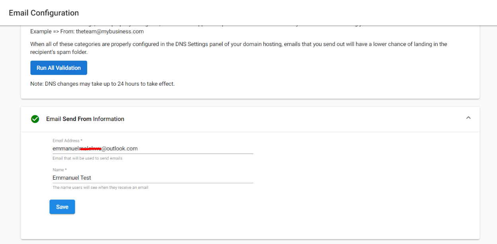

# Email Configuration in Business App

This guide covers how to manage email configuration settings in Business App, including validating send-from email addresses and reviewing SPF/DMARC/DKIM setup to prevent review requests from going to spam.

## Reviewing email configuration

You can review SPF/DMARC/DKIM setup for your client in Business App. Open **Business App > Settings > Email Configuration**.

- A red circle with the exclamation point next to a record indicates it has not been verified.
- A green circle with a checkmark next to a record indicates it has been verified.

## Managing email configuration settings

Through the Business App section **Email Configuration** under **Settings**, you can validate the send-from email address that appears in your Review Request Template, preventing your review requests from going to spam.

### Updating email send from information

To update your email configuration settings:

1. Navigate to **Business App > Settings > Email Configuration**
2. Update the email address and name as needed
3. Save your changes

### Deleting email configuration

You can delete an email configuration within the Business App by clicking on the "Delete Email configuration" button:

## Troubleshooting

### Common error: "An unexpected error occurred, please try again"

If you receive the error message "an unexpected error occurred, please try again" when trying to update your 'Email Send from Information':

**Solution**: This error typically occurs when you impersonate a user or open the Business App directly from Partner Center.

To resolve this:
1. Ensure the Business App user logs into the Business App directly (not through impersonation)
2. Then update their email address and name

A successful update will look like this:

