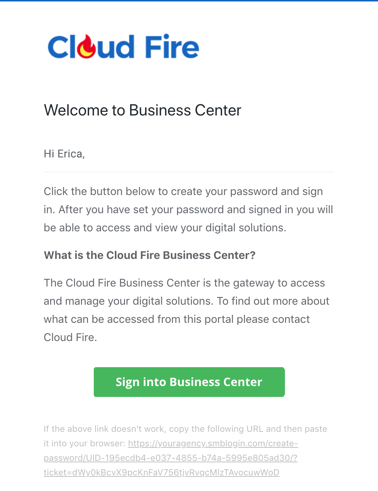
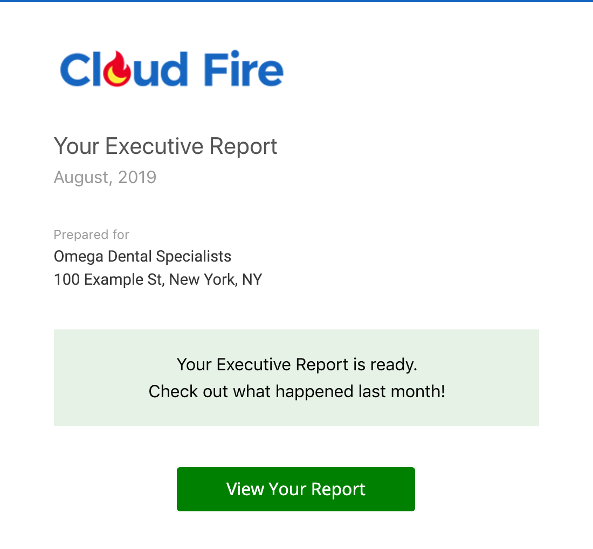

## What is Email Configuration & Notifications Management?

Email Configuration & Notifications Management encompasses all email-related settings and features within Business App, including domain verification, email deliverability setup, and comprehensive notification management. This system ensures your review requests and business communications don't go to spam folders while providing customers with timely updates about their services, orders, and business activities.

## Why is Email Configuration & Notifications Management Important?

Proper email configuration is critical for business communications and customer engagement. Without correct setup, your important emails may be marked as spam or rejected entirely. Email notifications keep customers informed and engaged with your services. Key benefits include:

- **Improved deliverability** - Proper SPF/DMARC/DKIM setup prevents emails from going to spam
- **Professional communication** - Branded emails maintain your business image
- **Customer engagement** - Timely notifications keep customers informed and responsive
- **Automated workflows** - Notifications trigger based on business activities and milestones
- **Compliance** - Proper email authentication meets industry standards
- **Trust building** - Consistent, professional email communication builds customer confidence

## What You Can Do with Email Configuration & Notifications Management

### Email Configuration Features
- Validate and verify email domain settings
- Configure SPF, DMARC, and DKIM records for authentication
- Set up send-from email addresses for review requests
- Troubleshoot email deliverability issues
- Manage email domain verification status

### Email Notifications Capabilities
- Send instant notifications for immediate events
- Provide daily digest summaries of business activities
- Customize notification preferences by event type
- Send branded emails with your company information
- Automate customer communication workflows
- Track email delivery and engagement

## How to Set Up Email Configuration & Notifications Management

### How to Configure Email Domain Verification

1. **Access Email Configuration Settings**
   - Navigate to **Business App > Settings > Email Configuration**
   - Review current verification status for your domain records

2. **Check Verification Status**
   - **Red circle with exclamation point** = Record not verified
   - **Green circle with checkmark** = Record successfully verified

3. **Verify Your Domain Records**
   - Work with your domain provider to add required DNS records
   - Configure SPF, DMARC, and DKIM records as specified
   - Allow 24-48 hours for DNS propagation
   - Return to Email Configuration to verify setup

### How to Set Up Send-From Email Information

1. **Access Business App Email Settings**
   - Navigate to **Business App > Settings > Email Configuration**

2. **Update Send-From Information**
   - **Important**: Business App user must log in directly (partners cannot impersonate)
   - Enter the email address for sending review requests
   - Add sender name information
   - Save changes

3. **Troubleshoot Update Issues**
   - If you receive "unexpected error occurred" message:
   - Ensure user is logged in directly to Business App
   - Do not access through Partner Center impersonation
   - User must update their own email address and name

4. **Delete Email Configuration** (if needed)
   - Click "Delete Email configuration" button
   - Confirm deletion when prompted

### How to Manage Email Notifications

#### Understanding Notification Types

**Instant Email Notifications** are sent immediately when events occur:
- Business App: Activation, File Upload, Inbox Messages
- Reputation AI: Reviews, Review Responses, Review Response Approval
- Social Marketing: Customer Posts, Leads, Post Notices, Social Calendar
- Website Pro: Domain Status, Order Notifications, WordPress Mail

**Daily Digest Emails** provide summaries of previous day activities:
- Business App: File Uploads, Inbox Messages
- Reputation AI: Reviews, Listings, Mentions
- Social Marketing: Agent Posts, Customer Posts, Leads, Post Notices
- Advertising Intelligence: Account Connections, Campaign Status
- Website Pro: Domain Status, Order Notifications, WordPress Mail

#### Notification Configuration

1. **Partner Center Configuration**
   - Channel Partners control default notification settings for customers
   - Configure which notifications are enabled by default
   - Set up notification preferences for new accounts

2. **Business App User Configuration**
   - Users can modify their notifications in **Business App > Settings > Notification Settings**
   - Choose between instant notifications and daily digest
   - Enable or disable specific notification types
   - Customize notification frequency preferences

## Email Notification Examples

### Business App Notifications

#### Welcome Messages
- **New User Creation Welcome**: Sent when creating Business App users with personalized message
- **New User Welcome Campaign**: Automated onboarding campaign for first-time logins
- **Subject Examples**: "Welcome [First Name] to the [Company Name] Business App"

#### Executive Report Emails
- **Monthly Reports**: Comprehensive business performance summaries
- **Weekly Reports**: Shorter performance updates
- **Subject Example**: "New Executive Report for [Company Name]"

#### Activity Notifications
- **Product Activation**: "Product Name Activated"
- **File Upload**: "New File Upload for Customer Name"
- **Inbox Messages**: "New Inbox Message from Sender Name, Company Name"

### Reputation AI Notifications

#### Review Notifications
- **New Reviews**: "New Review for Customer Name on Review Site"
- **Review Responses**: "New Review Response for Customer Name on Review Site"
- **Review Approval**: "Review Response Approval for Customer Name on Review Site"

### Social Marketing Notifications

#### Social Media Activities
- **Post Published**: "Social Post Published for Customer Name"
- **Post Failed**: "Social Post Failed for Customer Name"
- **Post Approval**: "Social Post Approval for Customer Name"

### Advertising Intelligence Notifications

#### Campaign Management
- **Budget Updates**: "Budget Update for Customer Name"
- **Connection Status**: "Connection Status Update for Customer Name"
- **Performance Reports**: "Weekly/Monthly Ad Performance Report for Customer Name"

### Task Management Notifications

#### Task Activities
- **Task Assigned**: "New Task Assigned from Assigner Name, Company Name"
- **Task Updated**: "Task Updated from Updater Name, Company Name"
- **Task Completed**: "Task Completed from Completer Name, Company Name"

## Advanced Email Configuration

### SPF/DMARC/DKIM Setup Best Practices
- Work with your IT team or domain provider for DNS record configuration
- Allow adequate time for DNS propagation (24-48 hours)
- Test email deliverability after configuration
- Monitor verification status regularly
- Update records when changing email providers

### Email Deliverability Optimization
- Use verified domains for all business communications
- Maintain consistent sender information
- Monitor spam complaint rates
- Follow email authentication best practices
- Regular review of email performance metrics

## Frequently Asked Questions

Why can't I update my 'Email Send from Information'?

When you impersonate a user or open Business App directly from Partner Center, you get an error when updating "Email Send from Information." To solve this, ensure the Business App user logs into Business App directly, then updates their email address and name.

Can I delete an email configuration?

Yes, you can delete an email configuration within Business App by clicking the "Delete Email configuration" button in the email settings.

How long does it take for DNS records to propagate?

DNS record changes typically take 24-48 hours to fully propagate. During this time, verification status may show as pending or unverified.

What's the difference between instant emails and daily digest?

Instant emails are sent immediately when events occur, while daily digest emails provide a summary of all previous day's activities. Users likely won't receive emails as long as the full digest example, as digests usually only include 1-2 relevant sections.

Can customers control which notifications they receive?

Yes, Business App users can modify their notification preferences by navigating to **Settings > Notification Settings**. They can choose between instant notifications, daily digest, or disable specific notification types.

Who controls the default notification settings?

Channel Partners control what Business App email notifications are enabled by default for their customers. Individual customers can then modify these settings in their Business App.

What should I do if my emails are going to spam?

Ensure your SPF, DMARC, and DKIM records are properly configured and verified. Check the Email Configuration page for red exclamation points indicating unverified records. Work with your domain provider to correct any DNS record issues.

How do I know if my email domain is properly verified?

In Business App, navigate to **Settings > Email Configuration**. Green circles with checkmarks indicate verified records, while red circles with exclamation points indicate unverified records that need attention.

Can I customize the content of email notifications?

Email notifications are automatically generated with your company branding and custom product names. The specific content is determined by the event type and includes relevant business information.

What happens if I don't configure email authentication?

Without proper SPF/DMARC/DKIM setup, your business emails may be marked as spam or rejected by recipient email servers, significantly reducing the effectiveness of your customer communications and review requests.

## Screenshots

<!-- Daily Digest Example image placeholder -->
