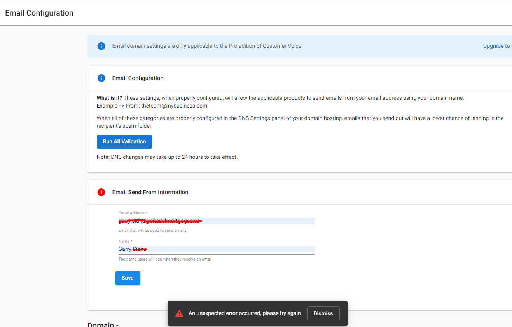
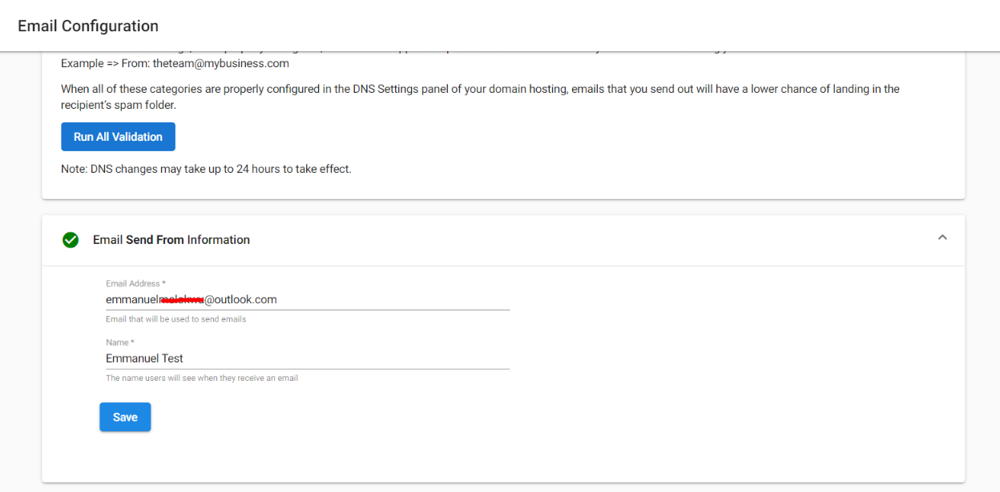
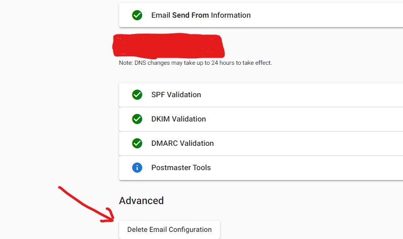

# Managing Email Configuration Settings in Business App

Through the Business App section **Email Configuration** under **Settings**, you can validate the send-from email address that appears in your Review Request Template here, preventing your review requests from going to spam.

For instructions on how to verify an email domain, please see the article [Update Email Settings](https://support.vendasta.com/hc/en-us/articles/4406951758871).

## FAQs

### Question 1
I keep receiving the error message "an unexpected error occurred, please try again". Why can't I update my 'Email Send from Information'?

**Answer**: When you impersonate a user or open the Business App directly from Partner Center, you get the above error when updating the "Email Send from Information".

To solve this, ensure the Business App user logs into the Business App directly, then updates their email address and name.

A successful update will look like this:

### Question 2
Can I delete an Email configuration?

**Answer**: Yes, you can delete an email configuration within the Business App by clicking on the "Delete Email configuration" button:

