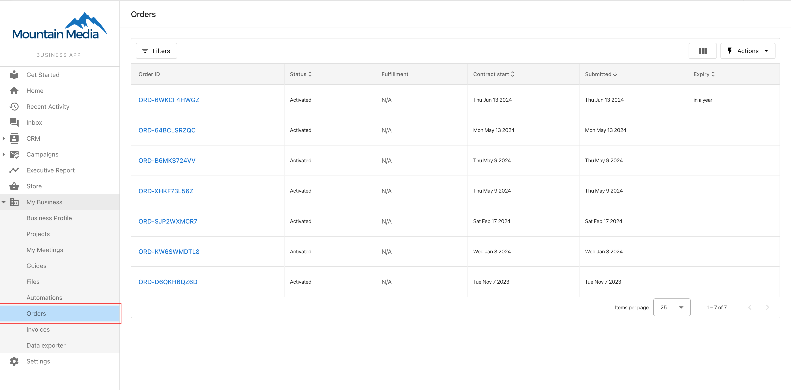
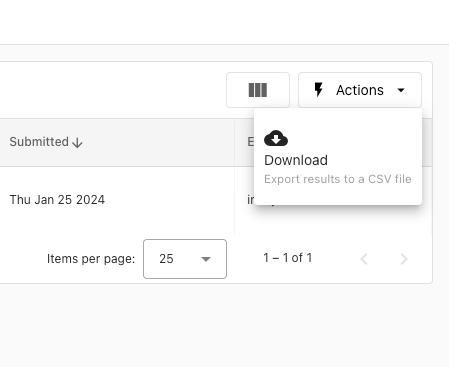
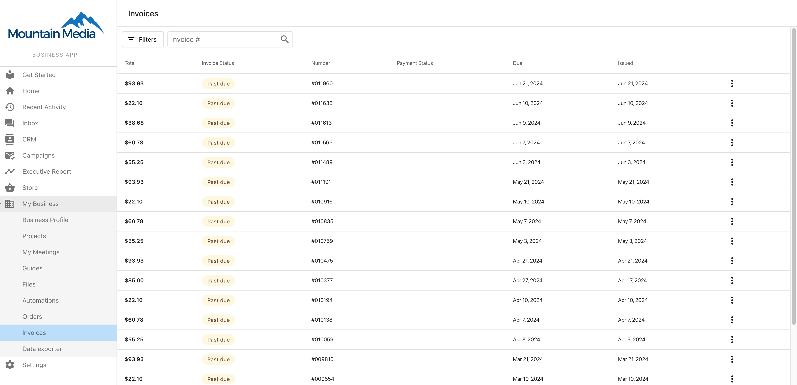
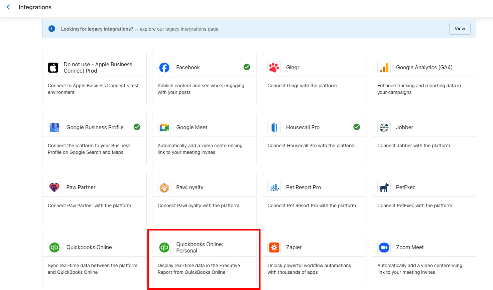
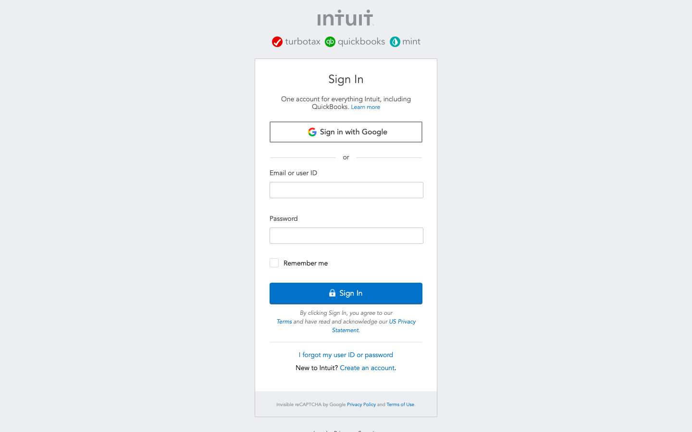
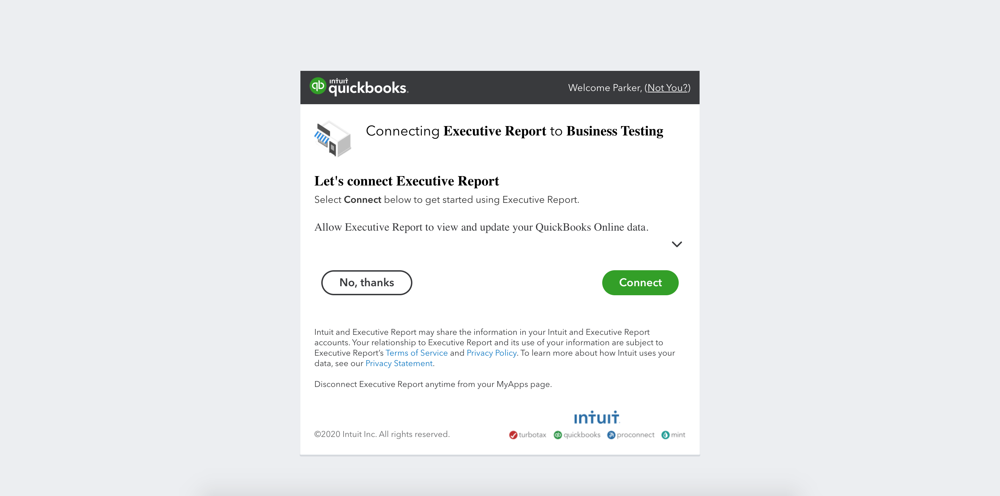
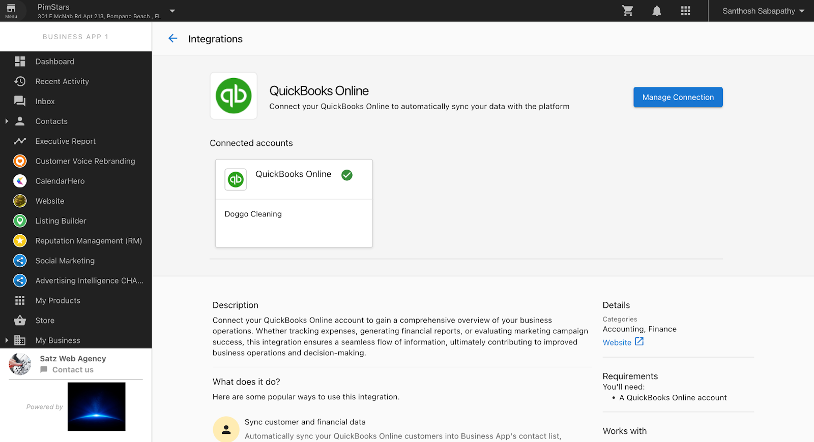

## What is Financial Management & Client Billing?

Financial Management & Client Billing provides comprehensive tools for managing all financial aspects of your client relationships through Business App. This system enables clients to view their orders, access and pay invoices, manage payment methods, and integrate with QuickBooks for seamless financial operations. These features create transparency in billing, reduce administrative overhead, and provide clients with self-service options for their financial interactions.

## Why is Financial Management & Client Billing Important?

Effective financial management tools are essential for maintaining healthy client relationships and streamlining business operations. These features provide transparency, reduce support requests, and enable automated financial workflows. Key benefits include:

- **Transparency and trust** - Clients can view all orders, contracts, and billing information
- **Reduced administrative burden** - Self-service options decrease back-and-forth communication
- **Improved cash flow** - Easy payment options encourage faster invoice payment
- **Better record keeping** - Centralized financial information for both partners and clients
- **Professional presentation** - Branded invoices and organized financial interface
- **Integration efficiency** - QuickBooks connection eliminates duplicate data entry

## What You Can Do with Financial Management & Client Billing

### Order Management Features
- View complete order history and details
- Access contract start and expiration dates
- Download CSV exports of order information
- Track order status and billing information
- Review product and service details

### Invoice Management Capabilities
- View all invoices in one centralized location
- Download invoice PDFs for record keeping
- Pay invoices directly through Business App (with Vendasta Payments)
- View payment receipts and transaction history
- Access invoice details and line items

### Payment Method Management
- Add and manage credit card payment methods
- Update payment information as needed
- Secure payment processing through integrated systems
- Multiple payment method support

### QuickBooks Integration Benefits
- Seamless connection to existing QuickBooks accounts
- Automatic data synchronization between systems
- Executive Report integration with financial data
- Streamlined accounting workflow

## How to Set Up Financial Management & Client Billing

### How to Access and Use Order Management

1. **Access Orders Interface**
   - Log in to Business App
   - Navigate to **Orders** section
   - View complete list of orders and services

2. **Review Order Details**
   - Click on any order to view detailed information
   - See contract start and expiration dates
   - Review product specifications and pricing
   - Access order status and billing information

3. **Export Order Information**
   - Click **Download CSV** option
   - Export order details for external record keeping
   - Use CSV data for accounting or reporting purposes
   - Maintain offline records of order history

### How to Manage Invoices

1. **Access Invoice Interface**
   - Navigate to **Business App > Invoices** tab
   - View all available invoices in chronological order
   - See invoice status (paid, unpaid, overdue)

2. **View Invoice Details**
   - Click on any invoice to see detailed breakdown
   - Review line items, taxes, and total amounts
   - Check payment due dates and terms
   - Access invoice history and notes

3. **Download Invoices**
   - Click the **three-dot menu (⋮)** next to any invoice
   - Select **Download Invoice** option
   - Save PDF copy for your records
   - Print invoices if needed for offline filing

4. **Pay Invoices** (with Vendasta Payments)
   - Click on unpaid invoice to access payment interface
   - Enter credit card information securely
   - Process payment directly through Business App
   - Receive payment confirmation and receipt

5. **View Payment Receipts**
   - Click the **three-dot menu (⋮)** next to paid invoices
   - Select **View Receipt** option
   - Access payment confirmation details
   - Download receipt for accounting purposes

### How to Manage Payment Methods

1. **Access Payment Settings**
   - Navigate to **Business App > Settings > Billing Settings**
   - Click **Add Payment Method** to add new payment options

2. **Add Credit Card Information**
   - Enter credit card details securely
   - Provide billing address information
   - Verify and save payment method
   - Set as default payment method if desired

3. **Update Payment Methods**
   - Access existing payment methods in billing settings
   - Update expiration dates, billing addresses, or card numbers
   - Remove outdated or unused payment methods
   - Manage multiple payment methods as needed

### How to Set Up QuickBooks Integration

1. **Navigate to QuickBooks Connection**
   - Go to **Business App > Settings > Connections**
   - Find QuickBooks connection card under **Browse** tab
   - Click on card to begin connection process

2. **Connect QuickBooks Account**
   - Click **Connect** button on QuickBooks marketing page
   - Complete pre-connect form with business information
   - Enter QuickBooks credentials on sign-in page
   - Grant permission for Business App to connect

3. **Manage QuickBooks Connection**
   - View connection status in **Manage** tab
   - Access QuickBooks Online directly from Business App navigation
   - Monitor data synchronization between systems
   - Troubleshoot connection issues if needed

**Important Requirements**:
- User must log in to Business App directly (cannot be impersonated)
- Only the connecting user can see and interact with QuickBooks data
- QuickBooks Online subscription required
- Proper permissions needed for data sharing

## Advanced Financial Management Features

### Order Management Best Practices
- **Regular Review**: Encourage clients to review orders periodically
- **Contract Awareness**: Help clients understand contract terms and renewal dates
- **Data Export**: Use CSV exports for integration with client accounting systems
- **Status Monitoring**: Track order fulfillment and delivery status

### Invoice Management Optimization
- **Timely Payment**: Set up automated reminders for invoice due dates
- **Payment Terms**: Clearly communicate payment terms and methods
- **Record Keeping**: Maintain organized invoice and receipt records
- **Dispute Resolution**: Use detailed invoice information to resolve billing questions

### Payment Method Security
- **Secure Storage**: Payment information encrypted and stored securely
- **Regular Updates**: Keep payment methods current to avoid processing issues
- **Multiple Options**: Maintain backup payment methods for reliability
- **Fraud Protection**: Monitor for unauthorized payment attempts

### QuickBooks Integration Benefits
- **Data Consistency**: Eliminates duplicate data entry between systems
- **Real-time Sync**: Financial information updates automatically
- **Reporting Enhancement**: Executive Report includes QuickBooks financial data
- **Workflow Efficiency**: Streamlined accounting and bookkeeping processes

## Troubleshooting Common Issues

### Order Management Issues
- **Missing Orders**: Verify user permissions and account access
- **Incorrect Dates**: Check contract terms and renewal settings
- **CSV Export Problems**: Ensure proper browser settings for downloads

### Invoice Payment Problems
- **Payment Processing Errors**: Verify payment method information and account status
- **Receipt Access**: Check email settings and spam folders for receipts
- **Invoice Disputes**: Use detailed invoice breakdown to resolve questions

### QuickBooks Connection Issues
- **Authorization Problems**: Re-authorize connection with current credentials
- **Data Sync Delays**: Allow time for synchronization between systems
- **Permission Errors**: Ensure QuickBooks user has appropriate access levels

## Frequently Asked Questions

Can clients pay invoices without Vendasta Payments?

The ability to pay invoices directly through Business App requires Vendasta Payments to be set up. Without Vendasta Payments, clients can view and download invoices but cannot process payments through the Business App interface.

Who can connect QuickBooks to Business App?

Only the actual Business App user can connect their QuickBooks account. Partners cannot impersonate users to complete this connection. Additionally, only the user who connects QuickBooks will be able to see and interact with the QuickBooks data.

How do clients add their credit card details?

Clients can add credit card information by navigating to **Business App > Settings > Billing Settings > Add Payment Method**. The payment information is stored securely and can be used for invoice payments.

Can clients download their order history?

Yes, clients can download a CSV file containing their order details by clicking the **Download CSV** option in the Orders section. This provides a complete export of their order history.

What information is included in invoice details?

Invoice details include line items, product descriptions, quantities, pricing, taxes, payment terms, due dates, and total amounts. Clients can also access payment history and receipt information.

How often does QuickBooks data sync with Business App?

QuickBooks data synchronization typically occurs in real-time or within a few minutes of updates. The exact timing depends on the type of data and QuickBooks API limitations.

Can clients set up automatic payments for invoices?

Automatic payment setup depends on your Vendasta Payments configuration. Contact your account representative to discuss recurring payment options and automatic billing features.

What should clients do if they can't access their invoices?

If clients cannot access invoices, verify their Business App login credentials and account permissions. Ensure invoices have been generated and sent to the correct Business App account. Contact support if access issues persist.

How do clients update their billing information?

Clients can update billing information by accessing **Settings > Billing Settings** in Business App. They can modify payment methods, billing addresses, and other financial details as needed.

What happens if a QuickBooks connection is lost?

If the QuickBooks connection is disrupted, clients will need to re-authorize the connection through the Connections page. Data synchronization will resume once the connection is re-established.

## Screenshots

