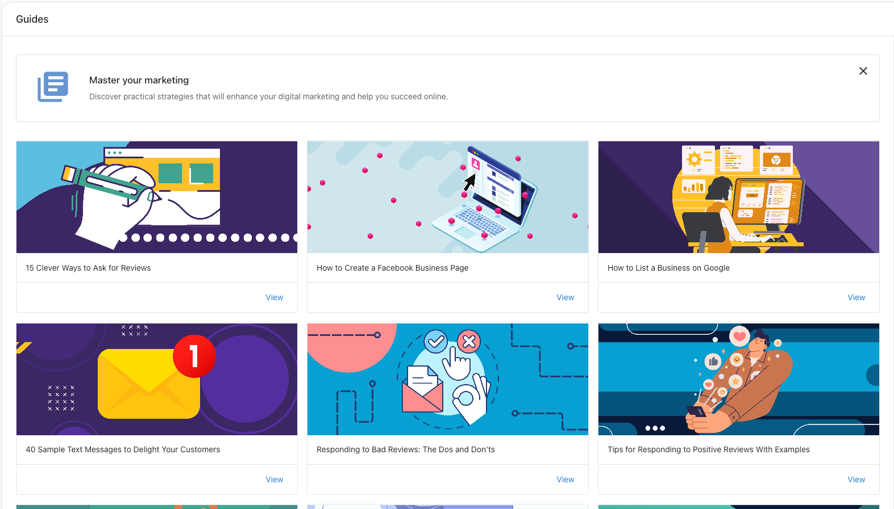
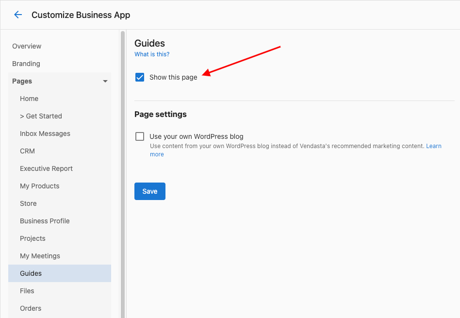

# Guides in Business App

**Guides**

Business App users can use the **Guides** tab in Business App to explore a number of guides that walk them through areas to focus on, how to sell, and how to manage their online presence.

**Where can I find Guides in Business App?**  
You can access Guides by navigating to **Business App > Administration > Guides.**

To make sure it is enabled for Business App users to see in their dashboard, navigate to **Partner Center > Administration > Customize Business App > Guides > Check off 'Show this page.' > Save.**

