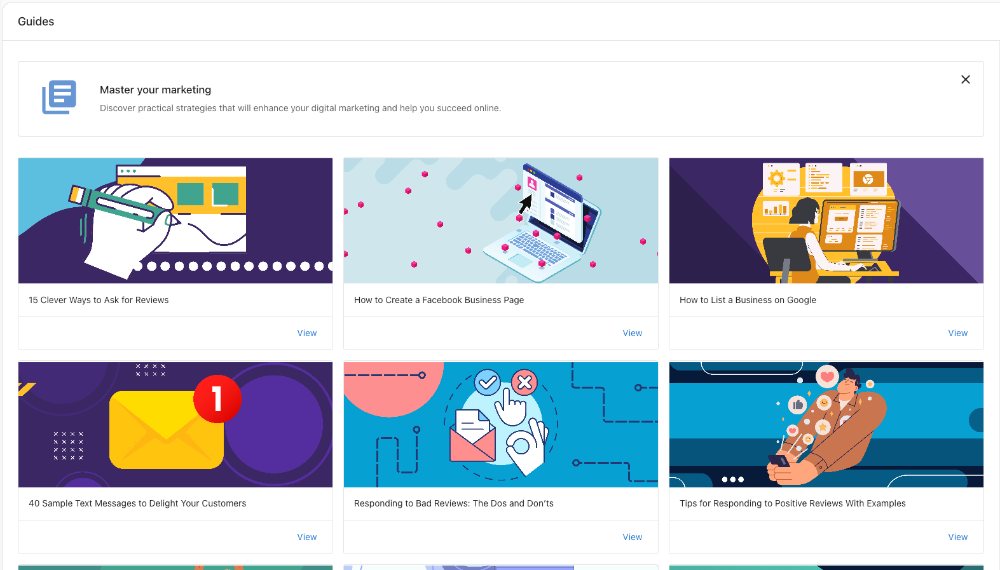
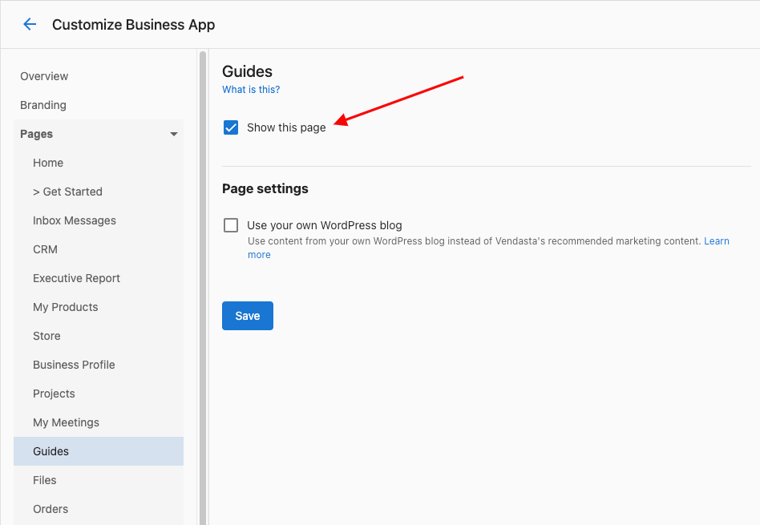

# Guides in Business App

## Overview

**Guides** in Business App provide users with curated, easy-to-follow resources that help them understand where to focus, how to improve their digital presence, and which strategies support business growth. These guides cover topics such as online reputation, social media, SEO, listings, customer communication, and more.

---

## Accessing Guides in Business App

Business App users can find Guides by navigating to:

**Business App → Administration → Guides**

From here, users can browse all available guides and open any topic for step-by-step instructions.

---

## Enabling Guides for Your Business App Users

Partners must enable the **Guides** tab for their Business App users.

1. Go to **Partner Center**  
2. Navigate to **Administration → Customize Business App**  
3. Select **Guides**  
4. Check **Show this page**  
5. Click **Save**

