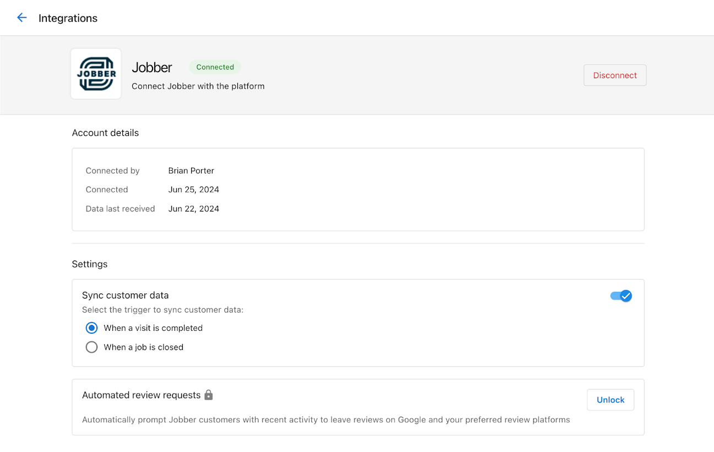
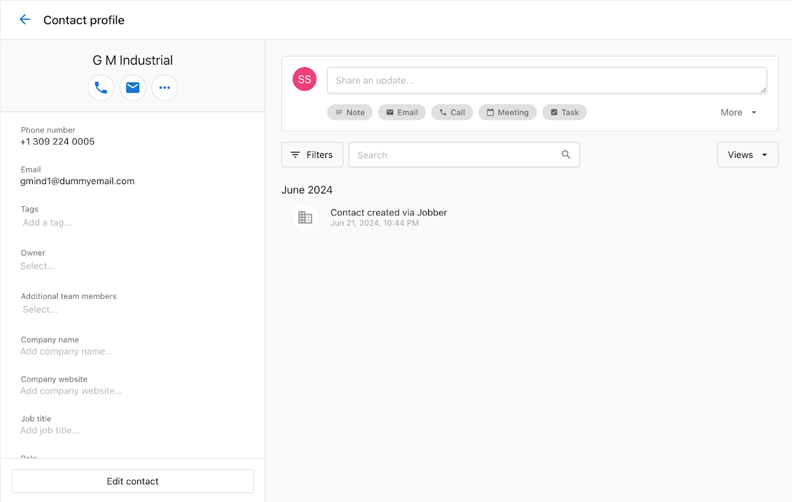

Integrations in Business App unlock data sharing, reporting, and automation between Business App and external systems.

Business App supports multiple integration types (direct, API key, SSO, and vendor-managed). Browse and connect from **Administration > Integrations**. Use the **Browse** and **Manage** tabs to add and manage integrations.

### Benefits

- Unified analytics across Executive Report and Marketing Funnel
- Automated workflows such as review requests and contact sync
- Enhanced features in Reputation AI, Local SEO, Social Marketing, and Website Pro

## Using Integrations to automate workflows

Many integrations can be used to automate workflows, such as review requests. To enable this, you need to enable Data Sync and select trigger events.

1. Ensure the integration is connected (see **Integrations > Manage**).
2. Open the integration settings to enable Data Sync and select the trigger events from your integration.
3. Optionally, you can enable Automated Review Requests to trigger review requests when the trigger events occur.

:::note Automated Review Requests
Note: Automated Review Requests require a Reputation AI Premium subscription.
:::

import Tabs from '@theme/Tabs';
import TabItem from '@theme/TabItem';

### Examples by integration

Trigger names and availability vary by integration. Review and select events in the integration's settings when enabling Data Sync.

<Tabs>
<TabItem value="jobber" label="Jobber">

<ul>
  <li>Visit is completed</li>
  <li>Job is completed</li>
</ul>

</TabItem>

<TabItem value="clio" label="Clio">

You can influence whether contacts sync when a matter is closed via custom fields.

**Closed Matter (Opt Out) — Contact custom field:**
- Field Name: SyncOptOut
- Type: Checkbox
- Default: Checked

**Closed Matter (Opt In) — Matter custom field:**
- Field Name: SyncOptIn
- Type: Checkbox
- Default: Checked

</TabItem>
</Tabs>

## FAQ

  
What permissions are required to connect?

  

    The connecting user must have access to the third-party account being linked.
  

  
Why can’t I connect on behalf of my client?

  

    For security and compliance, users must authenticate directly to third-party services. Some integrations may allow multiple users to authenticate an integration, but it still involves the user authenticating to the third-party service.
  

  
How do I reauthorize an expired connection?

  

    Open the integration from <em>Integrations &gt; Manage</em> and follow the reconnect prompts.
  

  
Do I need a specific subscription for automated review requests?

  

    Yes. Reputation AI Premium is required to enable automated review requests.
  

  
How do I verify that data synced?

  

    Check the integration’s Manage tab for recent activity and confirm updates in Business App objects.
  

  
What triggers are supported?

  

    Triggers vary by integration. Use the integration settings to review available events.
  

