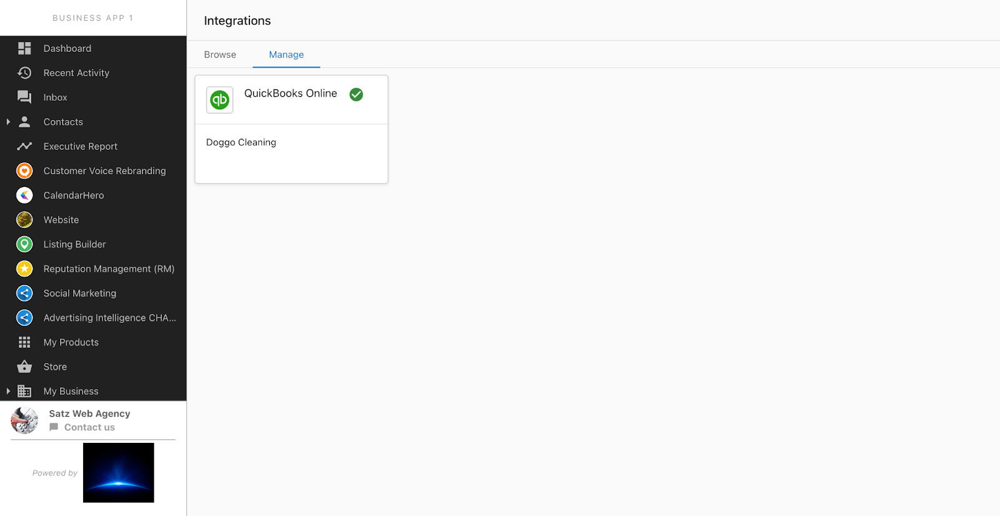

Connect an existing QuickBooks company to Business App and surface accounting insights in reporting.

:::info Choosing the right QuickBooks connection
There are two connection options:
- Select **QuickBooks Online** to sync contacts and certain financial details, automate review requests from invoiced customers, communicate via Business App, and build campaigns using financial insights.
 - Select **QuickBooks Online: Personal** to display a high-level financial summary in the Executive Report only. There is no contact sync or automations available from this connection.
:::
## Connect QuickBooks

1. Open Business App and go to **Settings > Integrations > Browse**.
2. Select the appropriate **QuickBooks** card.
3. Click **Connect** and complete any pre-connect form if shown.
4. Sign in to QuickBooks and approve permissions.

## Manage the integration

Use the **Manage** tab on the Integrations page to view status and open settings.

When connected, you’ll see the established connection with options to reauthorize or disconnect.

## FAQ

  
Can partners impersonate a user to connect?

  

    No. The end user must log in and complete the connection.
  

  
Who can see QuickBooks data after connecting?

  

    Only the user who connected their QuickBooks company sees and interacts with the data synced to Business App.
  

  
How do I reauthorize an expired connection?

  

    Open the QuickBooks integration from <em>Integrations &gt; Manage</em> and follow the prompts to reconnect.
  

