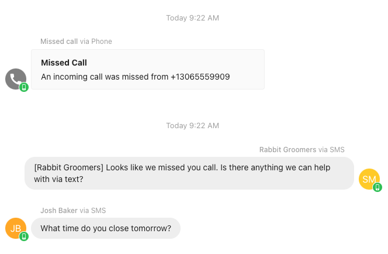
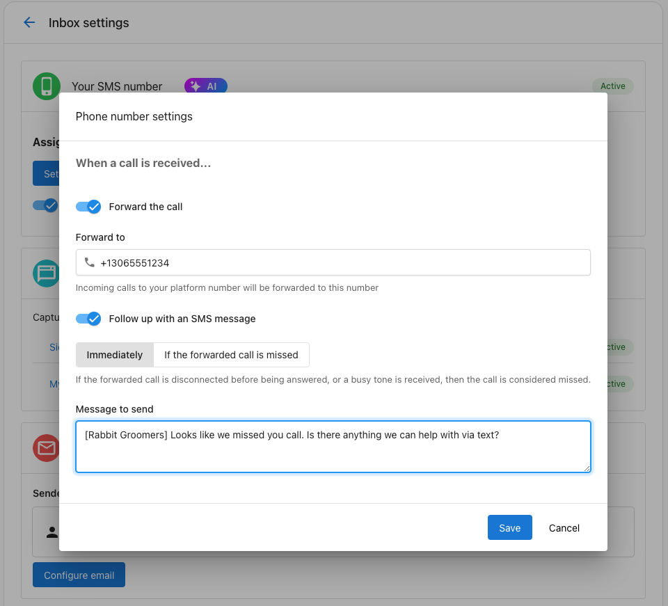

# Missed-Call Text Back

## Overview

The missed-call text back feature in Inbox ensures that your business can promptly respond to incoming calls, even when they go unanswered. Whether a call is missed because the line is busy, or the caller hangs up before it is answered, this feature allows you to send an automatic text message to the caller. Alternatively, businesses can choose to send a text to all callers immediately.

This functionality helps businesses maintain strong communication with their customers, reduce the chances of losing leads to competitors, and ensure a positive customer experience.

  

## Benefits

- **Instant Communication**: Ensures customers receive a response within seconds, even after hours or during busy times.
- **Improved Customer Experience**: Demonstrates responsiveness, increasing customer satisfaction.
- **AI Integration**: If enabled, AI can respond to the customer's text, answering questions and providing value immediately.

## How to Enable Missed-Call Text Back

1. **Access Settings**
   - Navigate to **Business App > Administration > Inbox Settings > Phone & SMS > Settings**.

2. **Enable Call Forwarding** 
   - If not already configured, set up call forwarding to redirect unanswered calls to another number.

3. **Activate Text Back Messages**
   - In the settings menu, enable the **"Follow up with an SMS message"** option.

4. **Configure Text Back Preferences**
   - Choose when to send text messages:
     - **For all calls**: A text message is sent immediately whenever a call is made to your Inbox number.
     - **For missed calls only**: A text message is sent only when a call is deemed unanswered.

5. **Customize Your Text Message**
   - Craft a professional and concise message. Include:
     - Your business name.
     - Any relevant follow-up information.
     - An opt-out option if required by your region's regulations (e.g., "Reply STOP to opt out").

6. **Enable AI Responses** 
   - Turn on AI functionality to allow automated replies to customer responses. This ensures customers receive immediate assistance, even through text.

  

**Example Text Back Message** "Hi, this is [Your Business Name]. We noticed you tried to call us but couldn't reach us. How can we assist you? Reply to this message, and we'll get back to you shortly. Reply STOP to opt out."

## Why Use Missed-Call Text Back?

- **Quick Responses**: Keeps your business top-of-mind for customers by responding instantly, reducing the likelihood of them reaching out to competitors.
- **Enhanced Productivity**: AI-driven replies can handle common inquiries, saving your team time.
- **Improved Customer Retention**: A responsive approach builds trust and loyalty among your customers.

Enable the missed-call text back feature today to ensure no customer inquiry goes unanswered, and your business remains the most responsive option for your audience.