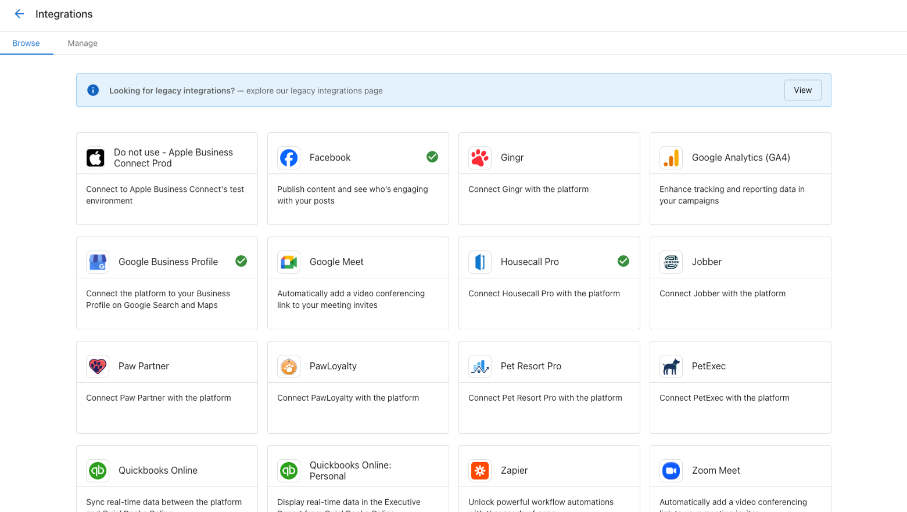
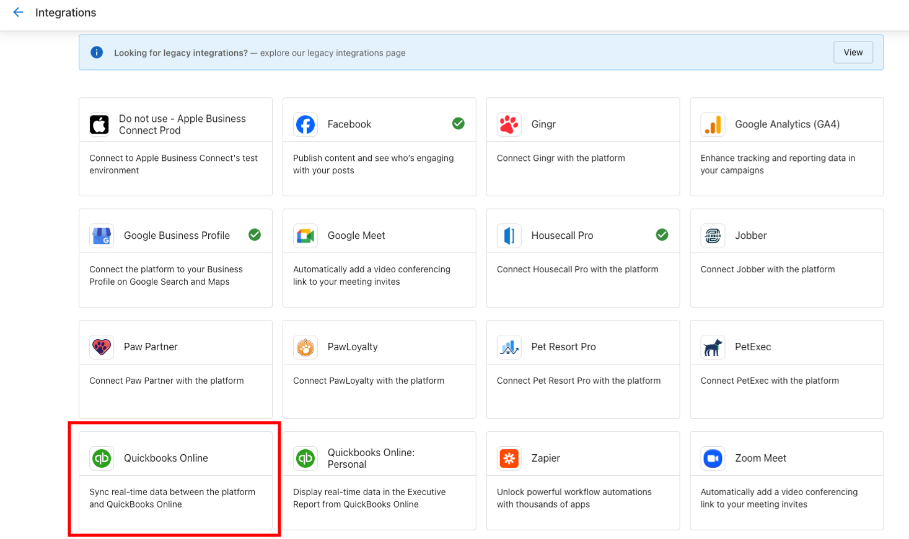
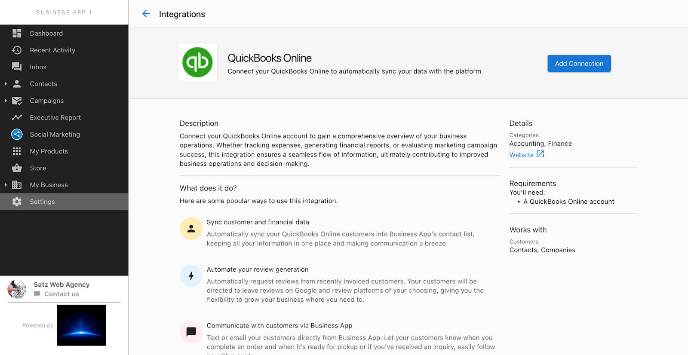
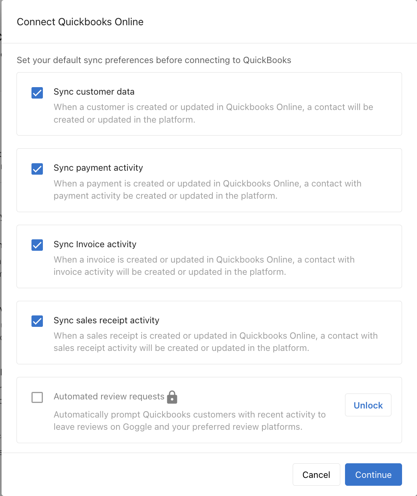
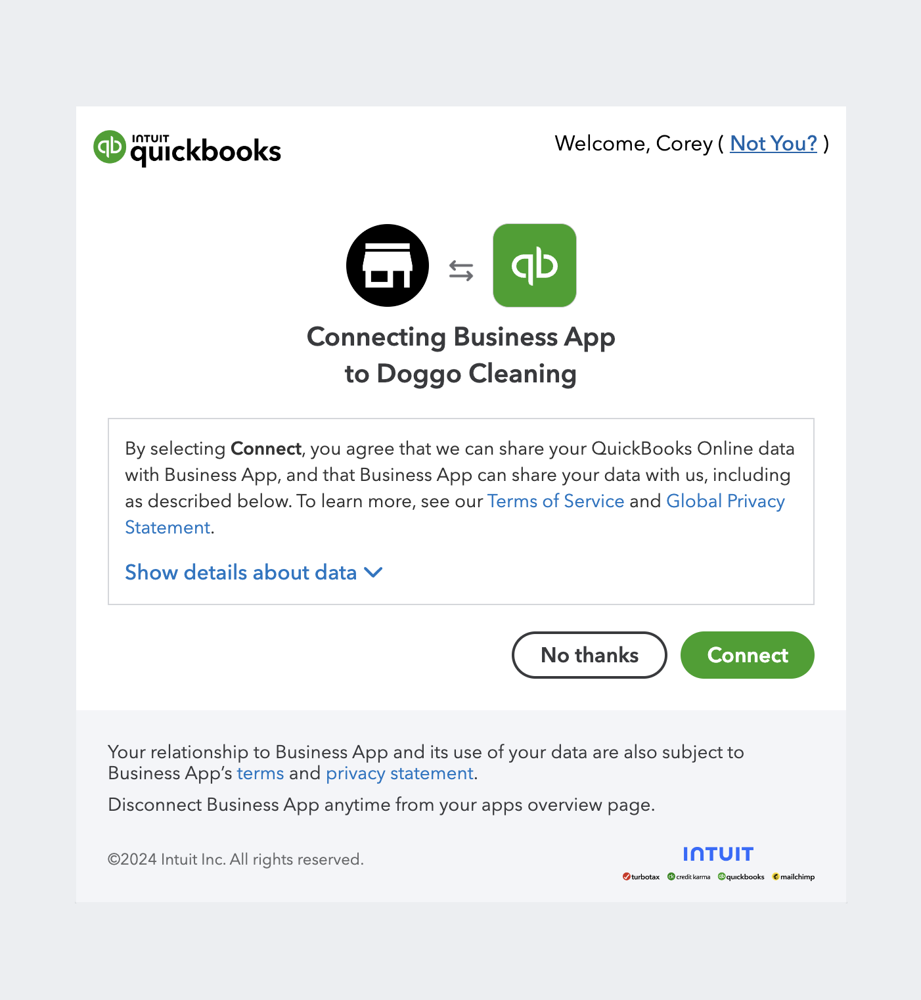
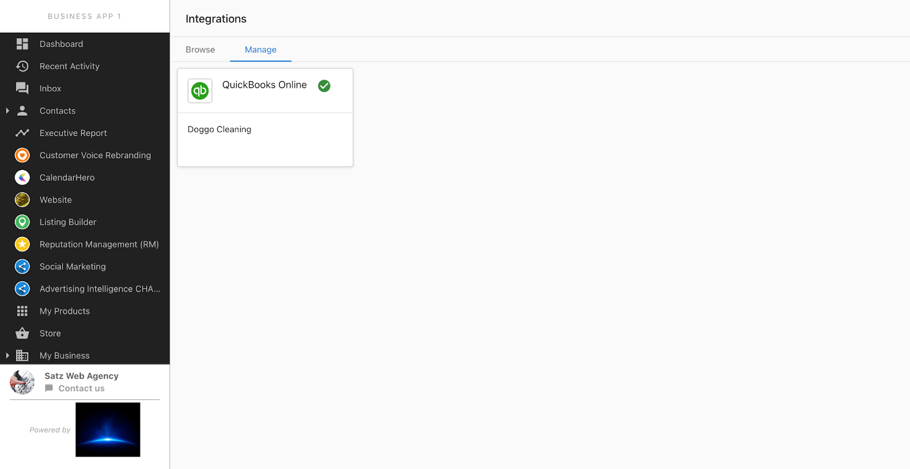
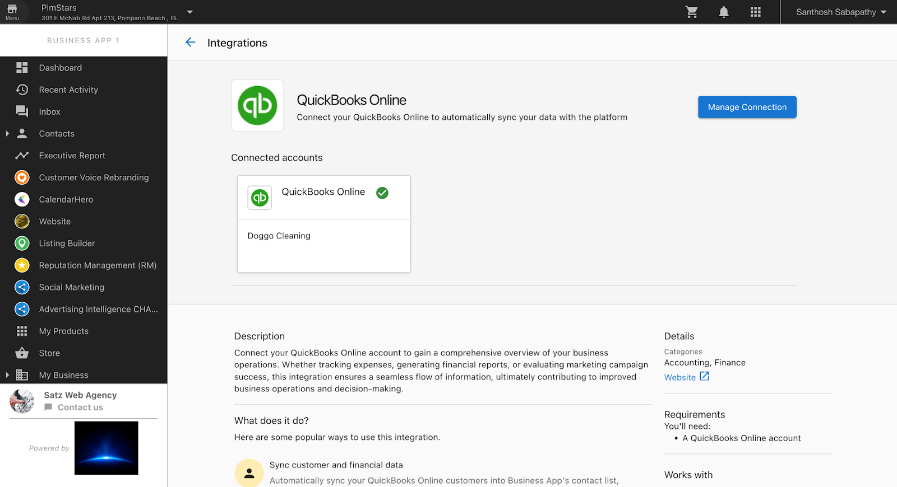

# QuickBooks Integration

The QuickBooks integration allows your client to connect their QuickBooks company to your application. Your client connects their QuickBooks company by using the Connect account button in the Connect your account widget. Your client can use this integration to:

- Connect an existing QuickBooks company to your application
- Create a new QuickBooks company and connect it to your application

## How to navigate to the QuickBooks integration

To connect to a QuickBooks company, your client needs to navigate to the Business App in the following path:

1. In the Business App, select the **Browse** tab

2. Navigate to the **QuickBooks** integration card 

3. Click **Learn more** to open the marketing page

## How to connect to QuickBooks

Once your client is on the marketing page, they can connect to their QuickBooks company by following these steps:

1. Click on **Connect**

2. Fill out and submit the pre-connect form 

3. Enter QuickBooks credentials on the sign-in page

4. Allow the app to connect to QuickBooks

## How to manage the integration

Your client can manage the QuickBooks integration from the **Manage** tab:

When the connection is established, they will see this screen:

