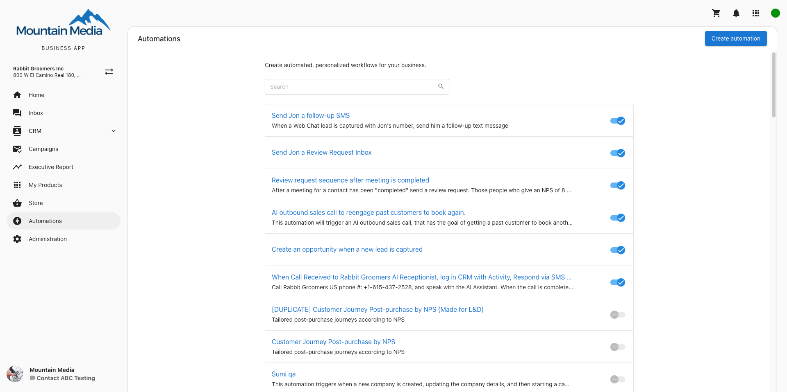
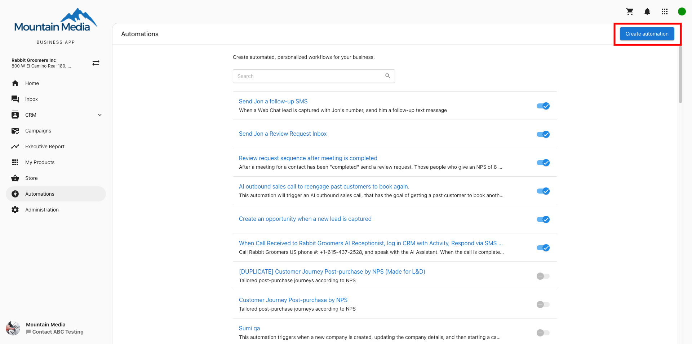
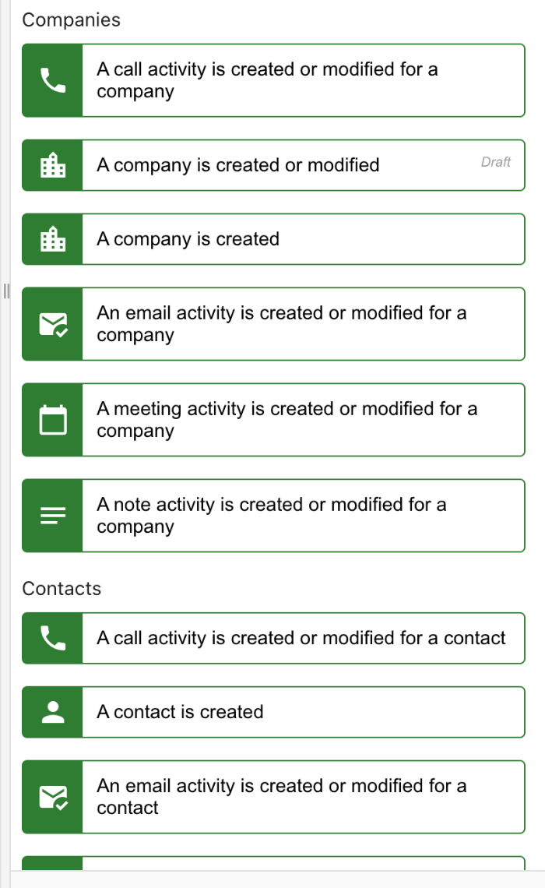
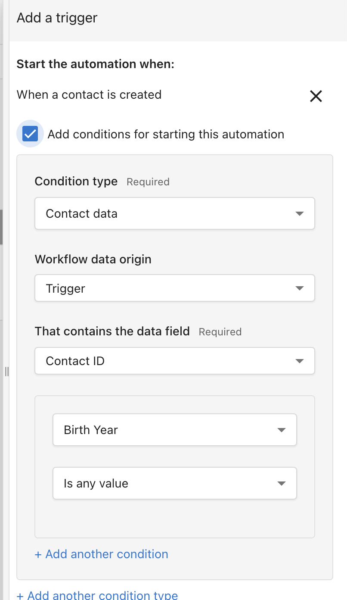
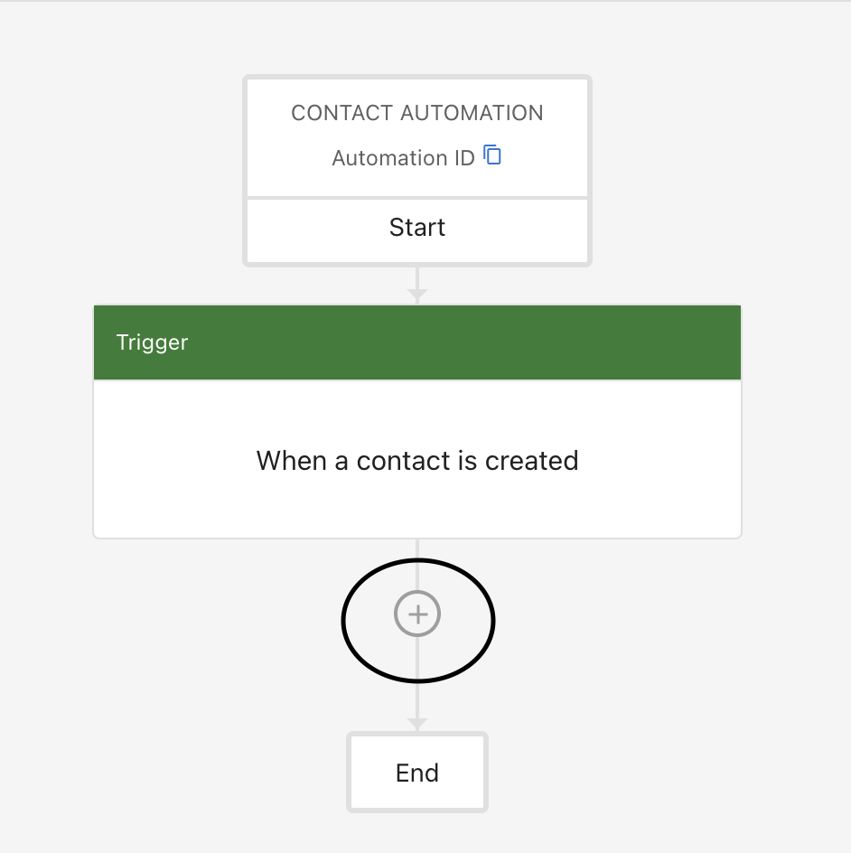
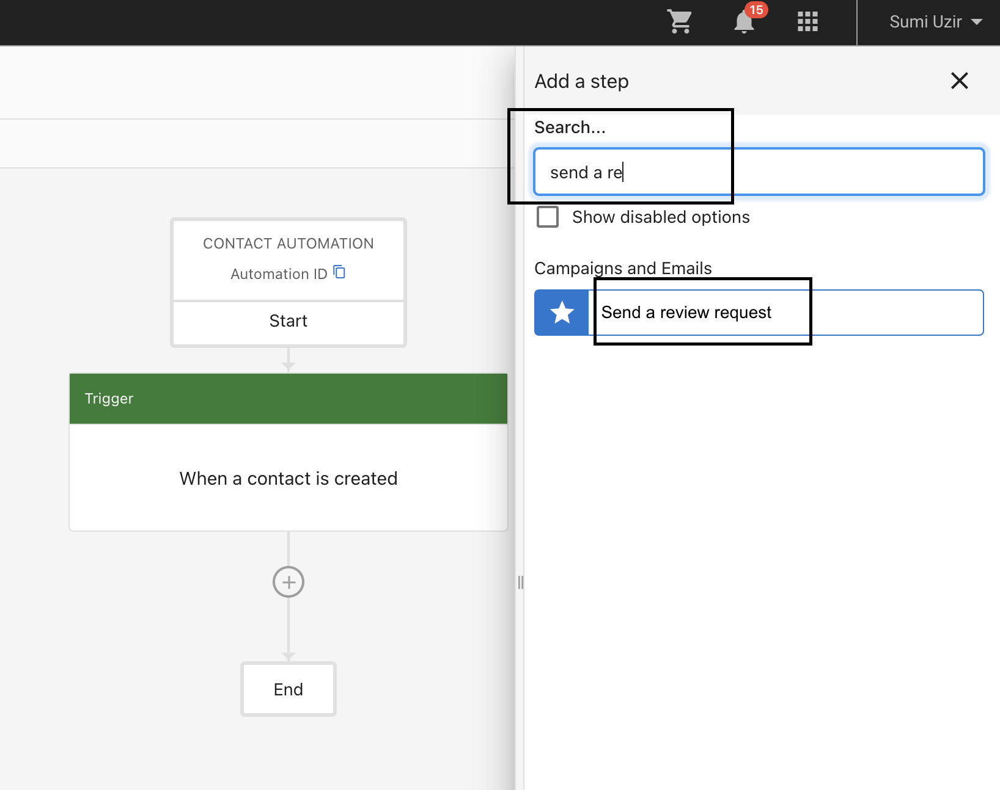
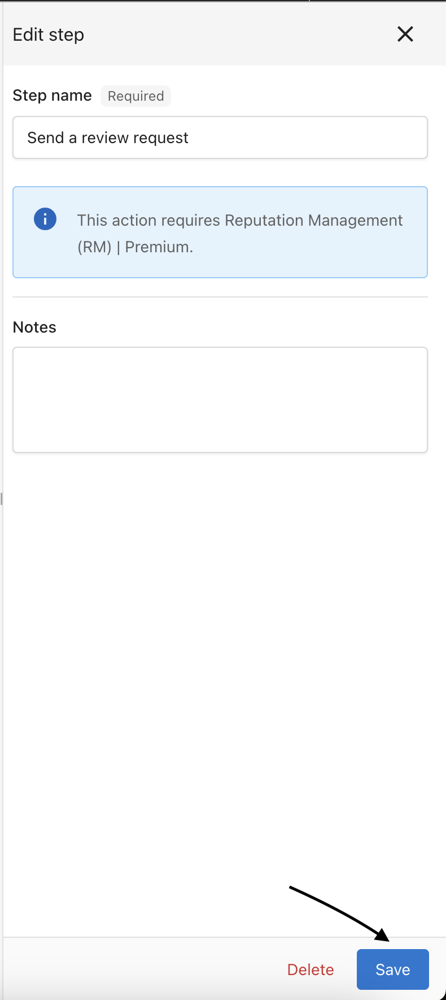
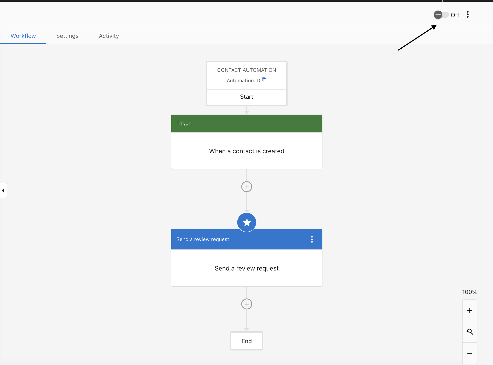
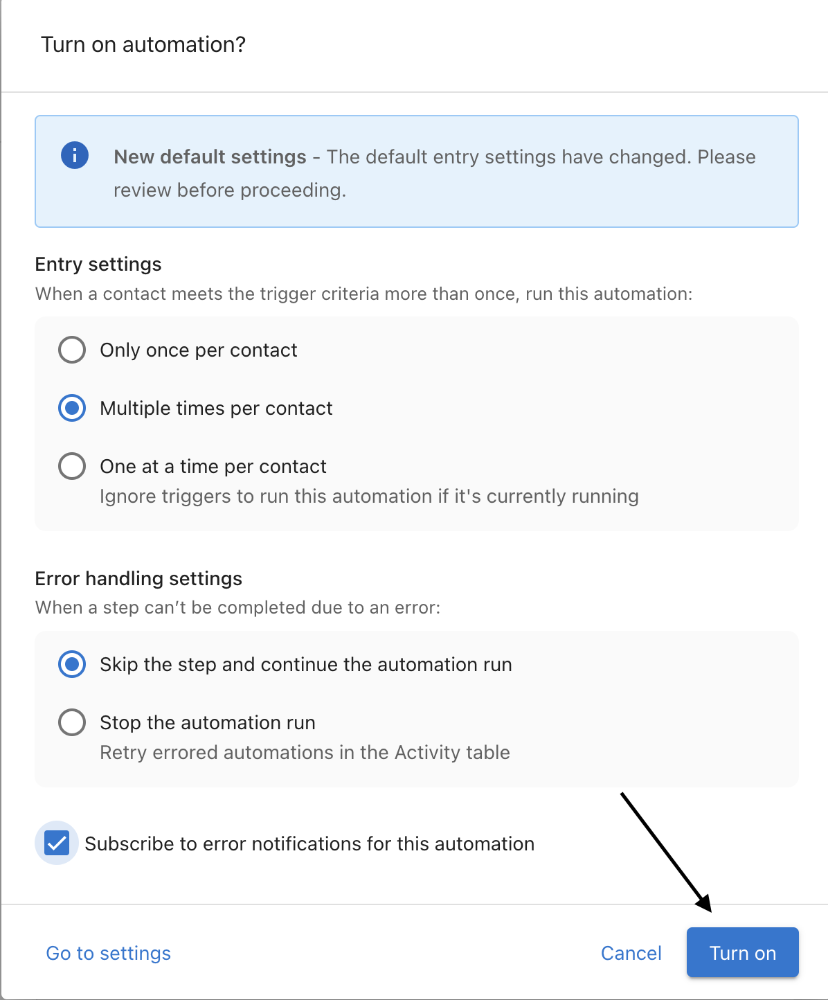
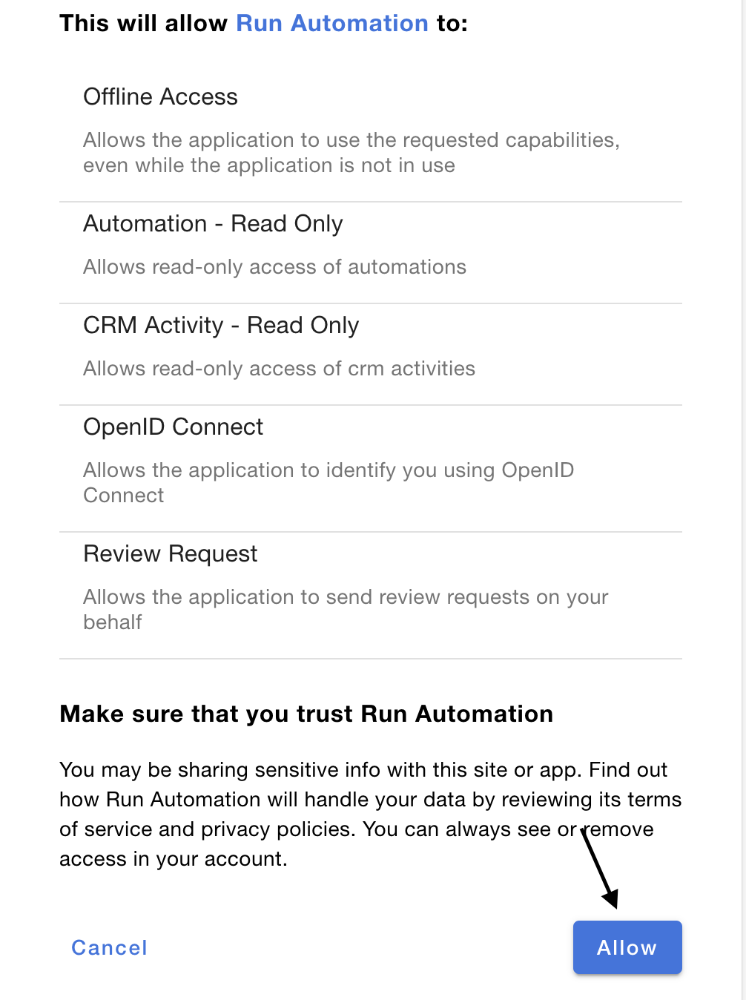

# Automations in Business App - Review Requesting

## What are Review Request Automations?

Review request automations in Business App allow you to configure automatic review request emails to be sent to customers who have recently made a purchase, visited a location, or otherwise interacted with a business. These automation settings allow businesses to collect more genuine reviews without manual intervention.

## Setting up Review Request Automations

To set up review request automations, follow these steps:

1. From within the Business App, navigate to the **Automations** tab in the left navigation menu.

2. In the automations dashboard, locate the **Review Request** automation card.

3. Click the **Edit** button on the Review Request automation card.

4. You'll be taken to the automation configuration page where you can enable/disable and customize the automation.

## Configuring the Automation

The review request automation has several configurable components:

### Enable/Disable

At the top of the automation configuration, you can toggle the automation on or off using the switch. When enabled, the automation will run according to your settings. When disabled, no automated review requests will be sent.

### Email Template

You can customize the email template that will be sent to customers:

1. Edit the **Subject Line** of the email.
2. Customize the **Preview Text** (optional text shown in some email clients before opening).
3. Modify the **Content** of the email using the rich text editor.

You can use placeholders like `{{ business_name }}` which will be automatically replaced with the actual business name when the email is sent.

### Review Sites

Select which review sites you want to include in the request email:

1. Choose from available review sites including Google, Facebook, and other platforms.
2. Toggle sites on or off to include or exclude them from the email.

### Timing

Configure when the automation should trigger:

1. Set the number of days after a transaction/interaction when the review request should be sent.
2. Specify time of day for sending emails (optional).

### Customer List

Configure which customers will receive automated review requests:

1. You can set the automation to **All Customers** or a specific segment.
2. If you choose a segment, only customers in that segment will receive review requests.

### Test Email

Before activating the automation, you can send a test email to verify how it will appear to recipients:

1. Click the **Send Test Email** button.
2. Enter an email address to receive the test.
3. Click **Send** to deliver the test email.

## Review Activity Analytics

Once your automation is set up and running, you can track its performance in the Review Activity section:

1. View metrics on emails sent, opened, and review site clicks.
2. Track conversion rates from email to review.
3. Monitor review ratings received through the automation.

## Best Practices

For optimal results with review request automations:

- **Timing matters**: Send requests 1-3 days after a transaction for best response rates.
- **Personalize content**: Use the customer's name and specific details about their interaction when possible.
- **Keep it simple**: Short, direct emails with clear call-to-action buttons typically perform best.
- **Monitor performance**: Regularly check analytics and adjust your approach based on results.
- **Comply with regulations**: Always ensure your automation practices comply with email and review solicitation regulations in your region.

By effectively setting up review request automations, businesses can consistently gather valuable customer feedback and improve their online reputation with minimal ongoing effort.