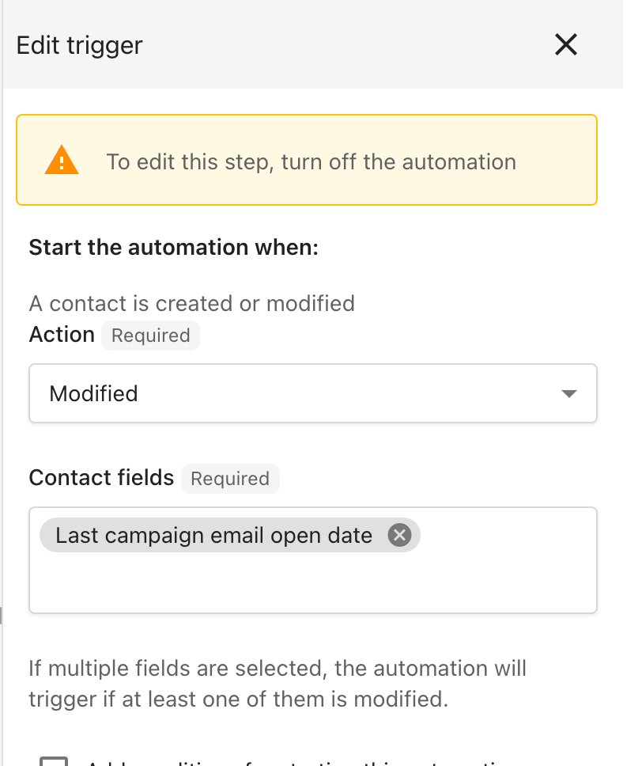
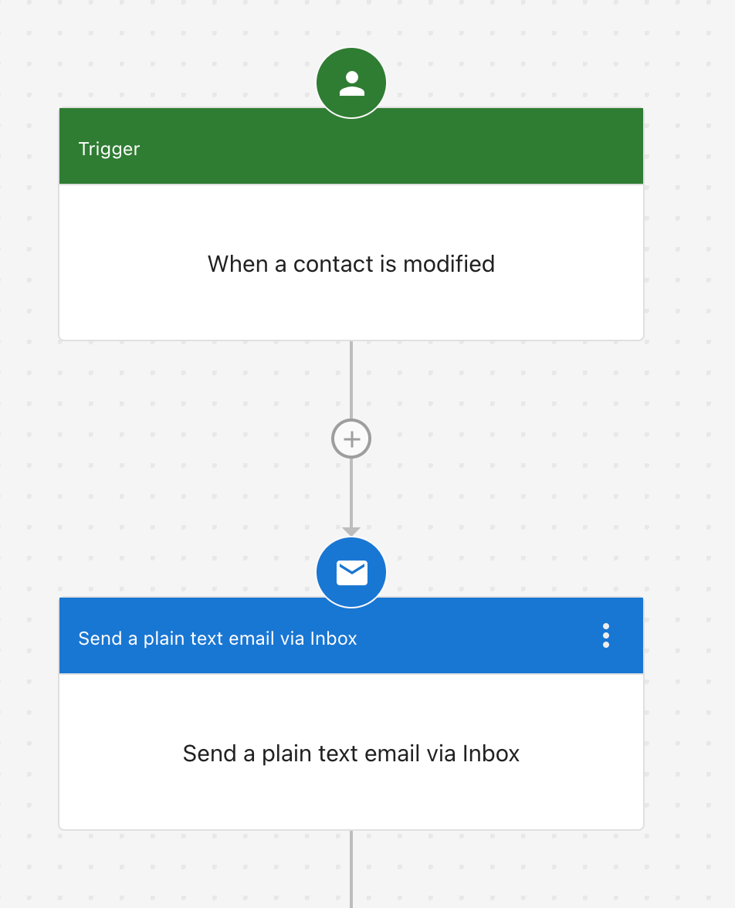
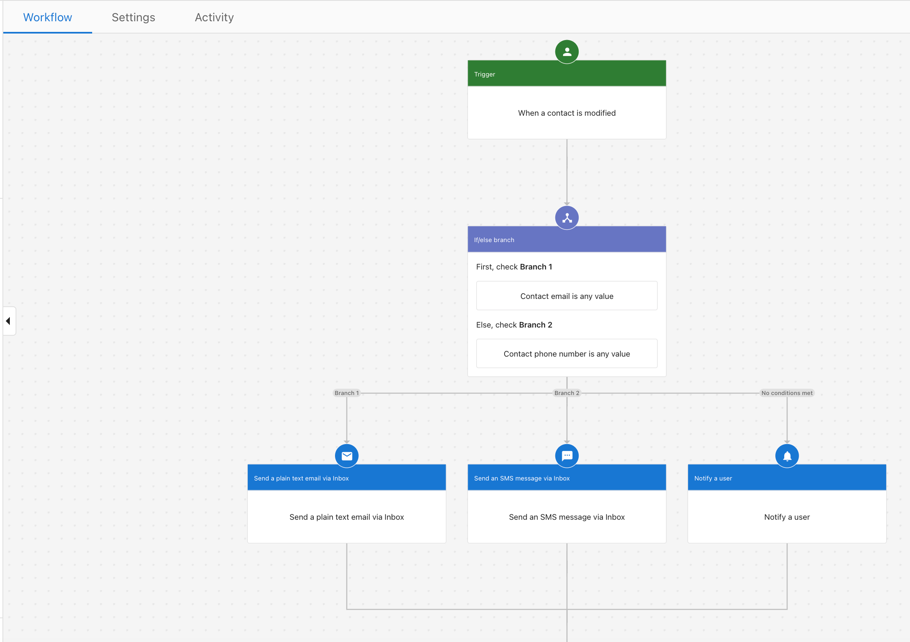
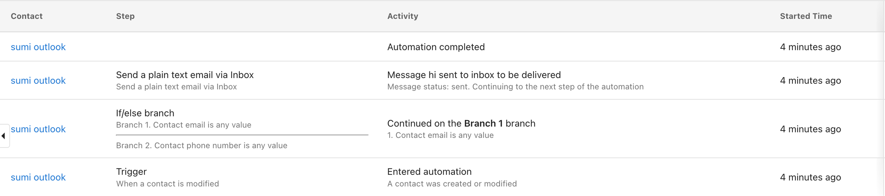

Transferring contacts from Campaigns to Inbox Pro for individual email or SMS follow-up is possible through the automations feature in Business App. This guide will walk you through the steps to send follow-ups to individuals who have opened your campaign emails, allowing for more targeted engagement. Before you begin, ensure that you have Inbox Pro and that your email and SMS setup is complete in Business App.

**Step 1:** Create an automation

- You will need to use the trigger **When a contact is modified**, and the field **Last campaign email open date.**
- We recommend adding **contact tags** prior to this, and choosing them in the **additional conditions** in the trigger section.

**Step 2:** Based on your specific need, a simple option is to choose the **Send a plain text email via Inbox** step.

**OR** - You can opt to create a more advanced workflow such as the following:

- This example includes steps to send follow up via SMS or notifications if needed.

The automation run will be similar to the following automation:

