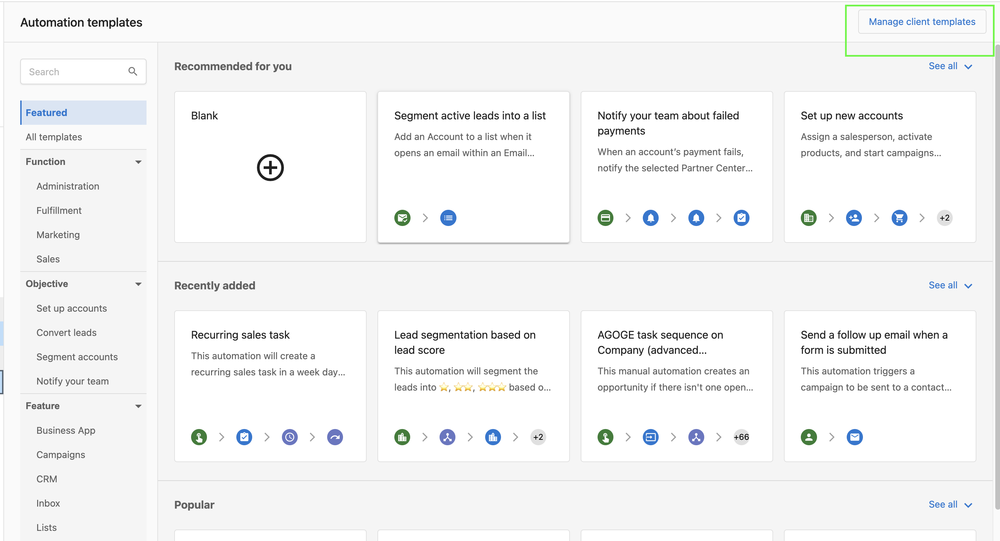
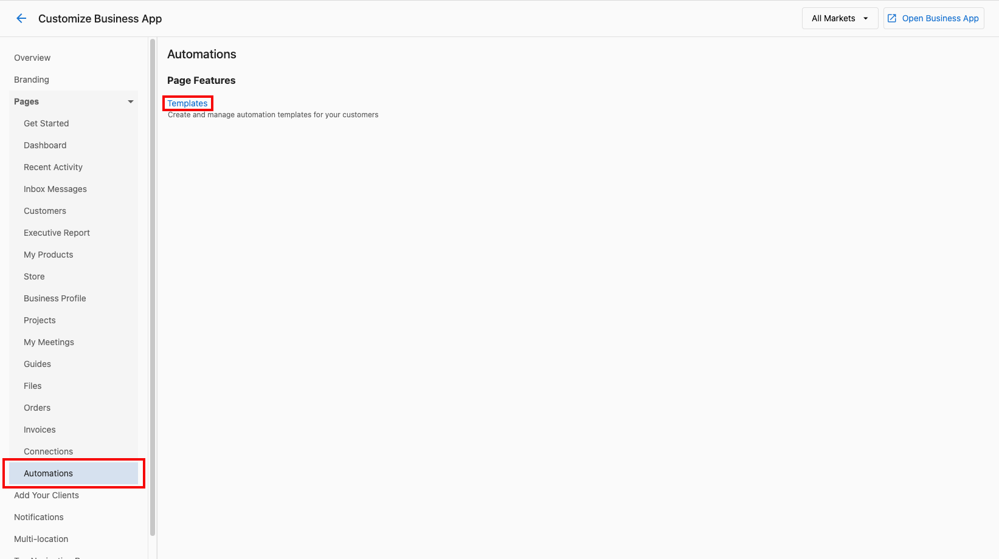
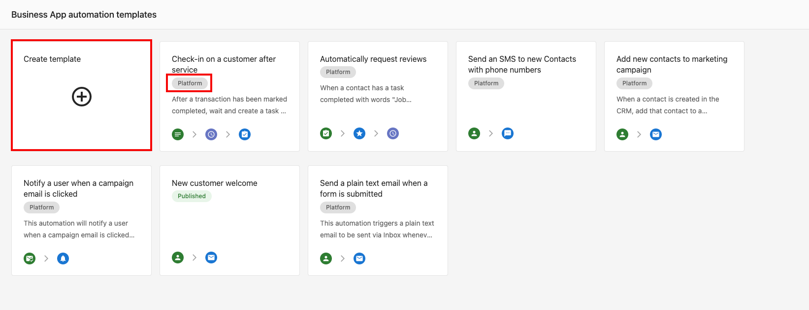
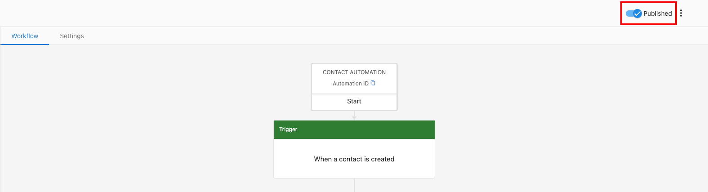

## Watch the Video Tutorial

<iframe 
  src="https://www.youtube-nocookie.com/embed/CmxPR64y_DU" 
  width="560" 
  height="315" 
  frameBorder="0" 
  allowFullScreen
></iframe>

### What are Partner-Made Automation Templates?

Streamline Your Workflow with Reusable Automation Templates! By creating templates you can empower your clients to leverage pre-built automation structures. You and your clients can easily customize the automations from the templates to save time, and standardize workflows.

### How to Build an Automation Template

**Step 1 -** Navigate to **Partner Center > Automations > Templates > Manage Client Templates.**

**OR**

Navigate to Partner Center > Administration > Customize Business App. 

**Step 2 -** Click on the **Automations** tab, and then select **Templates**. 

**Step 3 -** Click **Create**, or choose an existing template to update (Please note that you will not be able to update the Vendasta-made templates that have the "Platform" tag).

**Step 4 -** Create an automation.

**Step 5 -** Use the toggle on the top right-hand side of the page to publish the template.

**Please note:** These templates are strictly for your clients, and your clients will not be able to create templates for themselves.