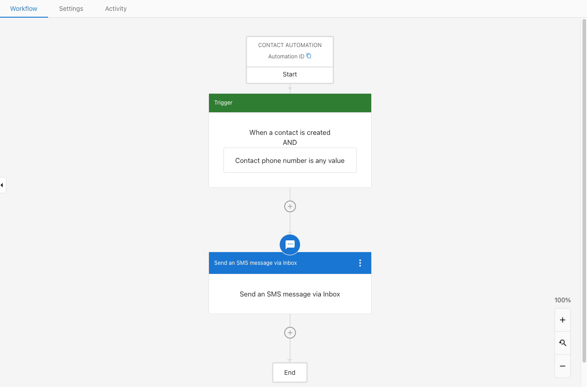

This powerful new automation step allows users to confidently send SMS messages via Inbox in Business App.

### **How to use SMS via Automations in Inbox**

**Step 1 -** Open **Business App > Automations.**

**Step 2 -** Open an automation, or create a new one.

**Step 3 -** Choose the trigger **When a Contact is created.**

**Step 4 -** Choose the SMS step.

This feature offers users the flexibility to send automated SMS messages through their existing inbox.