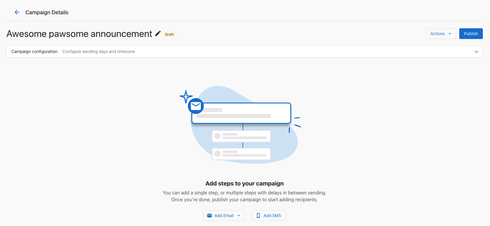
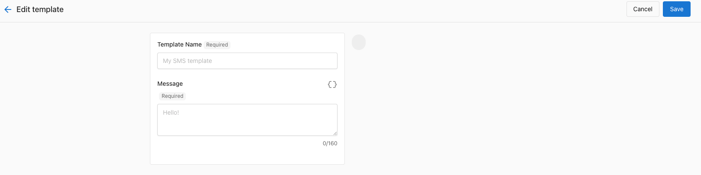
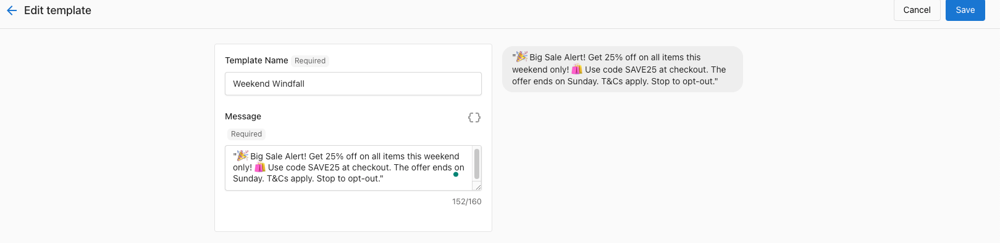
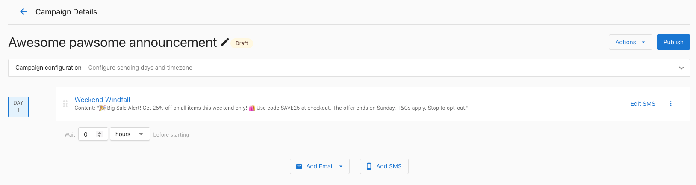
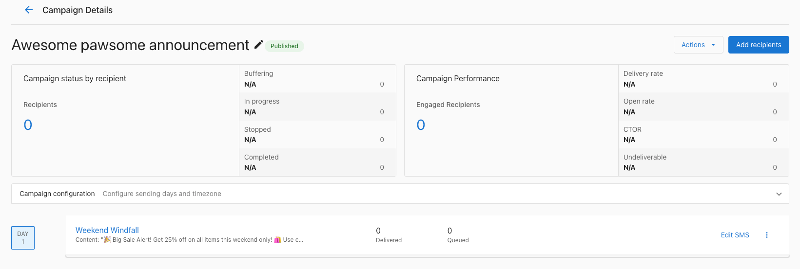

# SMS Campaigns in Business App

SMS campaigns are a powerful method for businesses to directly engage with their audience through text messages. This guide details how to create and manage SMS campaigns through the Business App.

## Creating an SMS Campaign

To create an SMS campaign in the Business App:

1. Access the Business App through your Partner Center.
2. Navigate to the **Campaigns** section.
3. Select **Create Campaign** and choose **SMS**.
   

## Setting Up Your SMS Campaign

### Campaign Details

1. Provide a **Campaign Name** for internal reference.
2. Select a **Category** that best describes your campaign purpose.
3. Choose between a **One-Time Campaign** or a **Recurring Campaign**.
   

### SMS Content

1. Enter the **Message Text** that you want to send to your audience. Remember that SMS campaigns have character limits.
2. Review the preview of how your message will appear on mobile devices.
   

### Audience Selection

1. Choose your target audience by selecting contacts from your list.
2. Filter contacts based on relevant criteria to refine your audience.
3. Review the estimated number of recipients for your campaign.
   

## Scheduling Your SMS Campaign

1. Select the desired send date and time.
2. For recurring campaigns, set the frequency (daily, weekly, monthly).
3. Consider timezone differences when scheduling your campaigns.
   

## Tips for Successful SMS Campaigns

- Keep messages concise and direct due to character limitations.
- Include a clear call-to-action in your message.
- Schedule campaigns at appropriate times (avoid late night or early morning).
- Always provide an opt-out option in compliance with regulations.
- Test your campaigns with a small audience before wide distribution.

## Managing SMS Campaigns

After creating campaigns, you can manage them from the Campaigns dashboard where you can:

- View campaign performance metrics
- Edit scheduled campaigns
- Pause or cancel ongoing campaigns
- Duplicate successful campaigns for reuse

## Legal Compliance

When using SMS campaigns, ensure compliance with regulations such as:

- Getting explicit consent before sending messages
- Providing clear identification of your business
- Including opt-out instructions
- Respecting do-not-contact requests
- Sending only during appropriate hours

For more information on digital marketing compliance, please consult our [Compliance Guidelines](/resources/compliance-guidelines).