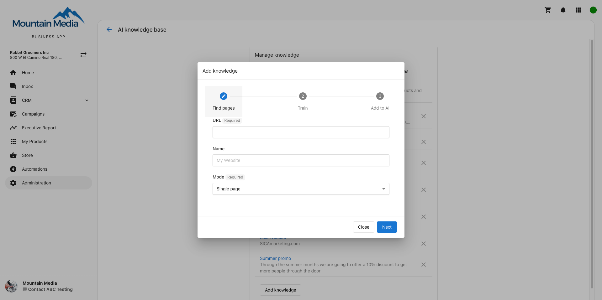

Website knowledge training (website scraping) is available for both partners and their clients that use the AI-assisted Web Chat Lead Capture widget.

[Learn more about Conversations here](/business-app/conversations/).

## How to train a business's AI assistant on the website – For SMBs using Conversations AI in Business App:

### Requirements:

- Business App with Conversations AI tab enabled
- LocalSEO (free) active on the account, to test the AI Assistant before installing on a website.
- Conversations AI Pro is needed to install the chat widget on a business website and make it customer-facing.

### Steps:

1. Setup an account: From Partner Center, create or select the desired client account you wish to add website knowledge to. Make sure to activate Local SEO, so that a My Listing demo chat widget is created, and make sure that the account has a website with content on it you'd like to train.
2. From the account details page, select Open Business App.
3. Navigate to Conversations AI > Conversations AI Settings > Web Chat Widget and select 'Configure Web Chat'
   - If you do not see Configure Web Chat, first click "Try it out today" to initialize a test Web Chat demo. Reload Conversations AI Settings page to see button to configure web chat.
4. Go to 'AI Assistant' settings card, and select 'add knowledge' then choose "Website"
5. Follow the wizard to train the AI assistant on a website. Make sure to select all the pages you'd like to train your AI on, and save.
6. To install the Web chat widget on the business website, make sure Conversations AI Pro is active on the account, and then install using the installation instructions.

## FAQs

<strong>Why did my AI provide a certain answer?</strong>

The AI will use facts and knowledge that it's been trained on. If an answer was incorrect, it's likely that the source training data was incorrect – the most common culprit is old or incorrect information found on the website.

<strong>How long does training take?</strong>

Depending on the size of a website, and how many pages the AI is trained on, it may take 1-5 minutes for the AI to begin using the new knowledge in its answers. Be patient after training a large website when testing.

<strong>Can the AI be trained on all the pages on my website?</strong>

By default, only the home page of the website will be scraped. The AI can then be trained on up to 100 pages from a website. Choose "follow links" or "sitemap" mode for finding pages on a website to give the AI as much content as possible to answer questions for your leads and customers.

<strong>Why am I having issues with AI scraping a certain site?</strong>

This may be blocked in the WordPress settings for the site. To check, navigate to **WordPress Dashboard > Settings > General > Privacy** and ensure that "Prevent third-party sharing for" is unchecked.

<strong>What file types are supported for uploads in the AI Knowledge Base?</strong>

The AI Knowledge Base supports a wide range of file formats (up to 100MB each). You can upload:
- PDF
- DOCX
- HTML
- Images: JPG, PNG
- TXT
- CSV
- Markdown
- JSON
- PowerPoint (PPTX)
- Excel (XLS, XLSX)

<strong>How should I upload image-based files?</strong>

If your document consists of images (e.g., scanned pages or brochures), upload each page as an image file (JPG or PNG). These formats allow the AI to extract and process text more reliably than image-based PDFs.

<iframe src="//www.youtube-nocookie.com/embed/eMTaoKXymXQ" width="560" height="315" frameBorder="0" allowFullScreen></iframe>