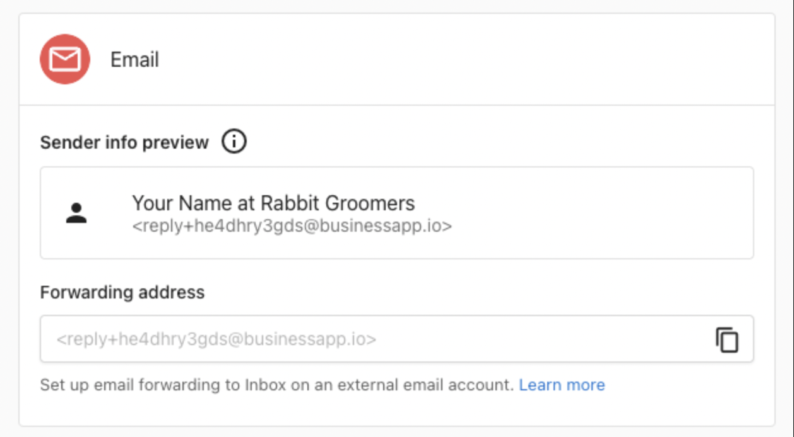

<iframe src="https://www.youtube-nocookie.com/embed/gBMk7gnG-IA" width="560" height="315" frameborder="0" allowfullscreen></iframe>

Conversations AI allows your client's team to send and receive emails with leads and customers from a shared email address.

When your client's account gets a new lead from web chat or a form, and that lead provides an email address as a way to contact them, anyone on your client's team can reply via email to that customer from the centralized Conversations AI inbox, without needing to open a separate email client.

### Features

- Available on both Conversations AI Standard and Conversations AI Pro plans
- Send emails to contacts using your client's assigned email address
- Receive email replies back into a shared Conversations AI inbox, where anyone on your client's team can continue the conversation
- Set up email forwarding to receive emails sent to your client's existing email address in Conversations AI
- AI auto-response support for 24/7 customer support via email

## How email works

### Assigned email address

Every client account is assigned a unique Conversations email address in the format `reply+xxxxx@businessapp.io`. All outbound emails from Conversations are sent from this address, and customer replies are routed back into the Conversations inbox automatically.

The assigned address is visible at `Business App` → `Administration` → `Email Configuration` → `Advanced email settings`, listed as the `Forwarding address`.

### Sending emails

To send an email to a new or existing contact:

1. Click `New Message` in Conversations
2. Enter the recipient's email address
3. Write your message, then select `Email` in the `Send via` dropdown menu
4. Click `Send`

When the customer replies, their response is automatically routed back into the same conversation thread, where any member of your client's team can continue the discussion.

## Email forwarding

By setting up email forwarding, your client can receive emails sent to an address they already own (like team@theirbusiness.com) directly in Conversations AI. When a customer sends an email to your client's address, a copy is forwarded to the Conversations inbox, where it appears as a new conversation. Your client's team can then read and reply directly from Conversations.

This is useful when your client wants customers to email a familiar, branded address while their team manages all replies from one place.

### How to set up forwarding

1. Find the Conversations forwarding address at `Business App` → `Administration` → `Email Configuration` → `Advanced email settings`, in the `Forwarding address` field (it looks like `reply+xxxxx@businessapp.io`)
2. Copy this address
3. In the email provider's settings, add this address as a forwarding destination

Once forwarding is active, any email sent to your client's address is also delivered to Conversations.

### Forward from Gmail

1. In Gmail, go to `Settings` → `See all settings`
2. Select the [Forwarding and POP/IMAP](https://mail.google.com/mail/u/0/#settings/fwdandpop) tab
3. Click `Add a forwarding address` and paste the Conversations forwarding address
4. Click `Next`, sign in again if required, and confirm
5. In Conversations, a confirmation message appears with a link. Click the link to confirm the forwarding request
6. Return to Gmail Forwarding settings and enable forwarding, then save changes

Gmail filters can also be used to forward only specific messages.

### Forward from Outlook

1. In Outlook, go to `Settings`
2. Select `Mail` → [Forwarding](https://outlook.live.com/mail/options/mail/forwarding)
3. Select `Enable forwarding`, enter the Conversations forwarding address, and select `Save`

## Email configuration settings

The `Business App` → `Administration` → `Email Configuration` page contains email settings for each client account.

- `Sender and reply settings`: Controls the sender name, reply address, and display address used by Campaigns and other integrated services. These settings do not affect emails sent through Conversations.
- `Advanced email settings`: Contains the Conversations forwarding address and sender domain configuration. A custom sender domain can be configured for use with Campaigns and other integrated services. Conversations sends from the assigned `@businessapp.io` address.
- `Email domains`: DNS record configuration (SPF, DKIM, DMARC) for custom sender domains. These records improve deliverability for emails sent by Campaigns and other services.

## FAQs

<strong>Can your client send Conversations emails from a custom domain?</strong>

Conversations sends all emails from the assigned `reply+xxxxx@businessapp.io` address. A custom sender domain can be configured at `Business App` → `Administration` → `Email Configuration`, but that applies to Campaigns and other integrated services, not Conversations.

To give customers a familiar point of contact, set up email forwarding from your client's email address so that inbound messages arrive in Conversations.

<strong>Can each team member get their own email address?</strong>

Each client account uses one shared email address for Conversations. When a team member sends a message, their name is visible in the sender details and email signature, so customers can see who they're communicating with.

<strong>What is the "email configuration" area in Business App settings?</strong>

The `Email Configuration` page at `Business App` → `Administration` → `Email Configuration` contains settings for both Conversations and other email services. The `Sender and reply settings` section applies to Campaigns and other integrated services. The `Advanced email settings` section is where the Conversations forwarding address and sender domain options are located.

<strong>Is there a limit on how many emails can be sent?</strong>

Yes. There is a daily email sending quota per client account. If your client is unable to send emails, their account may have reached its daily limit. The quota resets every 24 hours.

