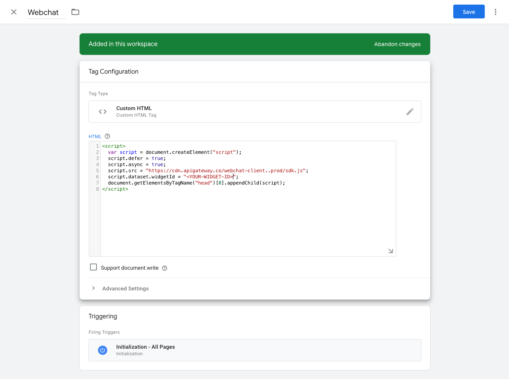
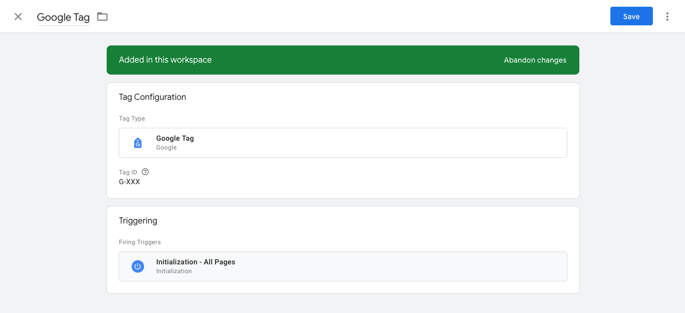
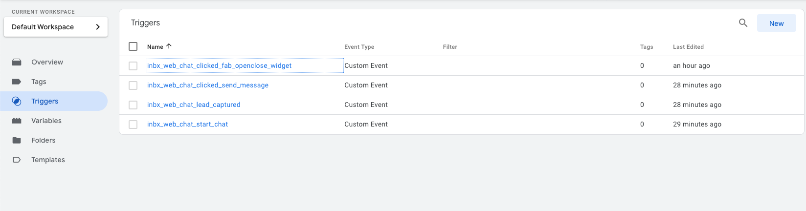
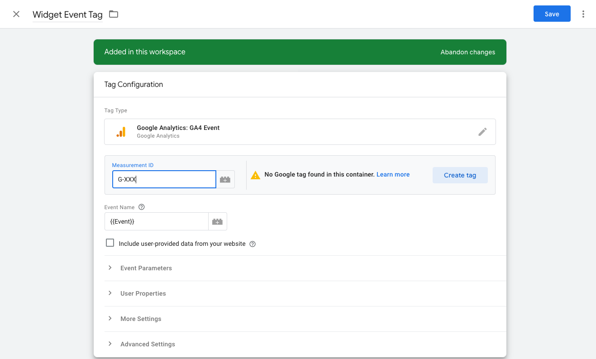
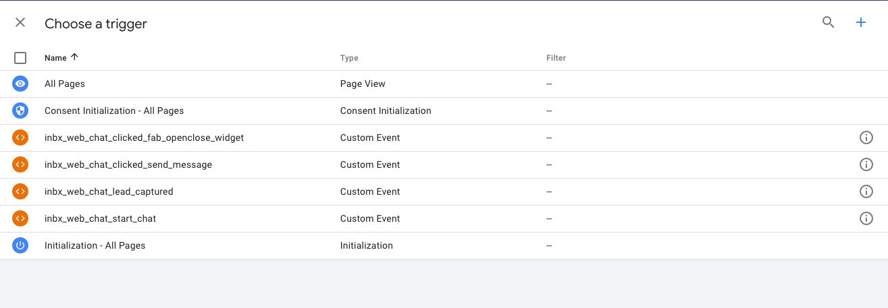
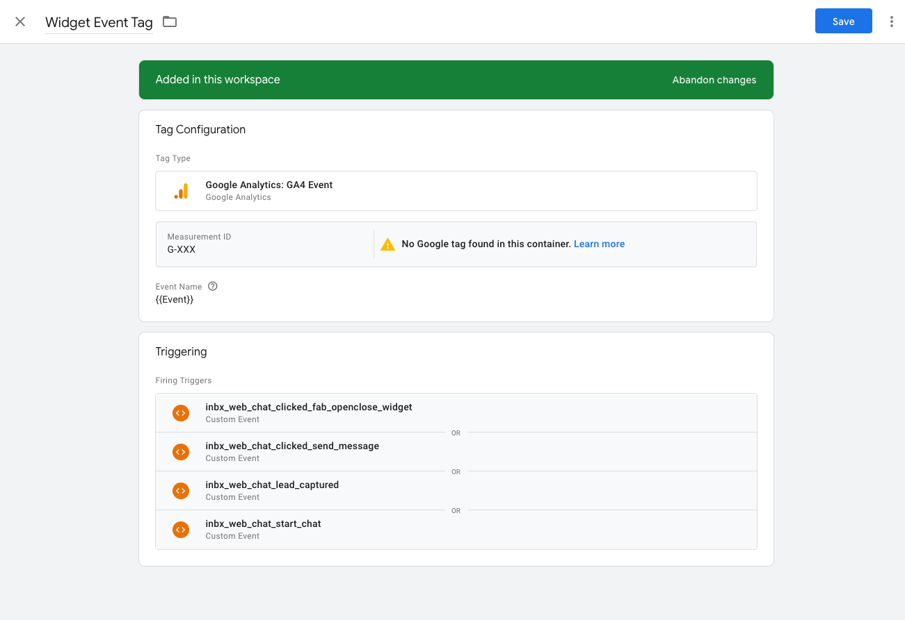
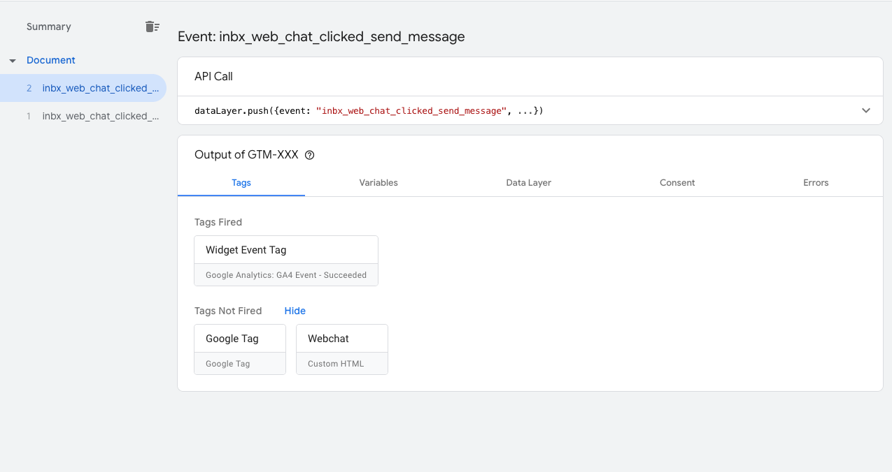

# Track web chat events in Google Analytics using Tag Manager

Integrating Google Tag Manager (GTM) with your web chat can provide valuable insights into user interactions. This guide walks you through the process of tracking chat events using Google Tag Manager and Google Analytics.

## Prerequisites

Before beginning this integration, ensure you have:

1. An active Web Chat account
2. Access to Google Tag Manager
3. A configured Google Analytics property

:::info
If you haven't set up your web chat widget yet, start with the [Web Chat Setup & Usage guide](./index.mdx) before configuring event tracking.
:::

## How web chat events work

The web chat widget automatically sends events to the Google Tag Manager dataLayer when users interact with the chat. These events are pushed to the dataLayer using standard GTM event format, making them available for tracking and analytics.

When a web chat event occurs, the widget executes code similar to:
```javascript
dataLayer.push({
  'event': 'inbx_web_chat_start_chat'
});
```

:::tip
The web chat widget must load after your GTM container initializes. If you're installing via [Google Tag Manager](./index.mdx#for-google-tag-manager), ensure the GTM container loads before the chat widget code.
:::

## Setting up event tracking

Follow these steps to set up web chat event tracking:

### 1. Create custom event triggers in Google Tag Manager

For each web chat event you want to track, create a Custom Event trigger in GTM:

1. In your GTM workspace, navigate to **Triggers** and click **New**
2. Select **Custom Event** as the trigger type
3. In the **Event name** field, enter the exact event name from the table below (e.g., `inbx_web_chat_start_chat`)
4. Leave **This trigger fires on** set to **All Custom Events** (unless you want to add additional conditions)
5. Save the trigger with a descriptive name like "Web Chat - Start Chat"



Repeat this process for each event you want to track:



### 2. Configure Google Analytics event tags

For each trigger you created, set up a corresponding GA4 Event tag:

1. Navigate to **Tags** and click **New**
2. Select **Google Analytics: GA4 Event** as the tag type
3. Choose your GA4 Configuration tag from the dropdown (or create one if it doesn't exist)
4. In the **Event Name** field, enter a descriptive name for the event in Google Analytics (e.g., "web_chat_started", "web_chat_lead_captured")
5. Optionally, add event parameters to provide additional context:
   - **event_category**: "web_chat"
   - **event_label**: The specific action (e.g., "start_chat", "lead_captured")



Configure your event parameters:



### 3. Link your tags to triggers

Connect each GA4 Event tag to its corresponding Custom Event trigger:

1. In the tag configuration, scroll down to the **Triggering** section
2. Click **Add** and select the appropriate Custom Event trigger you created in Step 1
3. For example, link the "Web Chat Started" GA4 tag to the "Web Chat - Start Chat" trigger
4. Save the tag



### 4. Preview and test your configuration

Use the GTM preview mode to ensure your events are firing correctly:



### 5. Publish your changes

Once you've verified everything is working correctly in preview mode, publish your changes to make them live on your website:



## Verifying event tracking

After publishing your changes, you can verify that events are being tracked by:

1. Opening your Google Analytics dashboard
2. Navigating to the Real-Time reports section
3. Interacting with your chat widget on your website
4. Confirming that events appear in your real-time reports

## Available web chat events

The web chat widget emits the following Google Tag Manager events that can be tracked for analytics:

| Event Description | Event Name | Trigger Condition |
|-------------------|------------|-------------------|
| Start web chat | `inbx_web_chat_start_chat` | Emits when a new conversation starts with a visitor |
| Lead Captured | `inbx_web_chat_lead_captured` | Emits when a lead is captured by the web chat |
| Send Message | `inbx_web_chat_clicked_send_message` | Emits when a message is sent by a visitor |
| Open Close Fab | `inbx_web_chat_clicked_fab_openclose_widget` | Emits when the chat window is opened or closed by a visitor |

## Troubleshooting

If events aren't appearing in Google Analytics, check these common issues:

1. **Verify GTM container installation**: Ensure your GTM container code is properly installed and the dataLayer initializes before the web chat widget loads
2. **Check event names**: Custom Event triggers must use the exact event names from the table above (case-sensitive)
3. **Test in preview mode**: Use GTM's preview mode to verify events are pushed to the dataLayer and triggers are firing

:::warning
Event names are case-sensitive. Use `inbx_web_chat_start_chat` exactly as shown, not `INBX_WEB_CHAT_START_CHAT` or other variations.
:::

## Frequently Asked Questions

<details>
<summary>Why aren't my web chat events showing up in Google Analytics?</summary>

Common issues include:
- **GTM container not loaded**: Ensure your GTM container code is installed on the website before the web chat widget
- **Event name mismatch**: Double-check that your Custom Event trigger uses the exact event name from the table above (case-sensitive)
- **Tag not published**: Changes in GTM preview mode only work during testing - publish your changes to make them live
- **Timing issues**: The web chat widget must load after GTM initializes
</details>

<details>
<summary>Why aren't my web chat events appearing in the dataLayer?</summary>

If events aren't showing up in GTM's Data Layer tab:
- Verify the web chat widget loads after GTM initializes
- Check browser console for JavaScript errors
- Confirm the widget is properly installed on your website
- Test with GTM preview mode's Data Layer tab to see if events are being pushed
</details>

<details>
<summary>Why are my triggers firing but tags aren't sending to GA4?</summary>

If your triggers are firing but events don't reach Google Analytics:
- Verify your GA4 Configuration tag is set up correctly
- Check that the GA4 Configuration tag is linked to your Google Analytics property
- Ensure the GA4 Event tag is properly linked to the trigger
- Review tag firing order in GTM preview mode
</details>

<details>
<summary>Why are events showing in preview mode but not on the live site?</summary>

If events work in preview but not on your live website:
- Publish your GTM container changes
- Clear browser cache and test in incognito mode
- Verify the published container version includes your tags and triggers
- Check that no other GTM containers are interfering
</details>

<details>
<summary>Can I customize the event names or add additional data?</summary>

The web chat widget sends events with predefined names and cannot be customized. However, you can add custom parameters to your GA4 Event tags to provide additional context, such as page URL, user type, or campaign information.
</details>

<details>
<summary>How do I track web chat events across multiple websites?</summary>

If you have multiple websites with web chat widgets:
- Use the same GTM container across all sites, or
- Create separate containers with consistent event naming
- Ensure each GA4 property is configured to receive events from the respective website
- Use custom dimensions in GA4 to differentiate between websites
</details>

<details>
<summary>Are there any privacy considerations when tracking chat events?</summary>

Yes, ensure compliance with privacy regulations:
- Chat interactions may contain personal data - consider if tracking is necessary
- Check if you need user consent for analytics tracking
- Review Google's privacy policies and data retention settings
- Consider excluding sensitive events from tracking if privacy is a concern
</details>