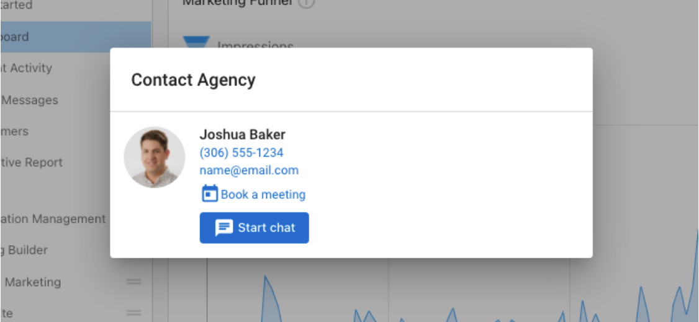

## Add a booking link in the Business App contact card

With the integration of a meeting scheduling link in Business App, you can make it easier for clients to book time with you. They will have access to a quick booking option from their mobile device or desktop browser on any platform they use.

### Business App contact card with booking link

Users accessing Business App can display a CalendarHero meeting link—or any meeting scheduling link—on their salesperson profile. This link appears inside the Business App contact card for accounts assigned to that salesperson.

### Important note about impersonation

When impersonating a user from Business App, you will not be able to start a conversation with the salesperson. To use this functionality, the user must be logged in to Business App directly.

## How to set up

### 1. Add a link to the salesperson profile

1. Go to **Partner Center > Administration > My Team**.  
2. Find the salesperson, select the **three dots** next to their name, and choose **Edit Salesperson**.  
3. Scroll to the field labeled **Book a meeting link**.  
4. Enter the meeting URL.  
5. Select **Save**.

### 2. Assign the salesperson to the account

1. Go to **Partner Center > Accounts > Manage Accounts**.  
2. Select an account and choose **Edit**.  
3. Under **Administration**, ensure the correct salesperson is assigned.  
4. Once saved, users on that account will see a **Book a meeting** button on the Business App contact card.

