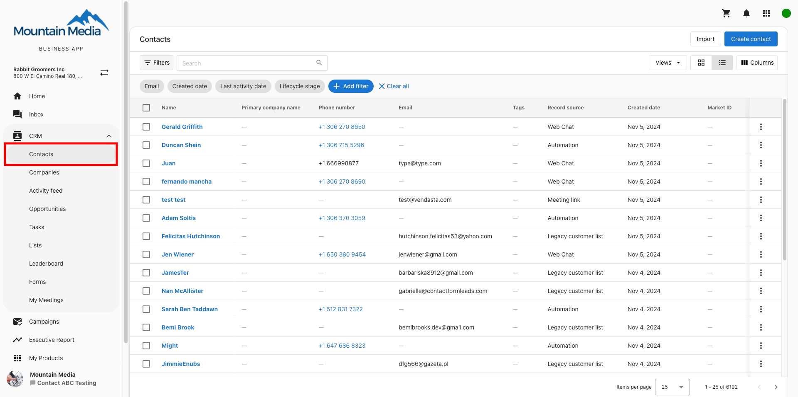
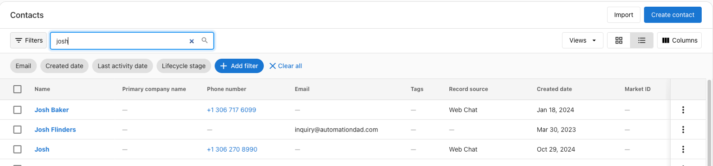
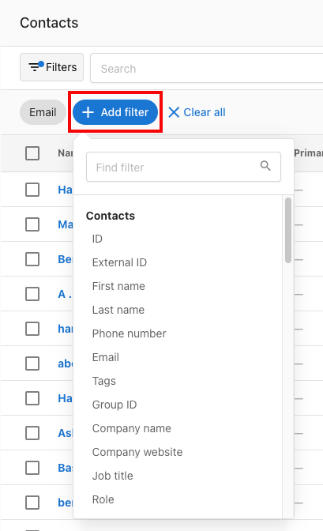

**Contacts** in Business App gives your clients a place to manage customer information. It syncs with other products to consolidate customer information into one place.

### **How are Contacts different from Business App users?**

Contacts refer to specific individuals at a company but they do not have access to any part of the platform. Users, however, have access to Business App and can receive notifications from the system, allowing them to access any products that are active for their account (if access is granted). 

While contacts and users have limited interaction, these two entities are primarily separate. The occasions where these two are linked are as follows:

- Users are created with a corresponding contact when an account is created via the Accounts tab in Partner Center.
- If a user is deleted in Partner Center that matches the email address of a contact, the contact will also be removed.

Please note that changing the email address of a contact will disassociate that contact from the Business App user. Additionally, removing a contact will not remove the corresponding user.

### **Searching Contacts**

Business owners are able to search for contacts by their first name, last name, email, or phone number.

### **Filtering Contacts**

Business owners can filter contacts by tags, first name, last name, phone number, email, and more! 

### **Uploading Contacts**

Business owners can upload contacts via CSV, with a limit of up to 5MB. During the upload, you will be able to add multiple columns as tags. Currently, there is no specific option to bulk edit contacts, but if you upload a CSV with the same contacts, they will not be duplicated, and will instead be updated with any new information. 

### **Syncing apps**

The following apps will automatically sync customer data into the Contact table:

- Inbox – When a message is sent or received to a new contact
- Customer Voice – When a contact is created in Customer Voice
- Website Pro/Standard – When a contact form is submitted on the website
- Constant Contact – When a contact is created

Business owners can add, delete, or edit customers to their lists to keep all of their valuable business data organized. Contacts can be created by either first name, last name, phone number, or email. Enter customer information manually or in bulk through the import feature.