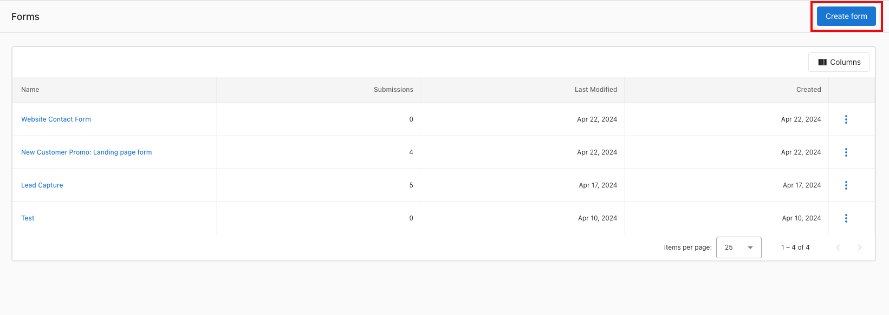
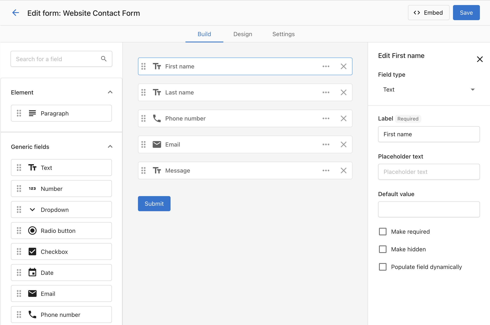
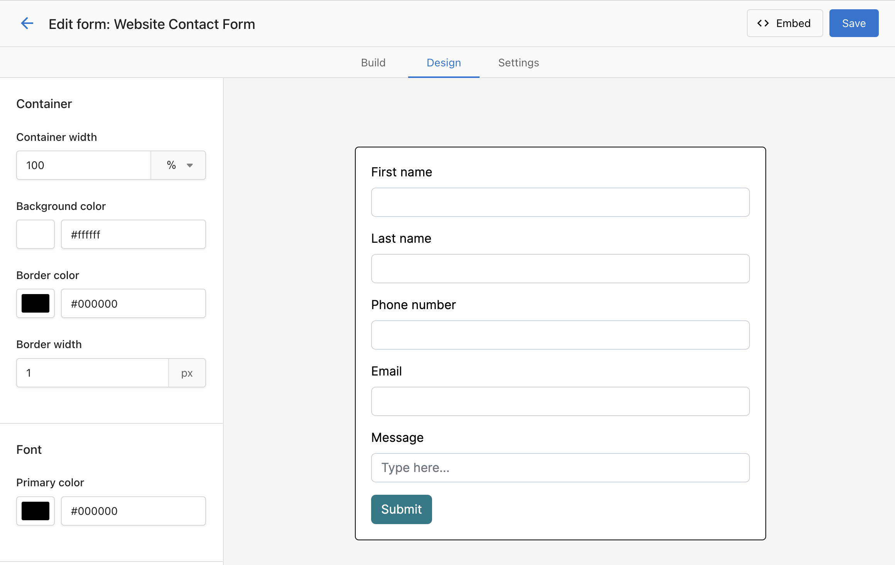
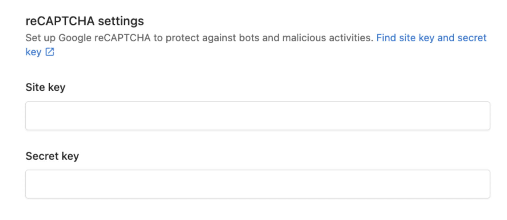
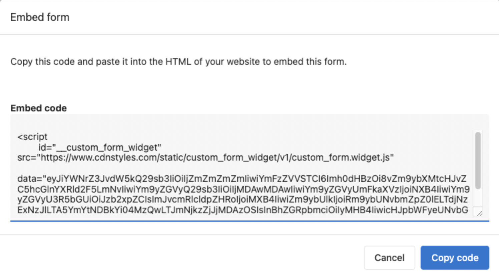

<iframe src="https://www.youtube-nocookie.com/embed/VD1JMKgIZrk" width="560" height="315" frameBorder="0" allowFullScreen></iframe>

A custom form can be created in Business App and installed on a website landing page or 'contact us' page with a simple embed code. When it is filled out, it will create a contact in the CRM, and create a conversation in Inbox where it can then be responded to. Using Automations, the contact can receive an automatic reply after filling out the form, can be added to an email or SMS nurturing campaign, and more!

## How to Use Forms

**Step 1 -** Navigate to **Contacts > Forms**.

**Step 2 -** Add all the key fields you'd like to capture.

* Remember that for every field that added to a form, the [conversion rate decreases](https://medium.com/@raminzamani/how-many-fields-should-you-have-on-a-form-4a3447661209#:~:text=Here%20are%20some%20other%20stats,conversion%20rate%20of%20just%2020%25.). (A study by Crazy Egg found that forms with 5 fields or fewer have a conversion rate of 50%, while those with 10 fields or more have a conversion rate of just 20%.)

There are a few different settings you can have on each form field

* **For all field types**
  * You can set a default value, which will be submitted when the user submits an empty field.
  * You can mark the field as required, and the user can't submit the form without filling in the required field.
  * You can make the field hidden, so users won't see the field and can't edit it when they fill out the form.
  * You can also populate the specific form field dynamically, which will take the query parameter from the URL to fill in the field.
    * For example, if you have a form that's put on this link: https://www.example.com/form?campaign=spring-promotion
    * If you put "campaign" on this setting, it will pre-fill the form field with "spring-promotion" when the user submits the form.
* **For the string field**
  * You can switch it to an open text field, drop-down, or provide a radio button option

**Step 3 -** Customize the styling to match your website. You may want to set the form width to 100%, and then manage the width using the website builder component.

* In the "Design" tab, you can style the form's container, font, and button.

**Step 4 -** You can set up reCAPTCHA in the form to prevent Spam.

* In the form builder, under "Setting", you can find a section called "reCAPTCHA settings", and it will be set up automatically after you generate the site key and secret key. The generation process takes several minutes.

**Step 5 -** Copy the embed code for the form, and place it on your website landing page or contact page.

* If using WordPress with Divi, you can add a "Code" block and paste the embed code.

**Step 6 -** Test your form, to confirm that a contact is captured in the CRM.

## Why customers love this

* Forms are a key way to capture leads. Form builder makes it very easy to setup, and the CRM + Inbox makes it easy to manage to leads from form fills.
* Automatic UTM capture from form fills make it easy to understand what acquisition methods are working for a business. Make sure the business is using UTM fields in all the links they publish in Ads, Social Media, etc.

## Q&A

**Q: My form isn't always capturing UTM fields, why might that be?**

**A:** For the form to capture UTM, they must be still present in the browser address bar. If a user clicks away from your landing page, to visit a second page on your website, and you don't have a UTM preservation tool active, the UTM can be lost and won't be captured if they fill out a form. One tactic to prevent this is removing all links from your landing page, to ensure leads fill out the form on the landing page and nowhere else.

**Q: What fields are supported by Business App forms?**

**A:** The following fields are supported:

| Contact | Company | Generic |
|---------|---------|----------|
| <ul><li>First name</li><li>Last name</li><li>Phone number</li><li>Email</li><li>Required</li><li>Market ID</li><li>Owner</li><li>Message</li><li>Job title</li><li>Role</li><li>Seniority</li><li>LinkedIn URL</li><li>Lifecycle stage</li><li>Record source</li><li>Record source drill down 1</li><li>Record source drill down 2</li><li>Original source</li><li>Original source drill down 1</li><li>Original source drill down 2</li><li>Timezone</li><li>UTM Campaign</li><li>UTM Medium</li><li>UTM Source</li><li>UTM Content</li><li>UTM Term</li><li>External ID</li><li>Street address line 1</li><li>Street address line 2</li><li>City/locality</li><li>State/province/region</li><li>Zip/postal code</li><li>Country</li><li>Birth Year</li><li>Gender</li><li>Additional phone number</li></ul> | <ul><li>Company name</li><li>Website</li><li>Street address line 1</li><li>Street address line 2</li><li>City/locality</li><li>State/province/region</li><li>Zip/postal code</li><li>Country</li><li>Phone number</li><li>Market ID</li><li>Owner</li><li>Fax number</li><li>Number of employees</li><li>Legal structure</li><li>Lifecycle stage</li><li>Record source</li><li>Record source drill down 1</li><li>Record source drill down 2</li><li>Original source</li><li>Original source drill down 1</li><li>Original source drill down 2</li><li>Timezone</li><li>Facebook URL</li><li>X URL</li><li>Instagram URL</li><li>LinkedIn URL</li><li>TikTok URL</li><li>Pinterest URL</li><li>UTM Campaign</li><li>UTM Medium</li><li>UTM Source</li><li>UTM Content</li><li>UTM Term</li><li>External ID</li><li>Google Place ID</li></ul> | <ul><li>Text</li><li>Paragraph</li><li>Number</li><li>Dropdown</li><li>Radio button</li><li>Checkbox</li><li>Date</li></ul> |