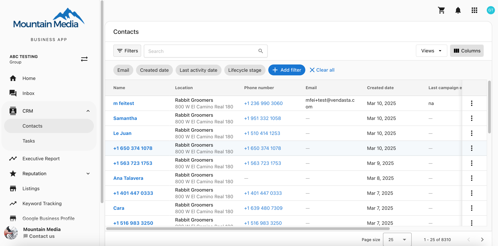

## Multi-Location Contact & Task View in Business App

Corporate teams supporting multiple franchise locations need a streamlined way to manage contacts and sales tasks across all locations in one place. The Multi-location Business App provides a centralized task and contact view, making it easier to track and complete key sales and customer support activities.

## Why This Matters

Many franchise businesses have corporate teams managing multiple locations. Without a centralized view, corporate reps must manually switch between locations to follow up on leads or respond to customer concerns, which can be inefficient and time-consuming.

For example, Best Friend Pet Hotel has 58 locations, but only two corporate reps managing 31 of them. These reps need a single view to track and complete tasks like:

- Responding to web chat leads that have been waiting over 24 hours.
- Following up with unhappy customers (NPS score 6 or below) to improve customer experience.

By using a centralized task view, corporate teams can efficiently handle these responsibilities, allowing franchise locations to focus on their daily operations while ensuring excellent customer service.

## How It Works

Corporate reps can manage sales tasks and customer interactions across multiple locations without needing to switch between accounts. Multi-location Business App provides a single view for:

- Viewing all tasks assigned across multiple locations.
- Tracking outstanding tasks in one place.
- Improving response times to leads and unhappy customers, enhancing the overall customer experience.

## How to Use This Feature

1. **Open the Multi-location Business App.**
2. Navigate to **CRM > Tasks** to see all tasks assigned to you across locations.
3. **Ensure automations are set up** to create tasks automatically, such as when a new NPS detractor is detected.
4. Select tasks and click **"Start Task"** to begin working through your assigned tasks.

The Multi-location Business App ensures corporate teams can efficiently manage contacts and tasks, leading to improved customer satisfaction and operational efficiency.