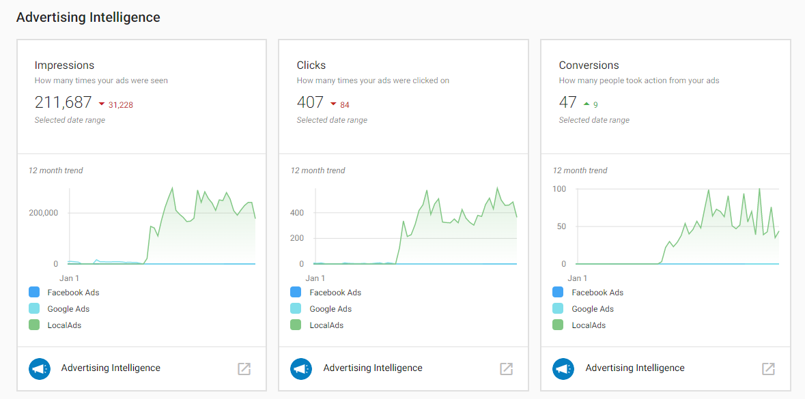

# Executive Report: Advertising (Advertising Intelligence)

## What is the Advertising Performance Summary?

Users of Advertising Intelligence can view performance summaries for both their Facebook Ads and Google Ads accounts within the Executive Report in Business App. This consolidated view gives you and your clients a complete picture of advertising performance across multiple platforms.

## Why is the Advertising Performance Summary important?

You and your clients can see what's happening across all your digital marketing channels in one place. This allows you to quickly and easily get insights into which ads are performing well and cut down on overhead with automated reporting. By combining real-time performance reporting across ad channels with unique sales data, you can keep your clients updated with their true ROI.

### Metrics You Can View

- **ROI** - Return on investment across advertising channels
- **Client spend** - Total advertising spend
- **Impressions** - How many times ads were displayed
- **Clicks** - Number of clicks on advertisements
- **Conversions** - Actions taken by users (purchases, sign-ups, etc.)
- **Comparisons to previous time period** - Week-over-week or month-over-month performance

## How to Set Up Advertising Performance Reporting

### Prerequisites
- Advertising Intelligence must be activated for the account
- Ad accounts must be connected to Advertising Intelligence

### Connecting Ad Accounts
1. With Advertising Intelligence activated, connect your Facebook Ads and/or Google Ads accounts to the product
2. Go to the Executive Report in Business App and select a time period
3. Under the "Advertising" section, you'll see subsections for "Facebook Ads" and "Google Ads" (depending on which accounts are connected)

### Viewing Performance Data
In the Executive Report, you can view the summary of both your Facebook Ads and Google Ads campaigns in a unified advertising section. This provides a comprehensive view of your advertising performance across platforms.

## Data Updates

Updated advertising data in the Executive Report is populated every Sunday, starting the week when you connect an account. This ensures you have regular, consistent updates on your advertising performance to share with clients.

## Supported Advertising Platforms

The Executive Report currently supports advertising data from:
- **Google Ads** (via Advertising Intelligence)
- **Facebook Ads** (via Advertising Intelligence)

Both platforms provide the same core metrics (ROI, spend, impressions, clicks, conversions) and comparison data to help you demonstrate advertising value to your clients.