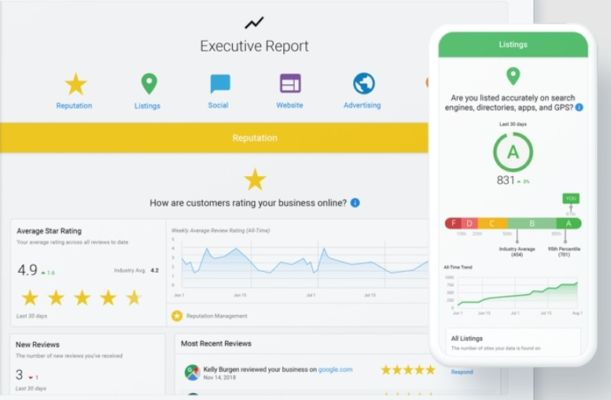
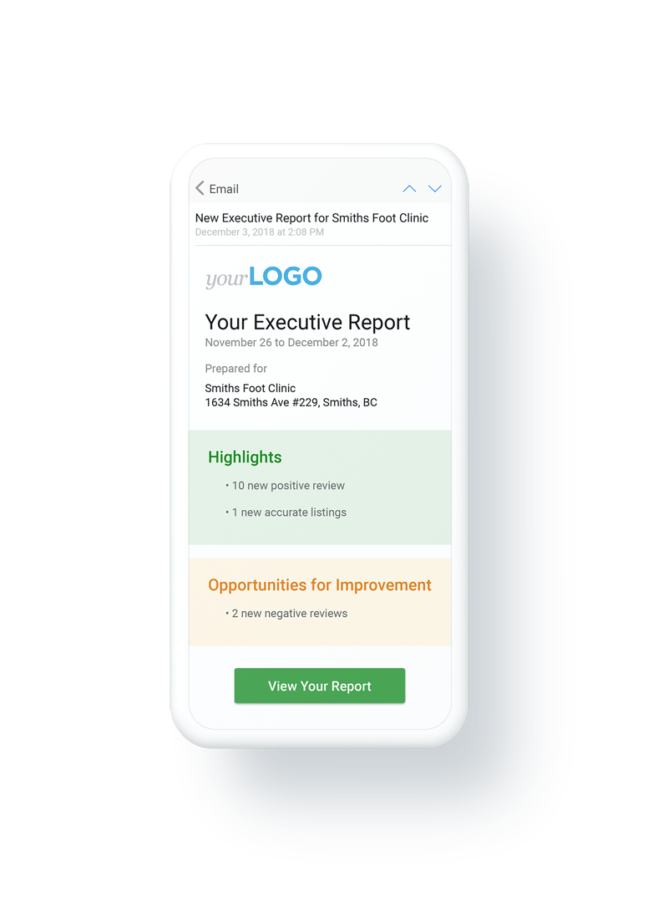
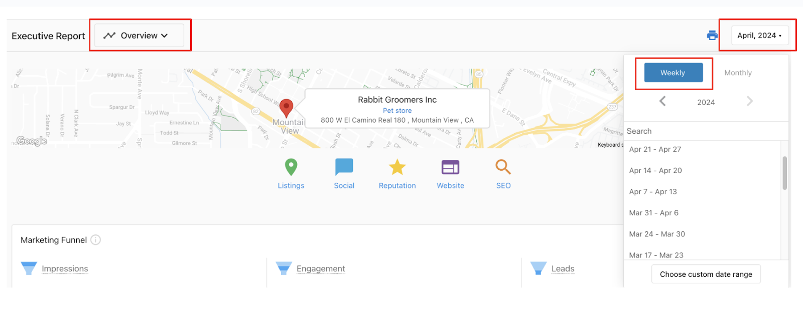
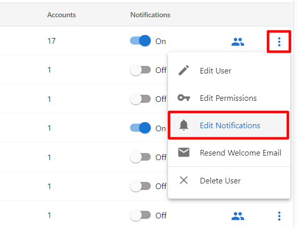
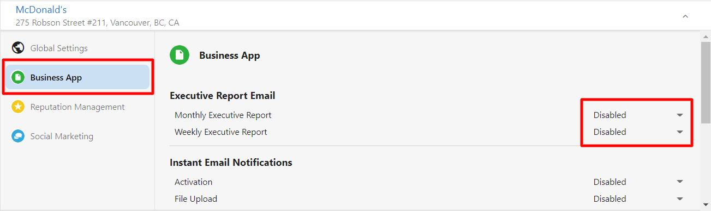

## What is the Executive Report?

The Executive Report is your client's single source of truth for the state of their online presence. It assembles metrics from products throughout the platform, giving clients a rollup of everything happening across their digital marketing channels week-to-week or month-to-month. This report is white-labeled and automatically generated under your brand, providing clients with a first-hand look at the return on their investment.

## Why is the Executive Report important?

The Executive Report helps you give clients relevant, personalized, actionable data at the right time. It serves as your tool for engaging with clients, continually proving your value, and retaining them for longer. Studies show that using the Executive Report with connected data sources like Google Business Profile can increase client retention rates by 51% over 24 months compared to those who don't use the Executive Report.

By receiving proof-of-performance reporting consistently, you provide clients with evidence of the value you bring to their business and engage them in your Business App offering.

## What's Included with the Executive Report?

### Key Features

- **Comprehensive metrics** from across the marketing stack, including Reviews, Listings, Social, Website, SEO, and Advertising
- **Short-term changes and long-term trends** - Compare metrics week-over-week or month-over-month, and use long-term trends to contextualize changes over time
- **Automated email delivery** with relevant highlights sent to clients at the beginning of every week, month, or both
- **Mobile-responsive design** - No sign-in required to view the report, accessible from any device
- **Immediate value** - Useful personalized data appears in the report within 5 minutes after running a Snapshot Report or authenticating Google Business Profile
- **White-labeled branding** with your logo in both email and Business App

### Supported Products

The following products push information to the Executive Report:

- Reputation Management
- Local SEO
- Google Business Profile (via Local SEO)
- Website Pro
- Advertising Intelligence
  - Google Ads (via Advertising Intelligence)
  - Facebook Ads (via Advertising Intelligence)
- Social Marketing
- Google Ads Robot
- Marketgoo
- Metricool
- SEO Network
- Instant Website with Facebook Sync
- PinnacleCart
- Google Ads for Small Businesses
- SiteGlue AI Starter
- SiteGlue AI Pro
- Alpha SEO - Full-Service SEO
- QuickBooks

## How to View and Navigate the Executive Report

You can access the Executive Report through the Business App. On the top-right of the report, you can choose your date range. The default options are weekly or monthly reports, and you can also select a completely custom date range.

Quick navigation to specific sections in the report is possible by:
- Clicking on a category icon in the header of the report
- Choosing from the drop-down menu in the navigation header

## When Reports Are Sent

### Delivery Schedule

- **Monthly Executive Report**: Usually sent between the 1st-3rd days of each month
- **Weekly Executive Report**: Sent out on Mondays
- **Processing time**: You may notice a 2-3 day delay before receiving your monthly report due to data processing requirements

:::info
The Executive Report may be sent outside of business days as it recognizes the start of each month, not specifically Monday-Friday.
:::

### Data Requirements

New data appears in the Executive Report automatically when supporting products are activated on an account, and sufficient time has passed to allow for data ingestion. Processing times vary based on the product.

:::warning
- Accounts with active products generally trigger Executive Reports to be sent
- For accounts with only Local SEO active, users will not receive Executive Reports if there are no changes in data
- If there are no changes from the previous month for any specific section, that section will not populate in the current month's report
:::

## Executive Report Notifications

### Default Recipients

By default, the Executive Report email is sent to Business App users under these conditions:

- Users on accounts with **active products** that push data to the report, and
- Users on accounts that have **authenticated Google Business Profile or Advertising Intelligence metrics**

### Managing Notification Settings

You can control email settings at the user level by:

1. Clicking the three dots next to a user
2. Selecting `Edit Notifications`
3. Navigating to `Business App`
4. Adjusting the Executive Report notification settings

## Frequently Asked Questions (FAQs)

How long does it take for new data to appear in the Executive Report?

New data appears automatically when supporting products are activated on an account, with processing times varying by product. After running a Snapshot Report or authenticating Google Business Profile, useful data appears within 5 minutes.

What happens if there are no changes in my data from month to month?

If there are no changes from the previous month for any specific section of the report, that section will not populate in the current month's report. For accounts with only Local SEO active, you won't receive Executive Reports if there are no data changes.

Can I customize the date range for my Executive Report?

Yes, you can choose weekly or monthly reports as defaults, or select a completely custom date range using the date selector in the top-right of the report.

How do I navigate to specific sections within the Executive Report?

You can quickly navigate to specific sections by clicking on category icons in the header or choosing from the drop-down menu in the navigation header.

Who receives the Executive Report emails by default?

Business App users on accounts with active products that push data to the report, and users on accounts that have authenticated Google Business Profile or Advertising Intelligence metrics.

Can I control who receives Executive Report notifications?

Yes, you can control email settings at the user level through the user menu by selecting "Edit Notifications" and adjusting the Executive Report notification settings.

Why might my Executive Report be delayed?

The Executive Report processes large amounts of data, so you may notice a 2-3 day delay before receiving your monthly report. This ensures all data is properly compiled and accurate.

Is the Executive Report mobile-friendly?

Yes, the Executive Report is mobile-responsive and can be viewed from any device. No sign-in is required to view the report.

What products need to be active to receive an Executive Report?

You need active products that push data to the report, such as Reputation Management, Local SEO, Website Pro, Advertising Intelligence, Social Marketing, and others listed in the supported products section.

Can I integrate custom data into the Executive Report?

Yes, custom data integrations are supported via API. You can work with your account representative for custom integrations through the Marketplace APIs.

## Example Report

You can download a full-size example of the Executive Report here:

[Download Executive Report Example (PDF, 900 KB)](/pdf/Vendasta_Executive_Report_Full_Size_Example.pdf)