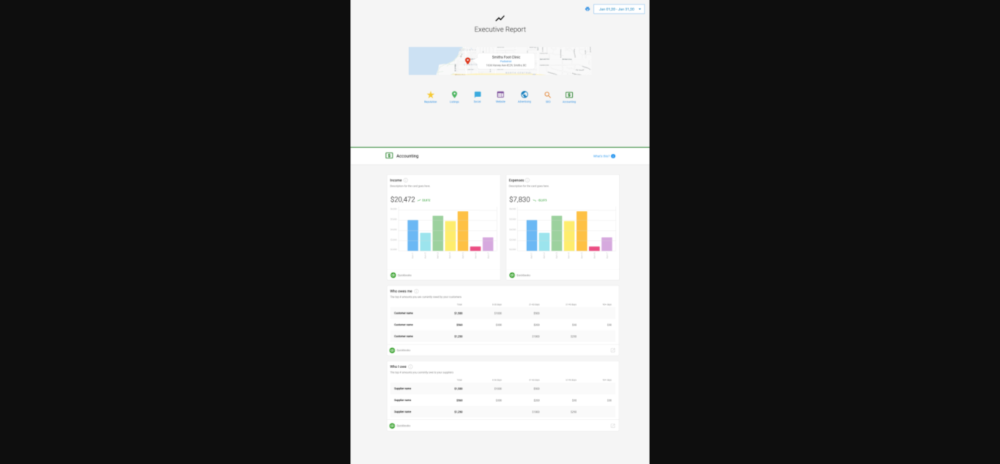

# Executive Report: Finance (QuickBooks Online)

## What Financial Data is Included?

Once a user has connected their QuickBooks Online account in Business App, their Executive Report will include comprehensive financial data to help track business performance.

### Financial Metrics Displayed

The Executive Report will show:

- **Income data** - Revenue and earnings information
- **Expense data** - Business spending and cost tracking  
- **Additional financial metrics** - Other relevant financial performance indicators

## Invoice Notifications

In addition to the financial data displayed in the Executive Report, users will receive real-time notifications about their QuickBooks Online invoices:

- **In-platform notifications** - Alerts within Business App when invoices are paid
- **Email notifications** - Email alerts sent when QuickBooks Online invoices have been paid in full

This integration ensures users stay informed about their cash flow and payment status without having to constantly check their QuickBooks account.

## How to Connect QuickBooks Online

To start seeing financial data in your Executive Report:

1. Navigate to **Business App > Administration > Connections**
2. Find QuickBooks Online in the **Browse Integrations** section
3. Follow the connection process to link your QuickBooks Online account
4. Once connected, financial data will begin appearing in your Executive Report

## Benefits of QuickBooks Integration

- **Comprehensive reporting** - See marketing performance alongside financial performance
- **Automated updates** - Financial data automatically syncs to the Executive Report
- **Real-time notifications** - Stay informed about invoice payments and cash flow
- **Client communication** - Share financial progress with stakeholders through the Executive Report
- **Holistic view** - Understand how marketing efforts impact business financial performance

This integration provides a complete picture of business performance by combining marketing metrics with essential financial data, helping you and your clients make informed decisions about business growth and marketing investments.