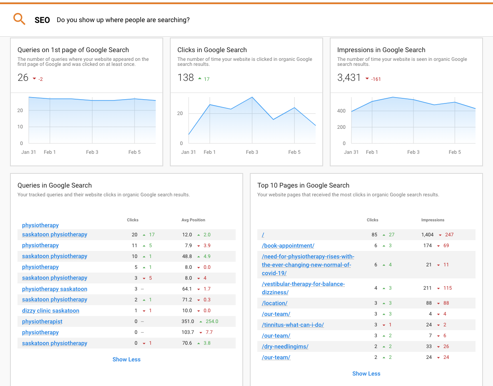
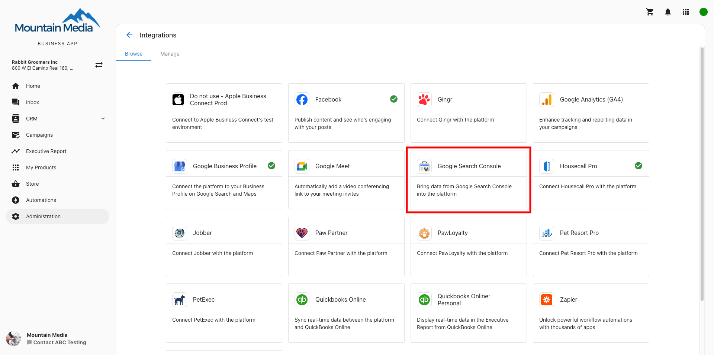
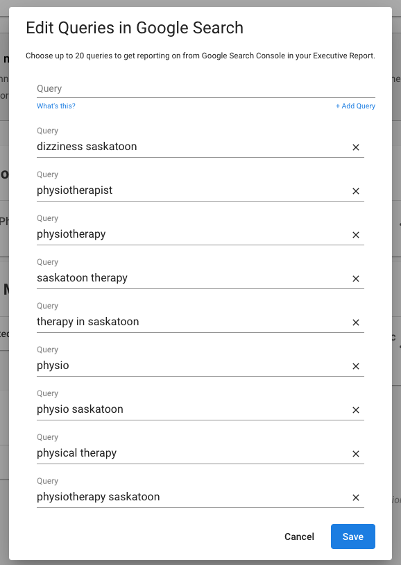
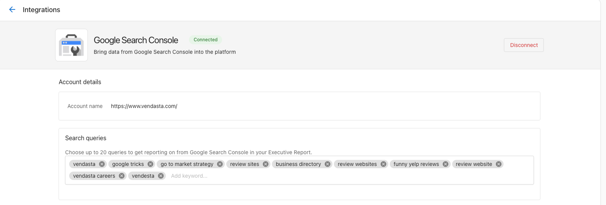
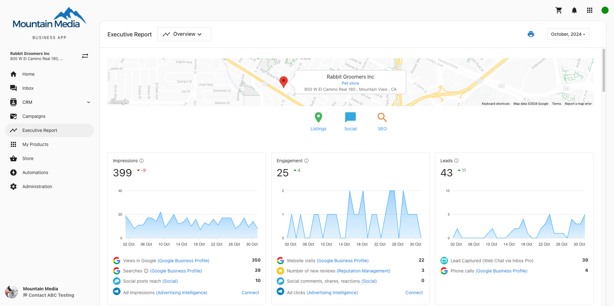
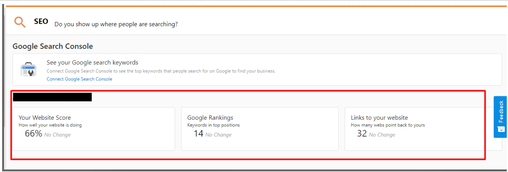

# Executive Report: SEO (Google Search Console & MarketGoo)

Show SEO proof-of-performance in the Executive Report! Automatically prove that the work you're doing for your customers is helping their business show higher in Google search results.

## Google Search Console

By connecting [Google Search Console](https://search.google.com/search-console/about) to Business App, you can show detailed, automatic proof-of-performance analytics for searches happening on Google:

- How many queries their website appears on page one of Google?
- How many clicks their website is getting?
- How many impressions their website is getting?
- Which queries are getting the most clicks, and their average position in search results?
- Which website pages are getting the most clicks and impressions?

With this powerful no-cost feature, you can show how all the hard work you do on a business's marketing (website content, blog, listings, reviews, social media, etc) is resulting in real improvements in their SEO – to help you retain your clients for longer!

### What is Google Search Console?

Google Search Console is a tool that Google provides at no charge to website owners to measure a website's search traffic and performance, fix issues, and make your site shine in Google Search results.

Your customer will have the ability to see detailed analytics about the organic 'SERP' (Search engine rank position) of a website, what search queries (keywords) are being typed into Google, and what pages are appearing the most via organic search. Our integration brings these features into the Business App Executive Report. [Visit the Google Search Console website for more info](https://search.google.com/search-console/about).

### Why connect to Google Search Console?

Our reporting provides a unique KPI that is not available from within Google Search Console itself: "Queries on 1st page of Google Search". This number is calculated daily and reveals if a business is making progress in the outcome they truly want: to show up on the first page of a Google search and get more website visits from potential customers. This metric tracks exactly that, with no extra noise.

Best of all, this reporting is automated. Connect it once to deliver automatic, ongoing proof-of-performance reporting to your clients.

### How to set up Google Search Console

**1. Setup Google Search Console**

Ensure you or your client has a Google Search Console connected to their website and fully verified. If your client doesn't yet have a Google Search Console account, you can set one up in a few quick steps [here](https://search.google.com/search-console/welcome).

**Note**: it takes 24-48 hours after a new property is connected to Google Search Console for data to start to appear on Google's side.

**2. Connect Search Console to Business App**

- In **Business App > Administration > Connections > Browse Integrations**, you'll find a card to connect to Google Search Console.
- Click the card to add an account. Only one connection per account is permitted at this time.
- Log into Google with an account that has permission to access this Search Console account.
- All accounts that can be connected will appear in this list. Choose the account you want to connect.
- Once connected, it will take up to just a few minutes for existing data to appear in the Executive Report. 30 days of history is pulled in when an account is first connected.

**Note:** If the account you want to connect does not appear here, make sure it is fully verified. Also, make sure the Google account you are connecting with has sufficient permissions to view this Search Console account.

**3. Customize the queries tracked in the Executive Report**

You can completely customize the keywords that are tracked and reported on in the Executive Report via Search Console.

- When Google Search Console is first connected, Business App will automatically pull in the top 10 search queries for this business by clicking for reporting.
- You can customize these keywords, remove them, or add, up to 20 keywords to be reported in the Executive Report.
- Go to **Business App > Administration > Connections and click on the Google Search Console card** to edit the search queries.

## MarketGoo

MarketGoo data populates within the Executive Report under the SEO section. It's important to note that any accounts with MarketGoo Lite will **NOT** populate on the report. MarketGoo submits data on a monthly cadence and as a result, the MarketGoo data is only viewable via the Monthly date range selection.

## Troubleshooting: Google Search Console data not appearing

If Google Search Console data is not appearing in your Executive Report, follow these troubleshooting steps:

### 1. When Was GSC Connected?
Data collection begins after the GSC account is connected, but it can take a few days for the data to populate. Please verify when GSC was connected and check if data is visible within the GSC interface.

### 2. Daily Data Collection Timing
Note that data is collected once daily, typically around midnight CST. Any recent changes may take up to 24 hours to reflect in reports.

### 3. When Did the Website Go Live?
If the website is newly launched, there may not be sufficient data yet to display in the reports. Check for activity or traffic within GSC to confirm.

If you have completed these checks and the issue persists, additional investigation may be required.

## FAQs

**How do I put this Search Console data at the top of my Executive Reports?**

- You can customize the order of the sections for the single-location Executive Report, from *[Partner Center > Administration > Customize](https://partners.vendasta.com/customize-design)* > *Business App Settings > Executive Report Page Layout* > [Edit Default Executive Report Template](https://partners.vendasta.com/customize-design/customize-executive-report). From here, we recommend dragging the SEO section to the top of your report. This can be configured on a market-by-market basis.

**I've connected Search Console to Business App, but I don't see any data in the Executive Report.**

- Do you see data in Google Search Console itself yet? It can take a few days for a newly connected Search Console account to begin to collect data. Check back the next day – after connecting, our data collection happens once per day around midnight CST.
- It can take a few minutes for Business App to pull in data to display in the Executive Report. The app automatically pulls in 90 days' worth of data, and you should usually be able to see data in the most recent weekly exec report within an hour of connecting to Search Console.
- If the website is new, there may be low or no data to report on yet. With no data yet, the cards will not appear. As you work at improving the SEO of this website, and it starts to receive organic clicks, data will appear in the report.
- Do you have sufficient permissions on your Google user to connect this data? Ensure you have admin privileges in Google Search Console.

**How are the 'Queries on 1st page of Google Search' cards calculated?**

- We created a new custom metric that is a great way to show proof of improvement over time to a business owner. Each day, we count the number of queries where:
  - They each have an average position of between 1.0 and 10.0 (the first page of Google).
  - The business's website received at least one click within the last 30 days for that keyword.
- We created this definition to eliminate the noise that can come from the hundreds of keywords a business might appear for but never get a click, because of poor relevancy.
- This number is calculated once every 24 hours and then plotted on a trendline, to show a trend over time. As a website's SEO is improved, so will this number on this card.

**Why aren't Average CTR or Average Position metrics in the reporting?**

- Average CTR (click-through-rate) and Average Position are helpful metrics to look at on a per-keyword level, but when rolled up as an overall stat, they are not helpful in proving performance to an SMB client, because they are averages that will continually be dragged down by every new keyword that the website appears for. Essentially, these are two metrics a business will never be able to win at, and will never go "up and to the right". So we decided to not include them in our Executive Report of high-level performance metrics.

**Do you support Domain Properties?**

- Yes! We support connecting both Domain-properties and URL prefix properties. We recommend using Domain properties, as they collect a wider view of all search activity from all variations of a domain (www vs non-www, etc.) [Learn about the difference here](https://support.google.com/webmasters/answer/34592).