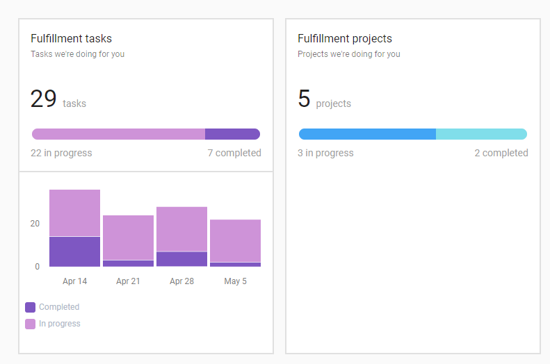
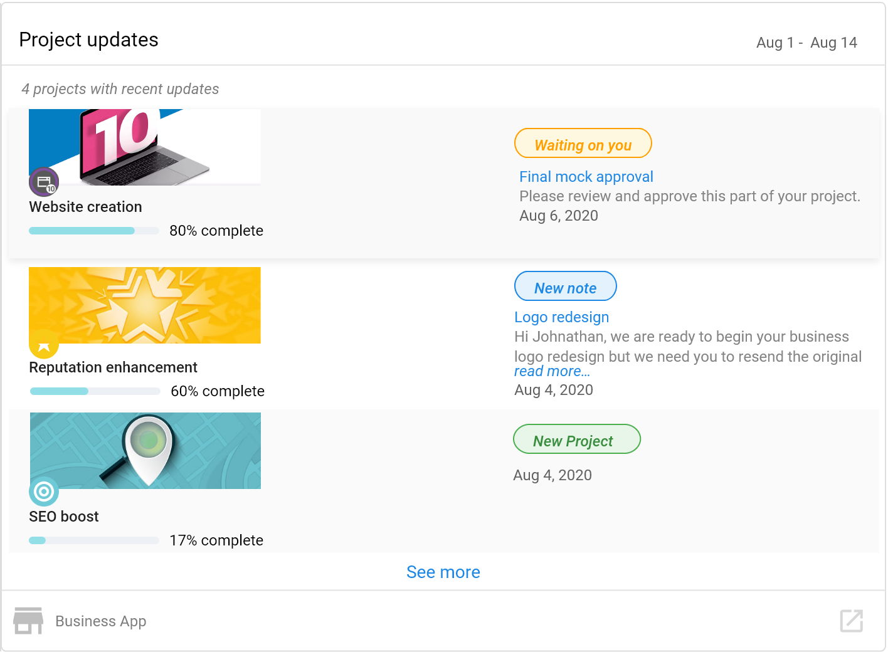

# Executive Report: Fulfillment

Your fulfillment team works hard to provide the most value it can to your clients, however, often this work remains hidden. Agents have to painstakingly create their reports to highlight the actions performed on behalf of your clients, taking them away from the work your company was trusted within the first place.

That's why we released fulfillment cards into the Executive Report centred on tackling this problem. 

## What Fulfillment Data is Shown

The Executive Report includes fulfillment cards that showcase your team's work:

These cards will tell your clients exactly how many tasks and projects you're doing for them, providing transparency and demonstrating the value your team delivers.

### Fulfillment Cards Include:

- **Fulfillment Tasks** - Shows the number of tasks completed for the client
- **Fulfillment Projects** - Displays project work done on behalf of the client  
- **Project Updates** - Communicates visible project updates and progress

## Visibility Rules

### Fulfillment Tasks and Projects Cards

**Question: Does this only show projects and tasks set to visible?**

No. For the *Fulfillment tasks* and *Fulfillment projects* cards, we will show total numbers regardless of visibility. This is to ensure your team gets the credit it deserves for all the work performed, whether marked as visible or not.

### Project Updates Card

The *Project updates* card, however, will only show information that's been made visible. This gives you control over what specific project communications and updates your clients see while still crediting your team for the overall volume of work.

## Multi-Location Support

**Question: Will these cards show in the Multi-Location Executive Report?**

Absolutely! Versions of these cards are available in the Multi-Location Executive Report, allowing you to demonstrate fulfillment value across multiple business locations for enterprise clients.

## Benefits of Fulfillment Reporting

- **Transparency**: Clients can see the volume of work being done on their behalf
- **Value Demonstration**: Automatically showcase your team's efforts without manual reporting
- **Time Savings**: Reduces the need for agents to create separate fulfillment reports
- **Client Retention**: Helps clients understand and appreciate the ongoing value they receive