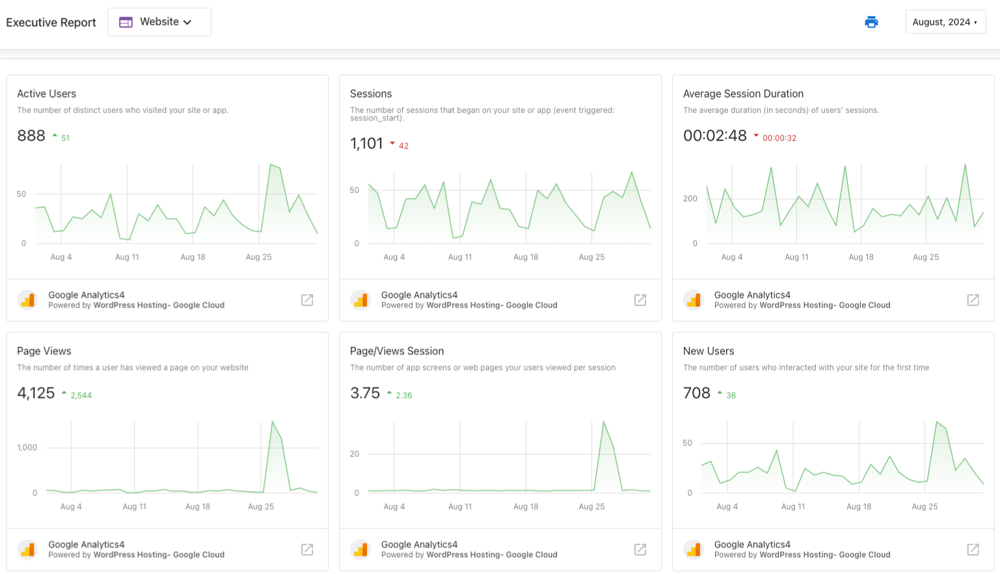

# Executive Report: Google Analytics in the Website section

Users can see improved data on their website's traffic in the Executive Report when they connect a Google Analytics account in Business App.

Users with a Google Analytics account connected to Business App will find the Executive Report to be even more useful in monitoring their website's performance. Users are now able to see an improved measurement of their site's traffic, referral sources, bounce rate, and more.

## How does Google Analytics in the Website section work?

Business App users can connect their Google Analytics account by going to **Business App > Administration > Connections** and adding Google Analytics from the **Browse Integrations** page.

Data collected from Google Analytics will be displayed under the Website section of the Executive Report. The following metrics are monitored:

- **Users**: The number of unique visitors that your website has received
- **Sessions**: The number of times your site has been visited
- **Page Views**: The number of times a user has viewed a page on your website
- **Average Time on Website**: The average length of time a user spends browsing your website
- **Bounce Rate**: The percentage of users who left your site after viewing only one page
- **Pages per Session**: The average number of pages viewed in a single session
- **Traffic Sources**: The types of browsing behavior that lead visitors to your website
- **Top Referral Sources**: The sites that direct the most traffic to your website

