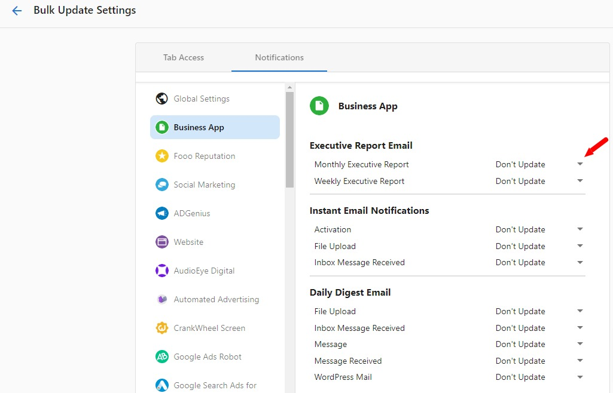
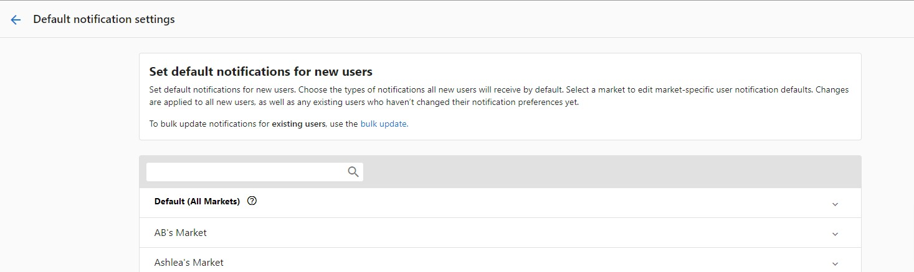

### **To turn off the Executive Report:**

1. Log in to **Partner Center.**
2. Navigate to **Accounts > Manage Users >** click on **'Bulk Update x Users' > Notifications**
3. Under **Business App** section **> Executive Report Email >** select **"Disabled" in the drop-down options for weekly and monthly:**

*Keep in mind that this will only prevent the Executive Report emails from being sent out to **already existing users***

You will also want to turn off the default settings for **newly created users** by going to **Partner Center > Administration > Client Notifications.** Here you will be able to set default notifications for new users, as well as customize them by market:

