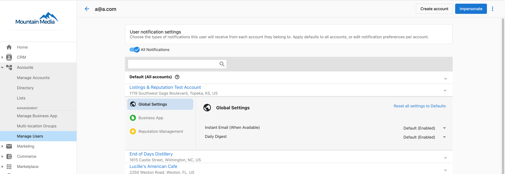

# How does the Executive Report work?

There are two aspects of the Executive Report that you will be able to globally manage:

1. Executive Report tab in Business App
2. Automated report email

Your clients can view the new Executive Report anytime in **Business App > Executive Report**. You can set a weekly and/or monthly schedule for the report to be sent via email to your clients.

To enable or disable the Executive Report and to Select whether you want your clients to receive Weekly or Monthly emails of the Executive Report, follow the steps below.

To edit notifications for a single user go to:  
**Partner Center > Accounts > Manage Users > 3 dots next to user > Edit notifications > Click on the white space next to the business name > Business app. Enable/disable.**

To edit users in bulk:  
**Partner Center > Accounts > Manage Users > Bulk Update > Notifications tab > Business app. Enable/disable.**

{/*  */}