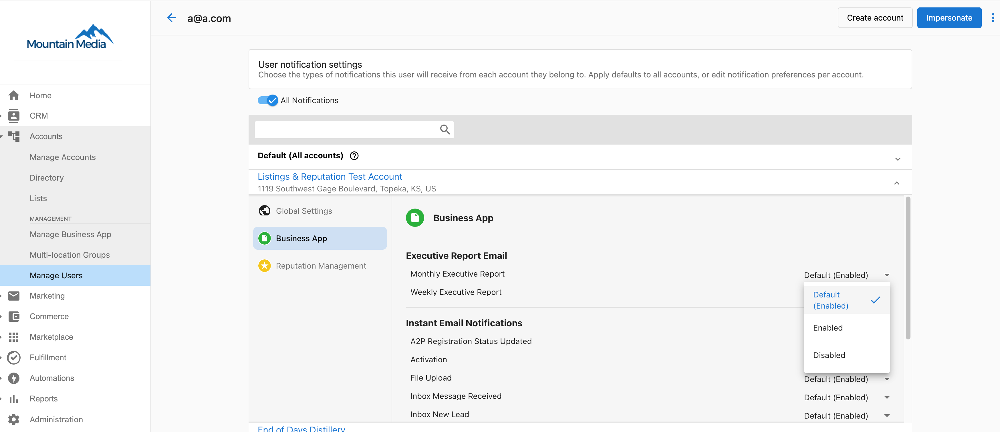
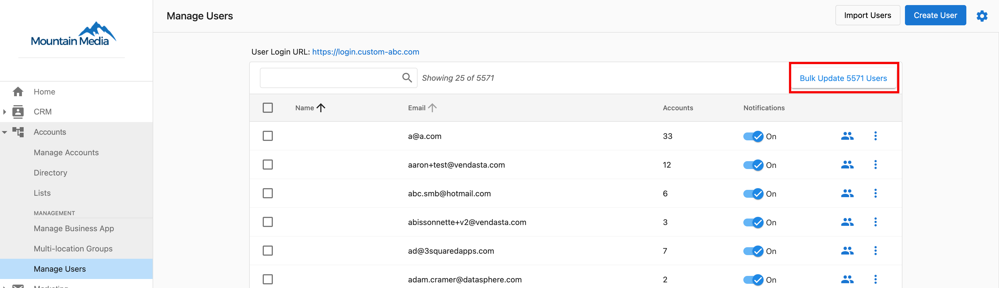

# How do I send the Executive Report weekly?

You can change the frequency of the Executive Report to "weekly" for either a specific user or for bulk users.

**For a single user:**  
Partner Center > Accounts > Manage Users > 3 dots next to user > Edit notifications > Click on the white space next to the business name > Business app tab.  

**To bulk update:**  
Partner Center > Accounts > Manage Users > Bulk Update > Notifications tab > Business app.

