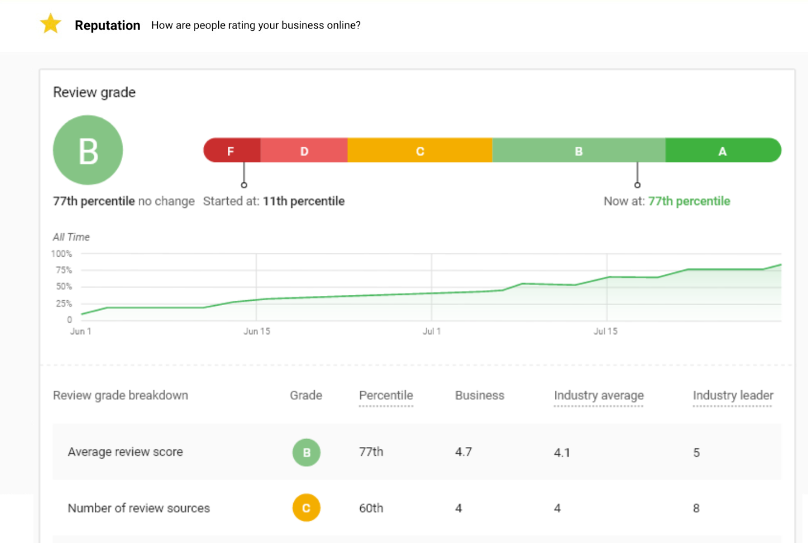

The Executive Report shows your clients how their businesses are performing across a variety of marketing categories including Reputation. This article covers a key component of reputation reporting: the Review Grade.

## Review Grade

The Review Grade is a letter grade given to your clients' businesses to evaluate their online review presence. The Review Grade is used in the Sales intelligence report and the Snapshot Report to evaluate a business's online reputation before partnering with your company.

The Review Grade in the Executive Report enhances reporting transparency for your clients and shows proof of performance over time.

### How is the Review Grade calculated?

The Review Grade is calculated based on the business' performance in four categories:

- Average review score
- Number of review sources
- Reviews found
- Number of reviews found per month

Scores in the four categories are then combined and compared to the industry average to get the final letter grade using this percentile grading system:

- **A** = 90 - 100th percentile
- **B** = 75 - 89th percentile
- **C** = 50 - 74th percentile
- **D** = 30 - 49th percentile
- **F** = 0 - 29th percentile

*For example, if a business has an average review score of 3.5, this puts the business in the 10th percentile compared to the industry average (4.32) and industry leader (5). This category receives an F. The same calculations are done for the other three categories and a combined score results in a Review Grade of C.*

The Review Grade is turned on by default.

### How to disable the Review Grade

We do not recommend disabling the Review Grade from your clients' Executive Reports, however, you may do so from a setting in Partner Center.

**To turn off the Review Grade for all markets (if applicable):**

1. Log in to [Partner Center](https://partners.vendasta.com)
2. `Administration` → `Customize Business App` → `Executive Report` → `Review Grade`
3. Uncheck the box beside `Show Review Grade Card in Executive Report for SMBs`.

All markets will abide by these Partner settings. If you wish to enable the Review Grade for select markets, follow the steps below, but ensure the setting is set to `Enable`.

**To turn off the Review Grade for select markets:**

1. Log in to [Partner Center](https://partners.vendasta.com) → `Administration` → `Customize Business App` → `Executive Report` → `Review Grade`
2. Click the `Markets` tab.
3. Uncheck the box beside `Show Review Grade Card in Executive Report for SMBs`.

