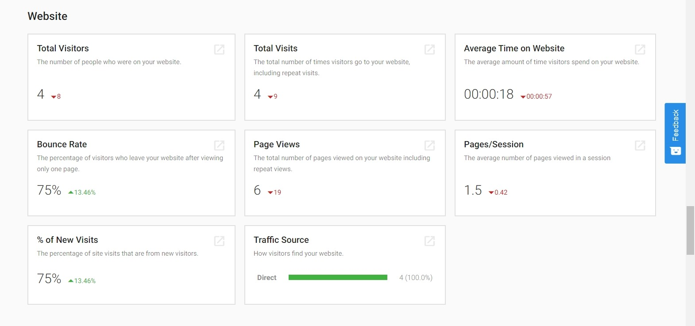

## What is it?

Information from Website Standard/Pro can be found in the Executive Report! 

You can see Google Analytics on your client's WordPress sites right in the Executive Report. This includes stats on visitors, page views, time on the website, referral sources, and more.

## Why is it important?

The Executive Report is a key tool in showing your proof of performance and showing your clients their progress across marketing channels. You can use the Executive Report to show your clients their website performance alongside the other products you offer them—giving them a rollup view of the value you deliver.

## How does it work?

This information will appear in the Executive Report when you activate Website Standard/Pro for an account and connect a WordPress site.

