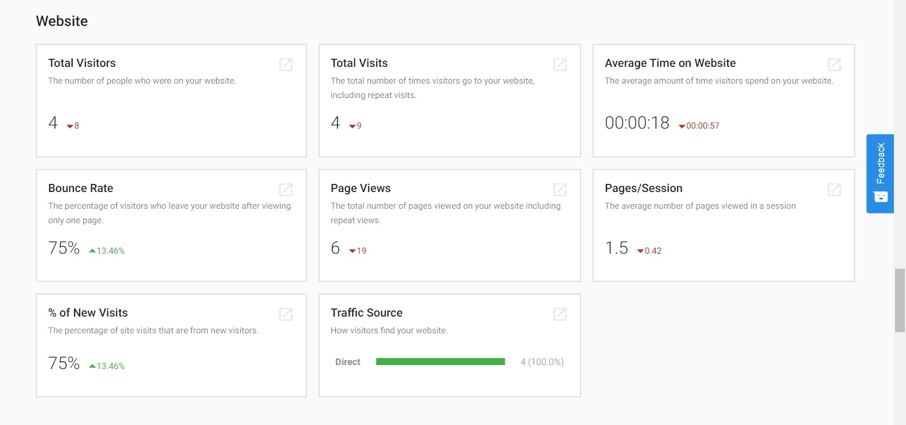
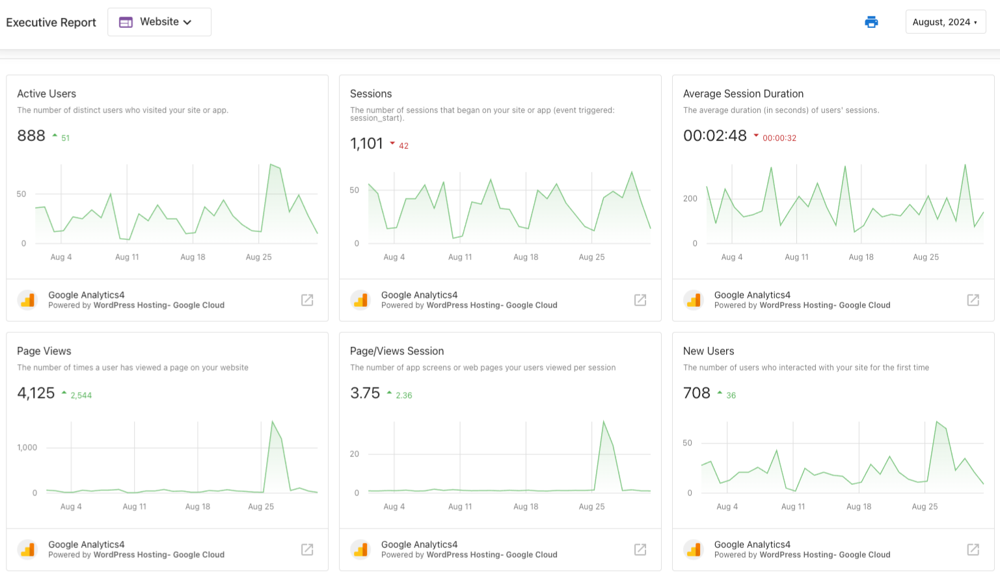

# Executive Report: Website Performance

## What is Website Performance Reporting?

Information from Website Standard/Pro can be found in the Executive Report! You can see comprehensive website analytics including Google Analytics data on your client's WordPress sites right in the Executive Report. This includes stats on visitors, page views, time on the website, referral sources, and more.

## Why is Website Performance Reporting important?

The Executive Report is a key tool in showing your proof of performance and demonstrating your clients' progress across marketing channels. You can use the Executive Report to show your clients their website performance alongside the other products you offer them—giving them a rollup view of the value you deliver.

Users with a Google Analytics account connected to Business App will find the Executive Report to be even more useful in monitoring their website's performance. They can see improved measurements of their site's traffic, referral sources, bounce rate, and more.

## How Website Performance Reporting Works

### Website Pro Integration
Website performance information will appear in the Executive Report when you activate Website Standard/Pro for an account and connect a WordPress site.

### Google Analytics Integration

Business App users can enhance their website reporting by connecting their Google Analytics account. A few important things to know before connecting:

- **Website Pro is not required** — any account with a GA4 property can connect Google Analytics to the Executive Report.
- **GA4 is the supported version** — Universal Analytics (UA) was deprecated by Google and is no longer supported. Connect a GA4 property.
- **12 months of history is pulled in** when a property is first connected.
- **Allow 24–48 hours** for data to populate after connecting.

To connect:

1. Go to **Business App > Administration > Connections**
2. Add Google Analytics from the **Browse Integrations** page
3. Sign in with a Google account that has access to the GA4 property
4. Select the GA4 property and complete the connection

Once connected, data collected from Google Analytics will be displayed under the Website section of the Executive Report. If no data appears after 48 hours, verify the connection is still active under **Business App > Administration > Connections**.

## Website Metrics Available

When Google Analytics is connected, the following metrics are monitored and displayed in the Executive Report:

- **Users**: The number of unique visitors that your website has received
- **Sessions**: The number of times your site has been visited
- **Page Views**: The number of times a user has viewed a page on your website
- **Average Time on Website**: The average length of time a user spends browsing your website
- **Bounce Rate**: The percentage of users who left your site after viewing only one page
- **Pages per Session**: The average number of pages viewed in a single session
- **Traffic Sources**: The types of browsing behavior that lead visitors to your website
- **Top Referral Sources**: The sites that direct the most traffic to your website

## Setup Requirements

To get website performance data in your Executive Report:

1. **For Website Pro data**: Activate Website Standard/Pro for the account and connect a WordPress site
2. **For enhanced Google Analytics data**: Connect a Google Analytics account through Business App > Administration > Connections > Browse Integrations

Both data sources provide valuable insights into website performance that can be shared with clients to demonstrate the value of your website and digital marketing services.

## Troubleshooting: Google Analytics data differs from GA dashboard

It's common to see slightly different numbers between the Executive Report and the Google Analytics dashboard. This doesn't indicate a problem — it results from differences in how each view calculates the same data.

### Common causes

- **Time zone differences** — The Executive Report may use a different time zone than your GA4 property. Check the GA4 property's reporting time zone under **Admin > Property Settings**.
- **Active users vs. new users** — GA4 dashboard views default to Active Users. The Executive Report may display a different user metric, and these two numbers can diverge depending on how often existing users return.
- **Dashboard summary vs. Explore** — The GA4 homepage summary uses estimation that can differ from a detailed Explore report. Compare Executive Report numbers against a proper Explore report, not the GA4 homepage.
- **Late-arriving data** — Both GA4 and the Executive Report update retroactively after a period closes. A number pulled on the 5th of the month may differ slightly from the same number on the 20th.

### Setting up a like-for-like comparison in GA4

1. In GA4, go to **Explore** (left nav) and click **Blank**
2. Set the date range to match the Executive Report period exactly
3. Add the same metric shown in the Executive Report (e.g., Users)
4. Set the time zone to match the Executive Report (typically UTC)
5. Compare the result against the Executive Report

Small discrepancies (1–5%) are normal. If the discrepancy is large (over 10–15%), check whether the correct GA4 property is connected and whether the connection is still active under **Business App > Administration > Connections**.