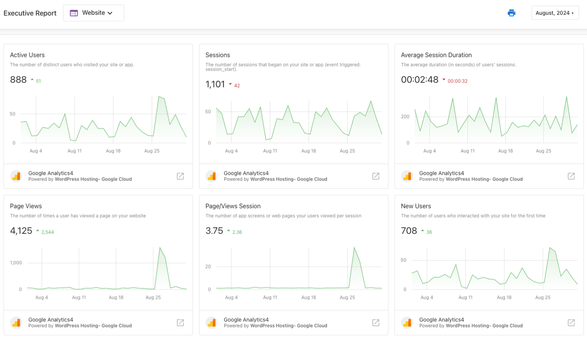

# Executive Report: Website Performance

## What is Website Performance Reporting?

Information from Website Standard/Pro can be found in the Executive Report! You can see comprehensive website analytics including Google Analytics data on your client's WordPress sites right in the Executive Report. This includes stats on visitors, page views, time on the website, referral sources, and more.

## Why is Website Performance Reporting important?

The Executive Report is a key tool in showing your proof of performance and demonstrating your clients' progress across marketing channels. You can use the Executive Report to show your clients their website performance alongside the other products you offer them—giving them a rollup view of the value you deliver.

Users with a Google Analytics account connected to Business App will find the Executive Report to be even more useful in monitoring their website's performance. They can see improved measurements of their site's traffic, referral sources, bounce rate, and more.

## How Website Performance Reporting Works

### Website Pro Integration
Website performance information will appear in the Executive Report when you activate Website Standard/Pro for an account and connect a WordPress site.

### Google Analytics Integration
Business App users can enhance their website reporting by connecting their Google Analytics account:

1. Go to **Business App > Administration > Connections**
2. Add Google Analytics from the **Browse Integrations** page
3. Complete the connection process

Once connected, data collected from Google Analytics will be displayed under the Website section of the Executive Report.

## Website Metrics Available

When Google Analytics is connected, the following metrics are monitored and displayed in the Executive Report:

- **Users**: The number of unique visitors that your website has received
- **Sessions**: The number of times your site has been visited
- **Page Views**: The number of times a user has viewed a page on your website
- **Average Time on Website**: The average length of time a user spends browsing your website
- **Bounce Rate**: The percentage of users who left your site after viewing only one page
- **Pages per Session**: The average number of pages viewed in a single session
- **Traffic Sources**: The types of browsing behavior that lead visitors to your website
- **Top Referral Sources**: The sites that direct the most traffic to your website

## Setup Requirements

To get website performance data in your Executive Report:

1. **For Website Pro data**: Activate Website Standard/Pro for the account and connect a WordPress site
2. **For enhanced Google Analytics data**: Connect a Google Analytics account through Business App > Administration > Connections > Browse Integrations

Both data sources provide valuable insights into website performance that can be shared with clients to demonstrate the value of your website and digital marketing services.