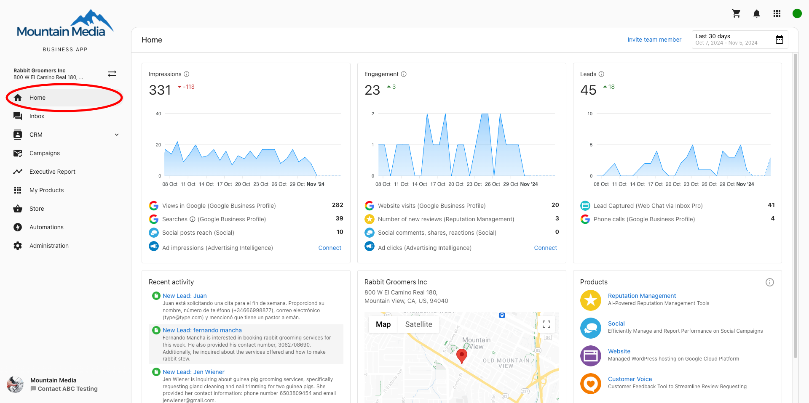
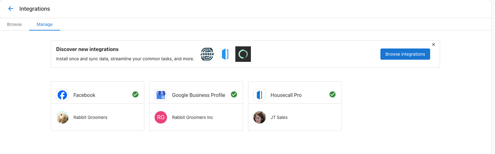
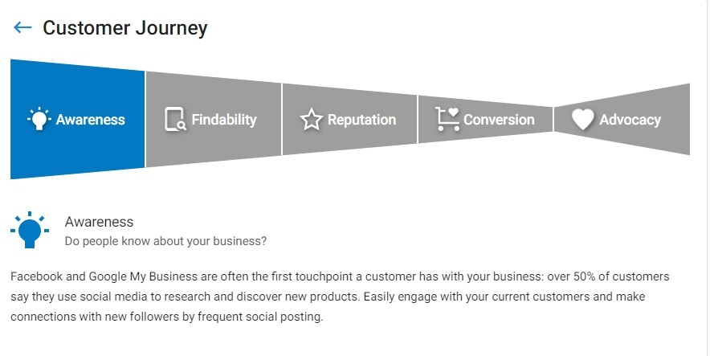
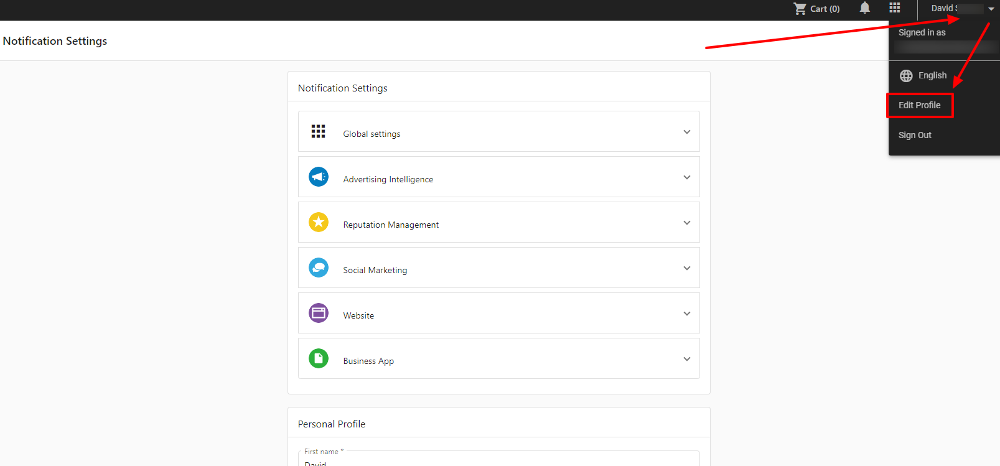

# Setting up Business App

Business App is your clients' branded dashboard where they access products, view reports, and manage their account. This guide covers everything you need to configure a professional, functional client experience.

## Phase 1: Basic Branding Setup

### Configure Your Brand Identity

Set up your brand identity to appear throughout Business App:

1. **Go to Partner Center > Administration > Partner Branding**
2. **Upload your logo, favicon, and shortcut icon**
3. **Set company name and primary colors**
4. **Configure custom domain** (if available on your plan)

**📖 Detailed Guide:** [Visual Branding and Identity](/administration/platform-settings/partner-branding/visual-branding-and-identity) - Complete branding customization options

**⚙️ Configuration Help:** [Customize Your Branding](/administration/platform-settings/partner-branding/customize-your-branding) - Step-by-step branding setup

## Phase 2: Feature and Access Configuration  

### Choose Available Features

Configure which tabs and features clients see:

1. **Go to Partner Center > Administration > Customize Business App**
2. **Enable/disable tabs** based on services you offer
3. **Configure onboarding settings** (video, welcome messages)
4. **Set notification defaults** for new users

**📖 Complete Guide:** [Business App Interface Customization](/administration/platform-settings/customize-business-app/business-app-interface-customization) - Full customization options and interface control

#### Navigation and tab access

Business App navigation features tabs that can be toggled globally or per user. Common tabs include Home, Conversations, CRM (Contacts, Companies, Activity Feed, Opportunities, Tasks, Lists, Leaderboard, Forms, My Meetings), Campaigns, Executive Report, My Products, Store, Automations, and Administration.

- **Set global defaults:** Use **Partner Center > Administration > Customize Business App** to turn tabs on or off for all accounts.
- **Adjust individual users:** Go to **Partner Center > Accounts > Manage Users**, select the users to modify, choose **Bulk Update x Users**, and configure tab access permissions.

## Phase 3: User Management and Permissions

### Create and Configure User Accounts

Set up user accounts with appropriate access:

1. **Go to Partner Center > Accounts > Manage Users** 
2. **Create users** with email and basic information
3. **Assign to accounts** and set permissions
4. **Configure tab access** for individual or bulk users

**👥 User Setup Guide:** [Manage Users](/accounts/manage-users) - Create users, assign to accounts, and configure permissions

**🔐 Permission Management:** [Business App Access](/accounts/manage-business-app/business-app-access) - User permissions and access control

#### User profiles and permissions

Clients can update their own profile details by opening the profile dropdown in Business App and selecting **Edit Profile**. They can manage personal information, change their password, update notification preferences, add a profile photo, and choose a preferred language.

If you need to fine-tune product or tab access for a user:

1. Click the three-dot menu beside the user in **Manage Users**
2. Select **Edit Permissions**
3. Choose the account
4. Adjust tab permissions or individual product access

## Phase 4: Multi-Location and Mobile Setup

### Multi-Location Clients

For clients with multiple business locations:

1. **Create business groups** to organize locations
2. **Set up consolidated reporting** across all locations
3. **Configure user permissions** for location-specific access

**Location tips:** Within Business App, clients can switch locations from the business name dropdown, set a default location via the three-dot menu, and ensure each location has accurate address information before sharing access.

**🏢 Multi-Location Setup:** [Getting Started with Multi-Location Business App](/multi-location-business-app/setup/getting-started) - Complete multi-location configuration

### Mobile Experience

Business App mobile access works automatically with your branding setup:

- **Progressive Web App** - Clients can add to home screen from any browser
- **Native Mobile App** - Available as "BusinessApp.io" from app stores  
- **Your branding** appears in mobile interfaces

**Partner configuration:** Upload a shortcut icon (192px square) via **Partner Center > Administration > Partner Branding**. For market-specific branding, choose the market, disable **Use All Markets default**, and upload market-level assets.

**Client installation instructions:**

- **iOS (Safari):** Open the Business App URL, tap **Share**, choose **Add to Home Screen**, and confirm the shortcut name.
- **Android (Chrome):** Open the Business App URL, tap the three-dot menu, select **Install App**, then confirm adding it to the home screen.

**📱 Mobile App Details:** [Business App Mobile App](/business-app/mobile-app) - Features, installation, and troubleshooting

## Phase 5: Testing and Launch

### Pre-Launch Testing

Test the complete client experience:

1. **Log in as client** to verify branding and functionality
2. **Test key features** they'll use most
3. **Check mobile experience** on different devices
4. **Verify user permissions** are set correctly

### Launch Checklist

- [ ] Branding displays correctly across all areas
- [ ] Only relevant tabs are enabled for services you provide
- [ ] Test users can access appropriate features  
- [ ] Mobile shortcut icon and branding work
- [ ] Client welcome email drafted with login details

## Next Step: Demo to Your Client

Once Business App is configured, you're ready to onboard your client. Learn how to effectively demo Business App features in our [Demoing Business App to Clients guide](./demoing-business-app-to-clients.mdx).

## Common Configuration Scenarios

### Basic Service Provider
**Enable:** Home, Executive Report, My Products  
**Focus:** Clean interface showing only reporting and service management

### Full-Service Marketing Agency  
**Enable:** All tabs except Administration  
**Focus:** Store configuration with your service packages

### Enterprise/Multi-Location
**Enable:** All tabs including Administration  
**Special:** Multi-location groups and location-specific user permissions

## Troubleshooting Common Issues

### Branding Problems
- **Logo not showing:** Clear browser cache, verify file upload completion
- **Wrong colors:** Check Partner Branding settings, ensure changes were saved

### User Access Issues  
- **Can't log in:** Verify user is assigned to correct account
- **Missing features:** Check user permissions and global tab settings
- **Wrong language:** Update in user profile or Partner Center > Manage Users

### Mobile Experience
- **Icon not appearing:** Ensure shortcut icon uploaded in Partner Branding
- **Installation problems:** Test both PWA (browser) and native app installation

**🔧 Additional Support:** Check the [Business App overview FAQs](/business-app/#frequently-asked-questions) for common questions and solutions

## Customer journey and onboarding resources

The Get Started experience walks clients through key stages of the customer journey.

### Awareness
Help clients expand their reach via social media. Prompt them to publish a post with Social Marketing.

### Findability
Ensure business listings stay accurate. Encourage the **Verify listings** or **Update business info** calls-to-action.

### Reputation
Coach clients to respond to new reviews through Reputation AI to maintain search visibility.

### Conversion
Keep websites current. Remind clients to update their site content or offers directly from Business App.

### Advocacy
Request reviews from delighted customers using the Customer Voice email tools.

### Get Started page features
- Personalized onboarding recommendations based on active products
- Dynamic call-to-actions for essential setup tasks
- Guided integrations for Google Business Profile, SMS registration, and customer imports

### Training videos
- **Unbranded welcome video:** Provides a quick overview of Business App value and how to connect social accounts
- **Walkthrough video:** Plays for first-time users and highlights dashboard features, key products, and reporting

## Language customization

### Users updating their own language
1. Log into Business App
2. Click their profile name (top right)
3. Select the current language and pick a new option

### Admin-assisted updates
1. Go to **Partner Center > Accounts > Manage Users**
2. Open the three-dot menu beside the user
3. Choose **Edit User**
4. Set the preferred language and click **Update User**

:::tip
If the browser language differs from the selected Business App language, users see a prompt asking which to use.
:::

## Product pinning and organization

Help power users surface favorite products quickly:

1. Open the **My Products** tab
2. Click the pin icon beside the desired products
3. Pinned products move to the top of the Products card, navigation, and the My Products page
4. The first four pinned items appear on the dashboard for fast access

## Screenshots

## FAQs

How do I remove the onboarding video from the Business App dashboard?

Disable the walkthrough video by navigating to **Partner Center > Administration > Customize Business App > Get Started** and unchecking **Display Onboarding Video**.

Should I connect my social accounts in Business App first?

Yes. Connecting Facebook, Google Business Profile, or other social accounts inside Business App automatically shares those connections with products such as Social Marketing, Reputation AI, and Local SEO. Even if no products are active, the Marketing Funnel still displays insights sourced from connected accounts.

What do I do if my Google Business Profile is suspended?

Only the business owner can appeal a suspension. Share these steps with your client:

1. Review the [Google Business Profile guidelines](https://support.google.com/business/answer/3038177)
2. Sign into Google Business Profile and correct any policy violations
3. Request reinstatement using [Google's form](https://support.google.com/business/troubleshooter/2690129)

If a reinstatement request is denied, contact Google support with storefront photos and company details to verify eligibility.

