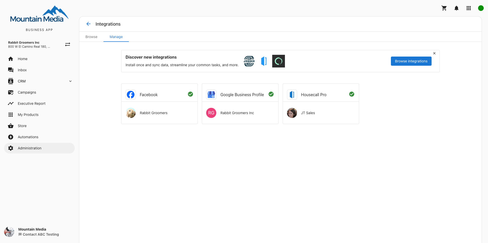

# Should I connect my social accounts in Business App first?

If you connect your social accounts (such as Facebook or Google Business Profile) to Business App first, it will automatically connect the account(s) to other areas on the platform! This includes products like Social Marketing, Reputation Management, or Local SEO.

When you have your social accounts connected and active products, you will see valuable stats throughout the product sections of the Executive Report. If you have your social accounts connected to Business App but there are no active products for the business, you will only see data in the Marketing Funnel.