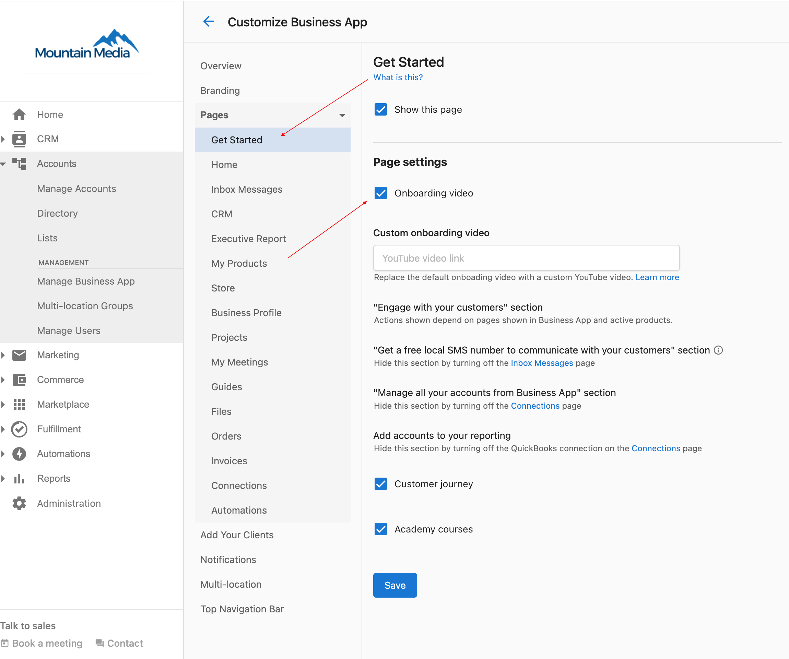

# How do I remove the onboarding video from the Business App dashboard?

If you do not want the Business App walkthrough video to be displayed to your clients, you can easily disable it by going to **Partner Center > Administration > Customize Business App > Get Started**, and then unchecking **Display Onboarding Video**.

