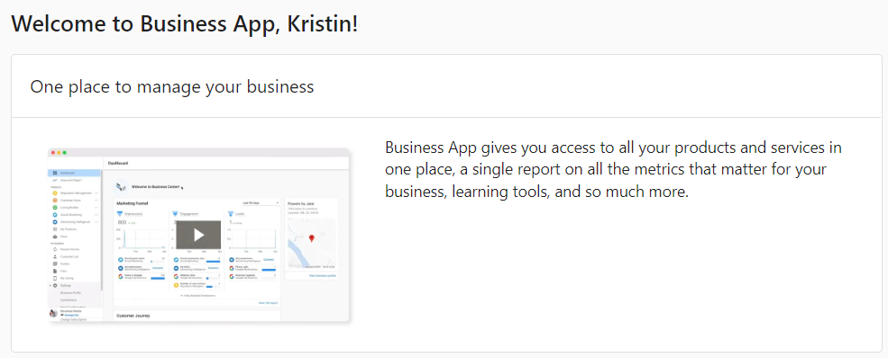
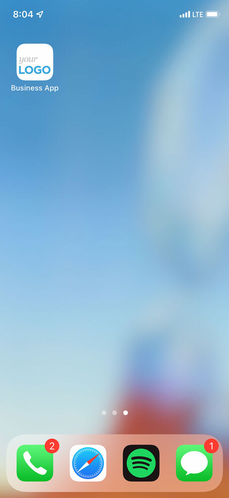
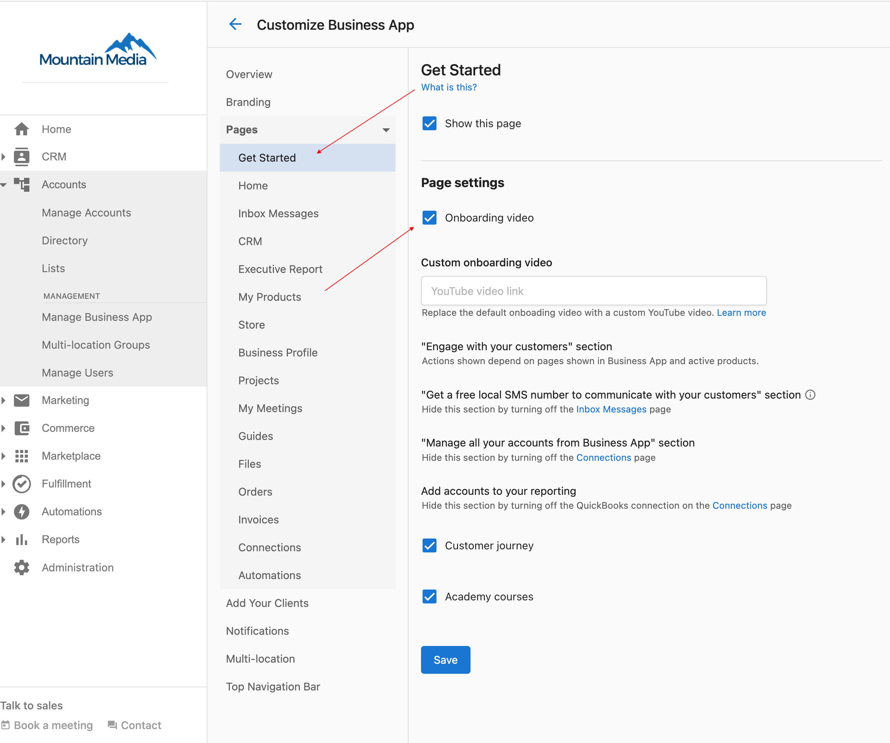
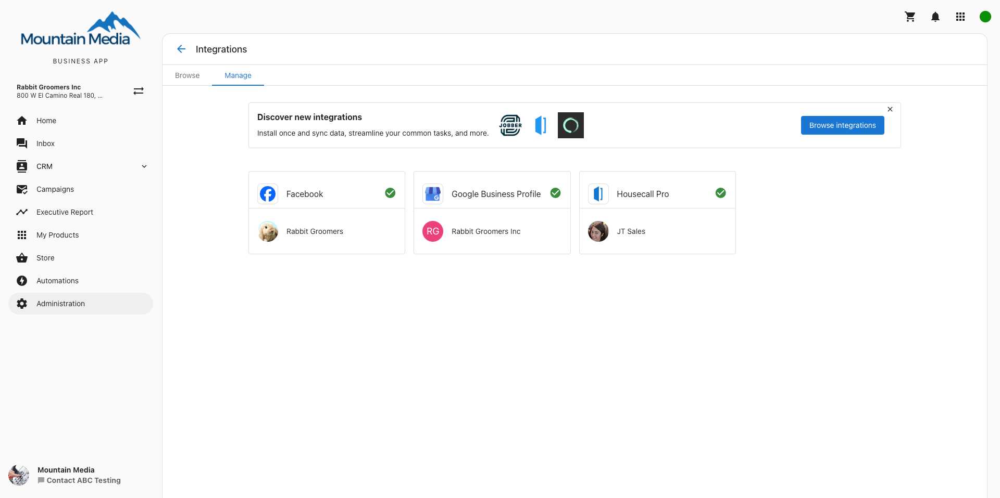

## Get Started with Business App

Business App is your client-facing dashboard that provides access to products, services, reporting, and communication tools – all under your brand. It serves as a central hub where your clients can access everything you provide, including automated proof-of-performance reporting and product management.

## What is Business App?

Business App is your client-facing dashboard. It's how your clients access the products and services you've provisioned for them, see proof of performance reporting, communicate with you and their customers, and more – all under your brand.

## Why is Business App Important?

Business App centralizes all client interactions and services in one branded platform. It eliminates the need for clients to juggle multiple tools while providing you with a professional, cohesive brand experience. The platform streamlines client onboarding, improves engagement rates, and helps convert prospects into paying customers through guided workflows and value demonstration.

## What You Can Do with Business App

With Business App, you can:

- [Brand as your own app](/business-app/business-app-get-started/branding) – Add your logo, rename it, and customize the domain
- [Configure the features](/business-app/business-app-get-started/configure-features) and [notifications your clients experience](/business-app/user-notifications-overview)
- Acquire new customers using [sign up widgets](/business-app/customer-acquisition/signupwidgets) paired with [automations](/business-app/customer-acquisition/automations)
- [Sell your services through a store](/business-app/business-app-store) where clients can purchase your products and services
- Chat with your clients through [Inbox](/business-app/inbox-send-first-message)
- Customize navigation tabs and product access for different users
- Enable multi-location management for clients with multiple business sites
- Provide mobile app installation without app store requirements

## What Your Customers Can Do

In Business App, your customers can:

- See their business analytics from across the web in [their personalized Executive Report](/business-app/executive-report)
- View their online [business activity](/business-app/business-activity)
- [Configure their online Business Profile](/business-app/business-profile) and how their business appears online
- Launch active apps/[products](/business-app/my-products)
- [Purchase new products](/business-app/purchasing-products) and services
- Send and receive SMS messages with customers (US and Canada)
- [Manage email notifications](/business-app/email-notifications)
- Monitor and manage online data for multiple businesses with [Multi-Location Business App](/business-app/multi-location)
- Install the app on mobile devices as a progressive web app

## How to Set Up Business App

### Initial Setup and Branding

1. **Configure Partner Branding:**
   - Go to **Partner Center > Administration > Partner Branding**
   - Upload your logo and customize the domain
   - Set a shortcut icon for mobile web app installation
   - Configure market-specific branding if needed

2. **Customize Features and Access:**
   - Navigate to **Partner Center > Administration > Customize Business App**
   - Enable or disable specific tabs and features
   - Configure the Get Started page and onboarding video settings
   - Set default notification preferences

### How to Set Up Navigation and Tab Access

Business App navigation features tabs that can be enabled or disabled from Partner Center:

**Available Tabs:**
- Home (Get Started)
- Inbox
- CRM (Contacts, Companies, Activity Feed, Opportunities, Tasks, Lists, Leaderboard, Forms, My Meetings)
- Campaigns
- Executive Report
- My Products
- Store
- Automations
- Administration

**To Customize Tab Access:**
1. Go to **Partner Center > Accounts > Manage Users**
2. Select users to modify
3. Click **Bulk Update x Users**
4. Configure tab access permissions

**For Global Settings:**
- Navigate to **Partner Center > Administration > Customize Business App**
- Toggle pages on and off for all Business App accounts

### How to Set Up User Profiles and Permissions

Users can manage their profiles by clicking the dropdown next to their name and selecting **Edit Profile**. The profile page includes:

- Personal details (name, location, phone)
- Password management
- Notification settings
- Profile photo
- Language preferences

**To Edit Product Access:**
1. Click the three dots menu next to a user
2. Choose **Edit Permissions**
3. Select an account and configure tab permissions
4. Adjust individual product access

### How to Set Up Multi-Location Management

For clients with multiple locations:

1. **Switching Locations:**
   - Select the business name in Business App
   - Choose the desired location from the dropdown
   - Set a default location using the three dots menu

2. **Setting Default Location:**
   - Select three dots next to desired location
   - Choose **Make default**
   - This location will be selected by default when accessing Business App

### How to Set Up Mobile Web App Installation

**Partner Setup:**
1. Go to **Partner Center > Administration > Partner Branding**
2. Upload a shortcut icon for mobile display
3. Save changes

**For Market-Specific Branding:**
1. Click **All Markets** (top right)
2. Select a market
3. Toggle off 'Use All Market default'
4. Upload shortcut icon and save

**Client Installation Instructions:**

**iOS Devices:**
1. Navigate to Business App URL in Safari
2. Click the "Share" button
3. Select "Add to Home Screen"
4. Add app name if prompted

**Android Devices:**
1. Open Business App URL in Chrome
2. Tap three-dot menu (top-right)
3. Click "Install App"
4. Add to home screen from installed apps

## Customer Journey Integration

The Customer Journey section on the Get Started page represents five key stages that help clients understand how to attract and retain customers:

### Awareness
Increase audience within local market through active social media presence.
- **Call to Action:** Make a post using Social Marketing composer

### Findability
Maintain consistent and accurate business information across online listings.
- **Call to Action:** Verify business listings or update business information

### Reputation
Monitor and respond to online reviews to improve search rankings.
- **Call to Action:** Respond to reviews through Reputation Management

### Conversion
Maintain informative, up-to-date website for customer information and purchases.
- **Call to Action:** Edit website through Citation Builder

### Advocacy
Encourage happy customers to leave reviews and refer others.
- **Call to Action:** Email customers for review requests through Customer Voice

## Onboarding and Training Resources

### Get Started Page Features

The Get Started page appears as a "Complete Setup" card in the Home tab for new users. It provides:

- Personalized onboarding based on active products
- Dynamic call-to-actions for essential setup tasks
- Customer Journey mapping with actionable strategies
- Integration prompts for Google Business Profile, SMS registration, and customer imports

### Training Videos

**Unbranded Welcome Video:** Downloadable training resource that shows Business App value, key features, and setup instructions for Facebook and Google Business Profile connections.

**Walkthrough Video:** Complete onboarding video that appears for first-time users, covering:
- Dashboard features (marketing funnel, business profile, customer journey)
- Account connection walkthrough
- Product introductions
- Executive Report overview

## Language Customization

### User Language Updates
1. Log in to Business App
2. Click profile name (top right)
3. Click current language
4. Select preferred language

### Admin Language Updates
1. Navigate to **Partner Center > Accounts > Manage Users**
2. Find the user to update
3. Click three dots menu, select **Edit User**
4. Select desired language in language field
5. Click **Update User**

:::tip
If a user's browser language differs from their preferred language, they'll see a prompt asking how to proceed. If languages match, no prompt appears.
:::

## Business App Pro Package

Business App Pro is a recommended package containing five integrated products:

- [Inbox Pro](/business-app/inbox-pro/inbox-pro-overview)
- [Campaigns Pro](/business-app/campaigns-pro/campaigns-pro-overview)
- [Reputation Management Premium](/business-app/reputation-management/reputation-management-premium)
- [Local SEO](/business-app/local-seo/local-seo-overview)
- [Social Marketing Pro](/business-app/social-marketing/social-marketing-pro-overview)

These work with standard Business App features including CRM, Integrations, Automations, Marketplace & Store, and Executive Report.

## Product Pinning and Organization

For accounts with many products, users can pin favorite products:

1. Navigate to **My Products** tab
2. Click grey pin icon beside desired products
3. Pinned products move to top of Products Card, Navigation, and My Products page
4. First four pinned items display on dashboard

## Screenshots

## FAQs

How do I remove the onboarding video from the Business App dashboard?

If you do not want the Business App walkthrough video to be displayed to your clients, you can easily disable it by going to **Partner Center > Administration > Customize Business App > Get Started**, and then unchecking **Display Onboarding Video**.

Should I connect my social accounts in Business App first?

If you connect your social accounts (such as Facebook or Google Business Profile) to Business App first, it will automatically connect the account(s) to other areas on the platform! This includes products like Social Marketing, Reputation Management, or Local SEO.

When you have your social accounts connected and active products, you will see valuable stats throughout the product sections of the Executive Report. If you have your social accounts connected to Business App but there are no active products for the business, you will only see data in the Marketing Funnel.

What do I do if my Google Business Profile is suspended?

If your Google Business Profile (previously Google My Business) listing is suspended, the owner of the business must appeal the suspension directly to Google. Vendasta is unable to appeal suspended profiles on your behalf.

Google may suspend Business Profiles and user accounts that go against their guidelines. [Check Google's guidelines](https://support.google.com/business/answer/3038177).

**Fix a suspended profile:**

**Important:** To avoid delays, submit one request per account.

1. [Review the Google Business Profile guidelines](https://support.google.com/business/answer/3038177)
2. Sign in to Google Business Profile. Ensure your profile follows the guidelines. [Learn how to edit your profile](https://support.google.com/business/answer/3039617)
3. After your profile meets the guidelines, you can ask for reinstatement. [Use our form](https://support.google.com/business/troubleshooter/2690129)

**Appeal a denied request:**

If your request was incorrectly denied, [contact Google](https://support.google.com/business/gethelp). They can help verify your eligibility. When you get an email from them, reply with:

- Pictures of the front of the store
- Summary of business operations

