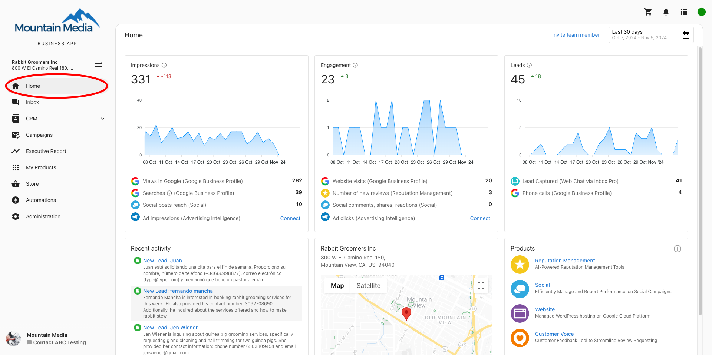
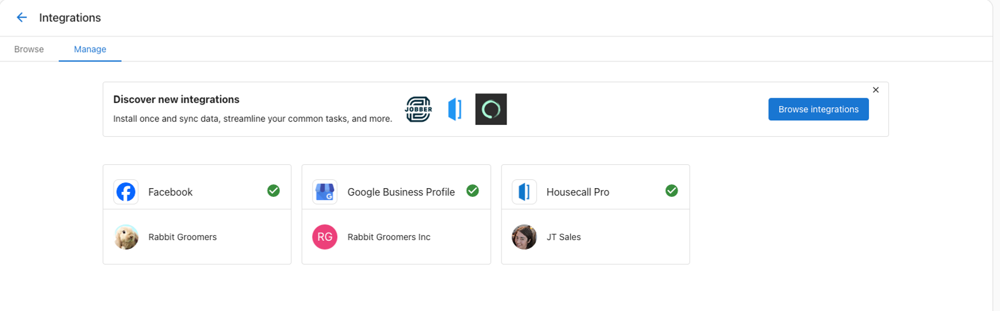
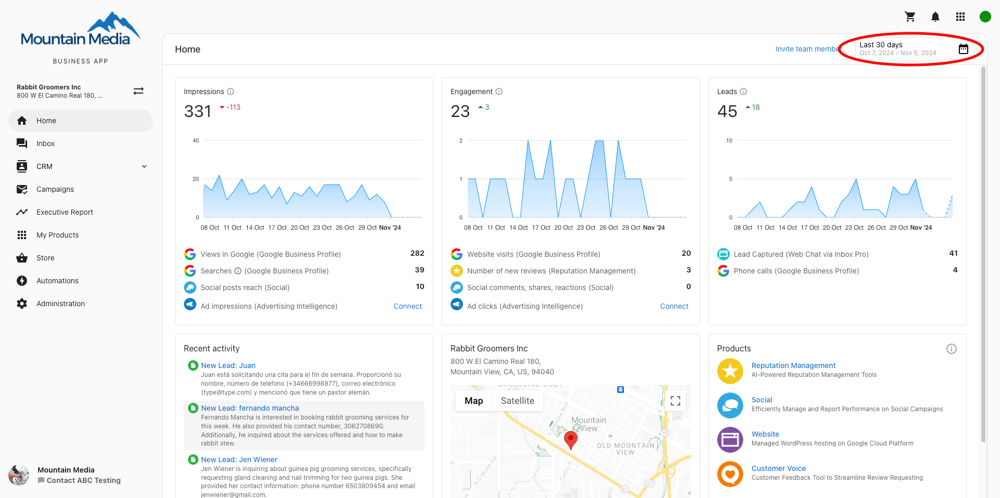

# Business App Home

The Business App Home is the primary tab that users land on once they've logged in and showcases business data and activity. It features the following sections:

- [Marketing Funnel](/articles/marketing-funnel)
- [Recent Activity](/business-app/recent-activity-page)
- [Business Profile](/business-app/business-profile)
- Active Products

Users are invited to connect their accounts (Facebook, Google Business Profile, and more) at the top of the screen. This will subsequently connect these accounts to relevant products automatically.

In the top right, users can also select a date range for their Marketing Funnel.

