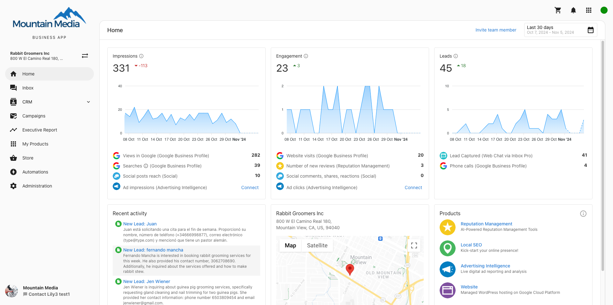

Business App is your client-facing dashboard. It's how your clients access the products and services you've provisioned for them, see proof of performance reporting, communicate with you and their customers, and more – all under your brand.

## With Business App, you can...

- [Brand as your own app](/business-app/business-app-get-started/branding) – Add your logo, and rename it, and customize the domain.
- [Configure the features](/business-app/business-app-get-started/configure-features) and [notifications your clients experience](/business-app/user-notifications-overview).
- Acquire new customers – using [sign up widgets](/business-app/customer-acquisition/signupwidgets) paired with [automations](/business-app/customer-acquisition/automations).
- [Sell your services through a store](/business-app/business-app-store) – where clients can purchase your products and services.
- Chat with your clients through [Inbox](/business-app/inbox-send-first-message)

## In Business App, your customers can...

- See their business analytics from across the web, in [their personalized Executive Report](/business-app/executive-report)
- See their online [business activity](/business-app/business-activity)
- [Configure their online Business Profile and](/business-app/business-profile) how their business appears online
- Launch active apps/[products](/business-app/my-products)
- [Purchase new product](/business-app/purchasing-products)s & services
- Send and receive SMS message with customers (US and Canada)
- [Manage email notifications](/business-app/email-notifications)
- Monitor and manage the online data for multiple businesses, with [Multi-Location Business App](/business-app/multi-location)

View [all support articles about Business App](/business-app).