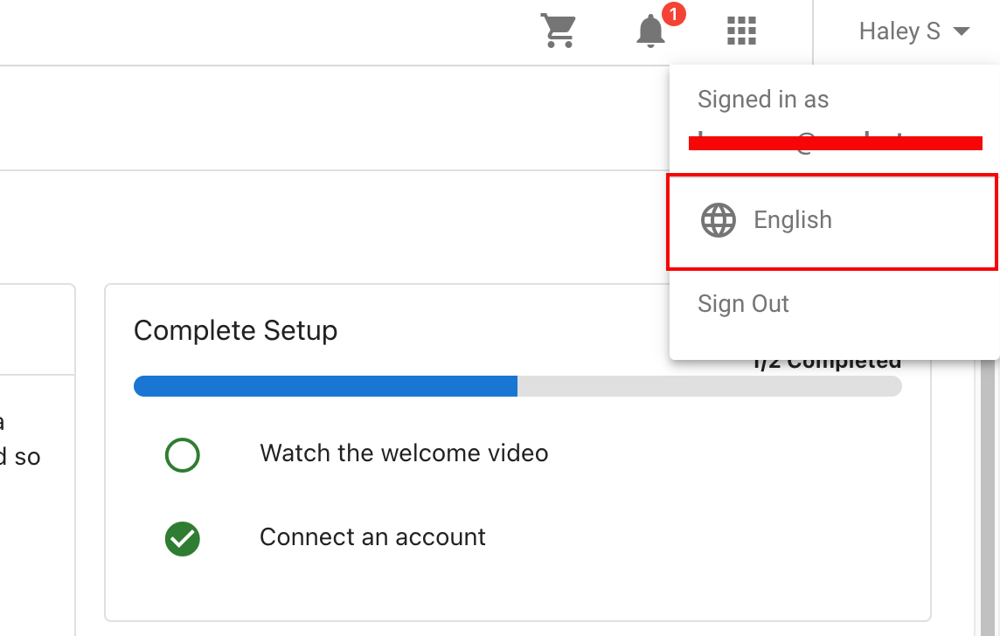
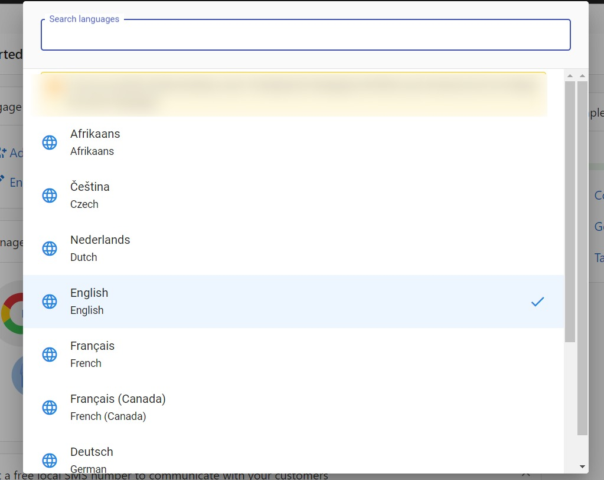
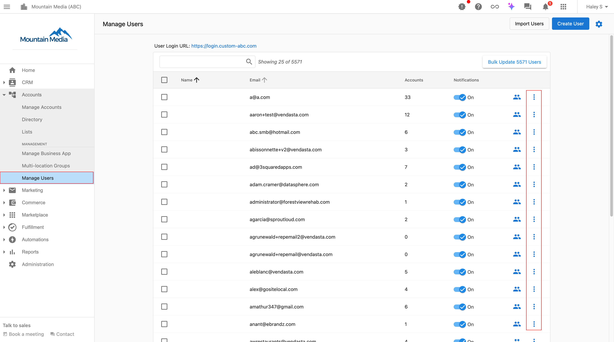
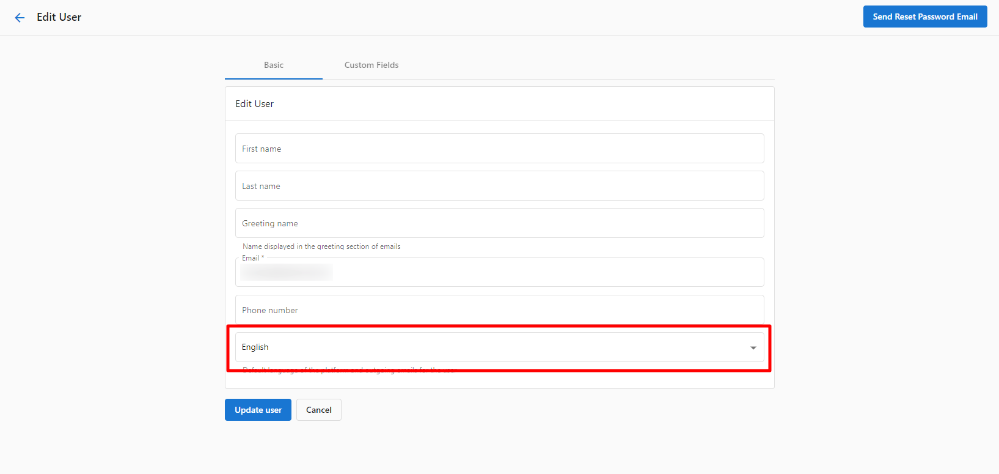
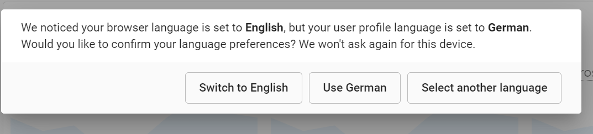

# Customize Language in Business App

You can customize the language in Business App either as a user or as a Partner Center admin.

## Update Language as a User

1. As a user, log in to Business App.
2. Click on your profile name in the top right corner, then click on the current language.

3. Select your preferred language from the available list.

## Update Language as a Partner Center Admin

1. In Partner Center, navigate to **Accounts > Manage Users.**
2. Find the user you would like to update.
   
3. Click the three dots menu to the right of the user name. Select **Edit User.**
4. In the language field, select the desired language. (Ex. German, French, Dutch, etc.)
   
5. Click **Update User.**

**Note:** If this user logs into Business App, there will be a prompt as shown below. The system notice if the browser's language is different from the preferred user language and asks how the user wants to proceed. If the browser's language matches the preferred user's language, this prompt will not be displayed.

